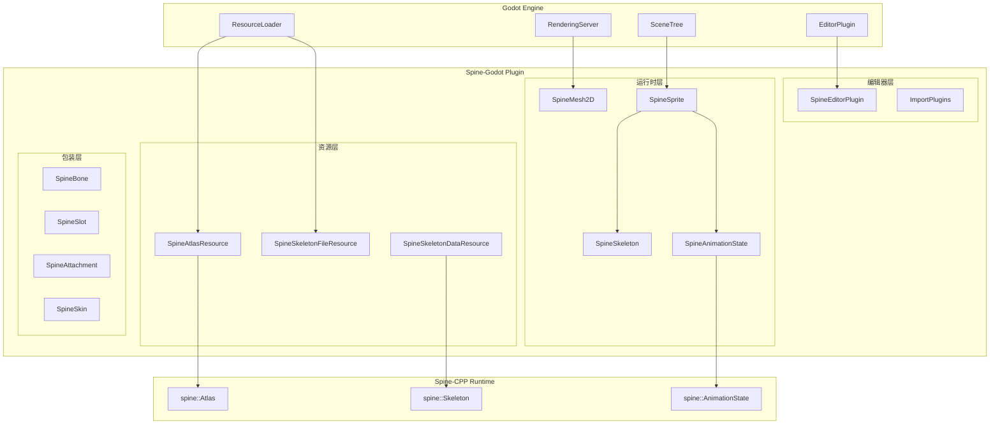
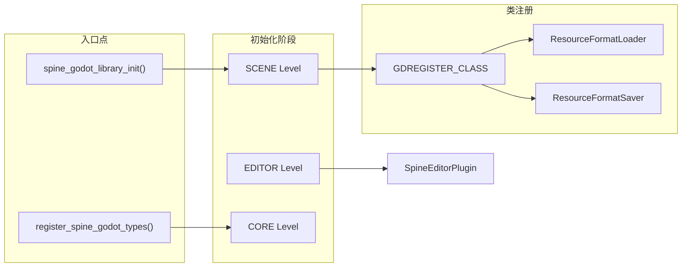
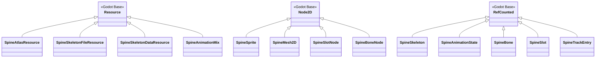
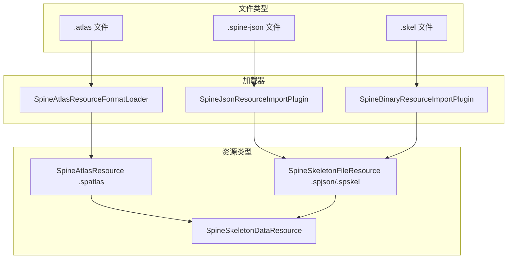
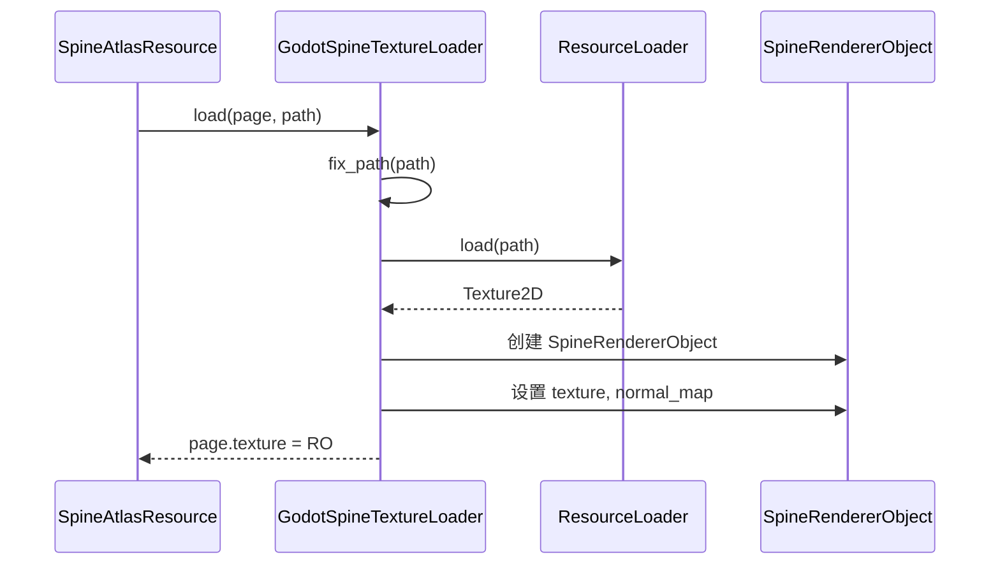
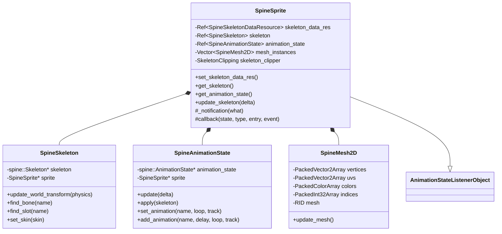
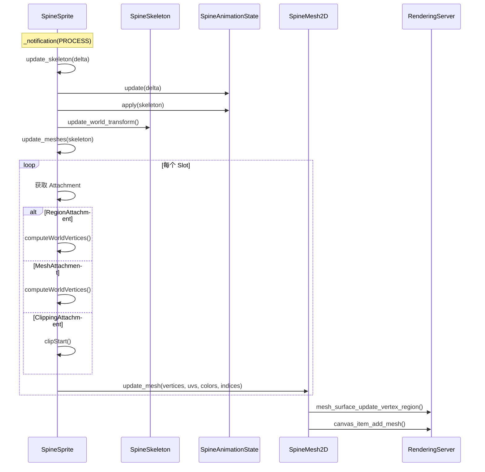
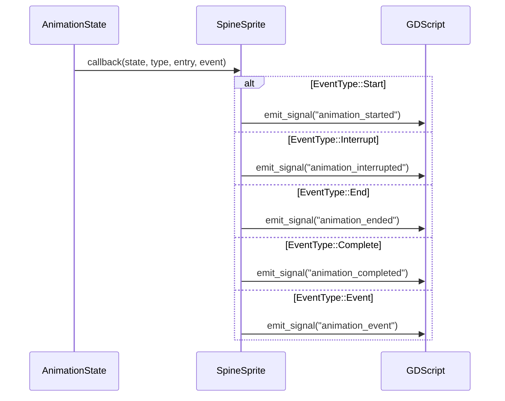
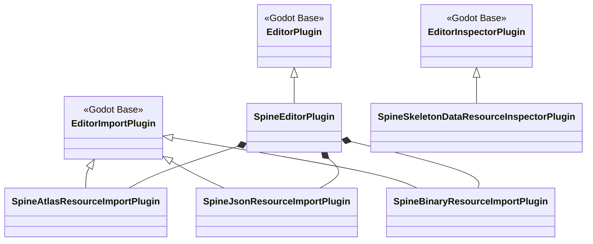
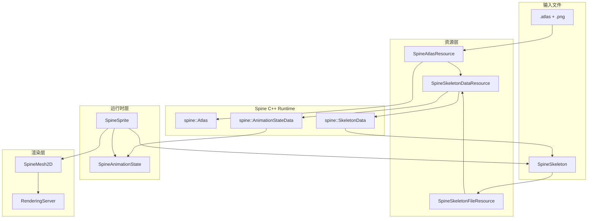

# Spine-Godot 架构与实现原理分析

## 1. 整体架构概览

spine-godot 是 Spine 骨骼动画工具针对 Godot 引擎的官方运行时实现。它通过 **GDExtension** (Godot 4.x) 或 **Engine Module** (Godot 3.x) 两种方式与 Godot 引擎深度集成。

### 1.1 系统架构图



---

## 2. 模块注册机制

### 2.1 GDExtension 入口点

spine-godot 支持两种集成方式，通过 `SPINE_GODOT_EXTENSION` 宏区分：



关键入口函数位于 [`register_types.cpp`](d:/projects/spx/pkg/gdspx/godot/spine-godot/spine_godot/register_types.cpp):

```221:228:d:/projects/spx/pkg/gdspx/godot/spine-godot/spine_godot/register_types.cpp
extern "C" GDExtensionBool GDE_EXPORT spine_godot_library_init(GDExtensionInterfaceGetProcAddress p_get_proc_address, GDExtensionClassLibraryPtr p_library, GDExtensionInitialization *r_initialization) {
	GDExtensionBinding::InitObject init_obj(p_get_proc_address, p_library, r_initialization);
	init_obj.register_initializer(initialize_spine_godot_module);
	init_obj.register_terminator(uninitialize_spine_godot_module);
	init_obj.set_minimum_library_initialization_level(MODULE_INITIALIZATION_LEVEL_SCENE);
	return init_obj.init();
}
```

### 2.2 类注册流程

所有 Godot 暴露的类都通过 `GDREGISTER_CLASS` 宏注册：



---

## 3. 资源系统集成

### 3.1 自定义资源加载器

spine-godot 实现了自定义的 `ResourceFormatLoader` 和 `ResourceFormatSaver` 来处理 Spine 特有的文件格式：



### 3.2 纹理加载流程

`GodotSpineTextureLoader` 类继承自 `spine::TextureLoader`，负责将 Spine Atlas 中的纹理加载为 Godot 的 `Texture2D`:



---

## 4. 核心运行时架构

### 4.1 SpineSprite 类层次

`SpineSprite` 是用户在场景中使用的主要节点，继承自 `Node2D`:



### 4.2 对象包装器模式

为了安全地管理 Spine C++ 对象的生命周期，使用了 `SpineObjectWrapper` 模板类：

```115:163:d:/projects/spx/pkg/gdspx/godot/spine-godot/spine_godot/SpineCommon.h
class SpineObjectWrapper : public REFCOUNTED {
	GDCLASS(SpineObjectWrapper, REFCOUNTED)

	Object *spine_owner;
	void *spine_object;

protected:
	static void _bind_methods() {
		ClassDB::bind_method(D_METHOD("_internal_spine_objects_invalidated"), &SpineObjectWrapper::spine_objects_invalidated);
	}

	void spine_objects_invalidated() {
		spine_object = nullptr;
// ...
	}

	template<typename OWNER, typename OBJECT>
	void _set_spine_object_internal(const OWNER *_owner, OBJECT *_object) {
		// 连接失效信号
		spine_owner->connect(SNAME("_internal_spine_objects_invalidated"), callable_mp(this, &SpineObjectWrapper::spine_objects_invalidated));
	}
// ...
};
```

---

## 5. 渲染管线

### 5.1 网格更新流程

每一帧，SpineSprite 会遍历所有 Slot，计算顶点并更新 SpineMesh2D:



### 5.2 渲染对象结构

```46:53:d:/projects/spx/pkg/gdspx/godot/spine-godot/spine_godot/SpineRendererObject.h
struct SpineRendererObject {
	Ref<Texture> texture;
	Ref<Texture> normal_map;
	Ref<Texture> specular_map;
#if VERSION_MAJOR > 3
	Ref<CanvasTexture> canvas_texture;
#endif
};
```

---

## 6. 动画事件系统

### 6.1 事件回调机制

SpineSprite 实现了 `spine::AnimationStateListenerObject` 接口来接收动画事件：



---

## 7. 编辑器集成

### 7.1 编辑器插件架构



---

## 8. 内存管理桥接

### 8.1 GodotSpineExtension

Spine C++ Runtime 的内存分配通过 `GodotSpineExtension` 桥接到 Godot 的内存管理器：

```34:45:d:/projects/spx/pkg/gdspx/godot/spine-godot/spine_godot/GodotSpineExtension.h
class GodotSpineExtension : public spine::SpineExtension {
protected:
	virtual void *_alloc(size_t size, const char *file, int line);
	virtual void *_calloc(size_t size, const char *file, int line);
	virtual void *_realloc(void *ptr, size_t size, const char *file, int line);
	virtual void _free(void *mem, const char *file, int line);
	virtual char *_readFile(const spine::String &path, int *length);
};
```
```43:59:d:/projects/spx/pkg/gdspx/godot/spine-godot/spine_godot/GodotSpineExtension.cpp
void *GodotSpineExtension::_alloc(size_t size, const char *file, int line) {
	return memalloc(size);  // 使用 Godot 的 memalloc
}

void *GodotSpineExtension::_calloc(size_t size, const char *file, int line) {
	auto p = memalloc(size);
	memset(p, 0, size);
	return p;
}
// ...
void GodotSpineExtension::_free(void *mem, const char *file, int line) {
	memfree(mem);  // 使用 Godot 的 memfree
}
```

---

## 9. 关键设计模式总结

| 设计模式 | 应用场景 | 相关类 |

|---------|---------|-------|

| **适配器模式** | 将 Spine C++ API 适配为 Godot API | SpineSkeleton, SpineAnimationState |

| **包装器模式** | 安全管理 C++ 对象生命周期 | SpineObjectWrapper, SpineSpriteOwnedObject |

| **观察者模式** | 动画事件通知 | AnimationStateListenerObject |

| **工厂模式** | 资源加载 | ResourceFormatLoader |

| **组合模式** | SpineSprite 包含多个 SpineMesh2D | SpineSprite |

| **策略模式** | 不同混合模式的材质选择 | BlendMode materials |

---

## 10. 数据流总览



此架构分析展示了 spine-godot 如何通过分层设计、适配器模式和资源系统集成，将 Spine C++ Runtime 无缝融入 Godot 引擎生态系统。