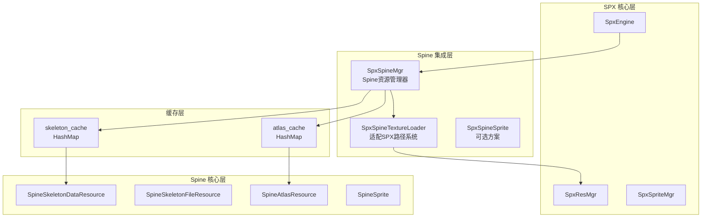
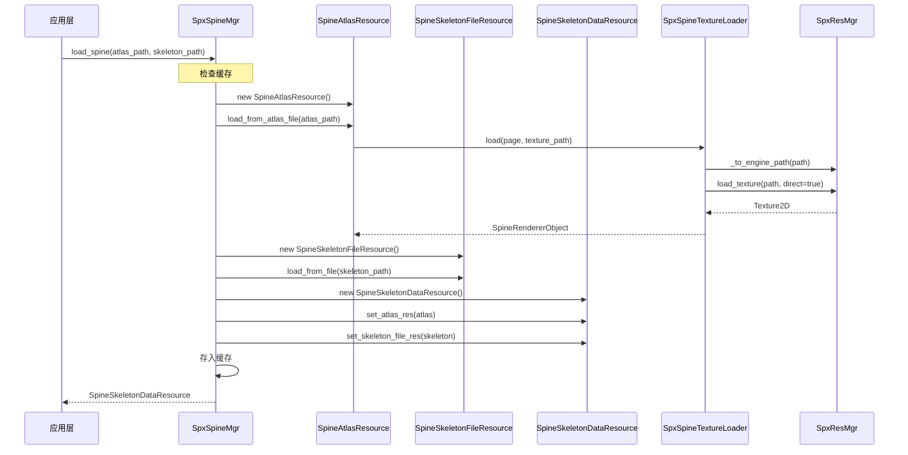

# SPX Spine 运行时集成方案

## 1. 架构设计



## 2. 核心组件实现

### 2.1 SpxSpineMgr - Spine 资源管理器

**文件**: [`modules/spx/spx_spine_mgr.h`](modules/spx/spx_spine_mgr.h) / `.cpp`

**职责**:

- 运行时加载 Spine 资源（.atlas, .json/.skel）
- 资源缓存管理
- 与 SPX 路径系统集成

**核心 API**:

```cpp
class SpxSpineMgr : SpxBaseMgr {
    // 缓存
    HashMap<String, Ref<SpineSkeletonDataResource>> skeleton_data_cache;
    
    // 加载方法
    Ref<SpineSkeletonDataResource> load_spine(
        const String& atlas_path, 
        const String& skeleton_path
    );
    
    // 缓存管理
    void update_caches(const Vector<String>& files);
    void clear_cache();
};
```

### 2.2 SpxSpineTextureLoader - 适配 SPX 路径系统

继承 `spine::TextureLoader`，重写纹理加载逻辑以复用 SPX 的路径转换和直接加载能力：

```cpp
class SpxSpineTextureLoader : public spine::TextureLoader {
    void load(spine::AtlasPage &page, const spine::String &path) override {
        String fixed_path = spxResMgr->_to_engine_path(path);
        Ref<Texture2D> texture = spxResMgr->load_texture(fixed_path, true);
        // ... 设置 page.texture
    }
};
```

### 2.3 SpxSprite Spine 模式扩展 (推荐方案)

在现有 [`SpxSprite`](modules/spx/spx_sprite.h) 中添加 Spine 支持：

```cpp
class SpxSprite : public CharacterBody2D {
    // 新增 Spine 相关成员
    SpineSprite* spine_sprite = nullptr;
    bool is_spine_mode = false;
    
    // 新增方法
    void set_spine_skeleton(GdString atlas_path, GdString skeleton_path);
    void play_spine_anim(GdString name, GdBool loop = true, GdInt track = 0);
    void set_spine_skin(GdString name);
    Ref<SpineSkeleton> get_spine_skeleton();
    Ref<SpineAnimationState> get_spine_animation_state();
};
```

## 3. 加载流程



## 4. 关键修改点

### 4.1 修改 SpineAtlasResource

在 [`SpineAtlasResource.cpp`](spine-godot/spine_godot/SpineAtlasResource.cpp) 中，需要支持自定义 TextureLoader 或添加新的加载方法：

```cpp
// 新增方法：支持外部 TextureLoader
Error SpineAtlasResource::load_from_atlas_file_with_loader(
    const String &path, 
    spine::TextureLoader* custom_loader
);
```

### 4.2 模块集成

在 [`modules/spx/register_types.cpp`](modules/spx/register_types.cpp) 中注册新类型：

```cpp
GDREGISTER_CLASS(SpxSpineMgr);
// 如果创建独立 SpineSprite
// GDREGISTER_CLASS(SpxSpineSprite);
```

### 4.3 SpxEngine 扩展

在 [`modules/spx/spx_engine.h`](modules/spx/spx_engine.h) 中添加 SpineMgr：

```cpp
class SpxEngine {
    SpxSpineMgr* spineMgr;
    SpxSpineMgr* get_spine() { return spineMgr; }
};
```

## 5. API 设计

### 5.1 资源管理 API

```cpp
// 加载 Spine 动画
spine_data = spineMgr.load_spine("player.atlas", "player.json");

// 缓存控制
spineMgr.clear_cache();
spineMgr.update_caches(changed_files);
```

### 5.2 SpxSprite Spine 模式 API

```cpp
// 设置 Spine 骨骼
sprite.set_spine_skeleton("player.atlas", "player.json");

// 播放动画
sprite.play_spine_anim("walk", loop=true, track=0);
sprite.play_spine_anim("attack", loop=false, track=1); // 叠加轨道

// 皮肤
sprite.set_spine_skin("warrior");

// 获取底层对象进行高级操作
var skeleton = sprite.get_spine_skeleton();
var anim_state = sprite.get_spine_animation_state();
```

## 6. 实现优先级

| 优先级 | 任务 | 复杂度 |

|--------|------|--------|

| P0 | SpxSpineMgr 基础实现 | 中 |

| P0 | SpxSpineTextureLoader 实现 | 低 |

| P1 | SpxSprite Spine 模式集成 | 中 |

| P2 | 缓存管理和热重载 | 低 |

| P3 | 高级功能（Slot节点、骨骼变换等）| 高 |

## 7. 需要确认的问题

1. **集成方式选择**：

   - 方案A：在 SpxSprite 中添加 Spine 模式（推荐，保持 API 一致性）
   - 方案B：创建独立的 SpxSpineSprite 类（更清晰的职责分离）

2. **spine-godot 模块位置**：

   - 保持在 `spine-godot/spine_godot/` 作为独立模块
   - 或合并到 `modules/spx/` 中

3. **事件回调机制**：

   - 是否需要将 Spine 动画事件映射到 SPX 回调系统？