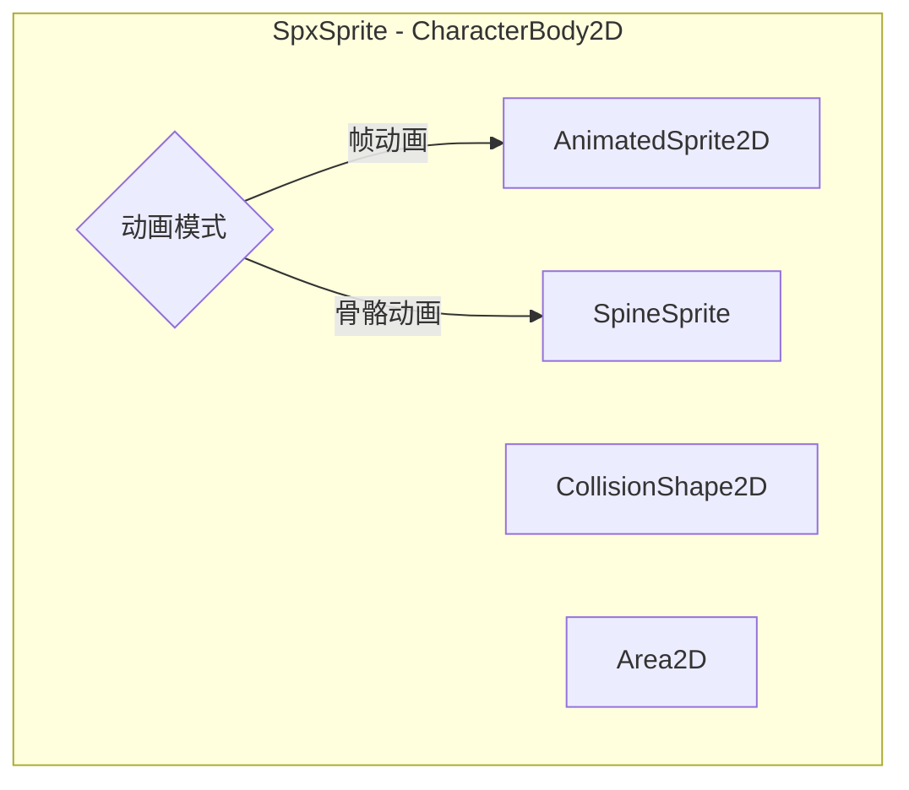
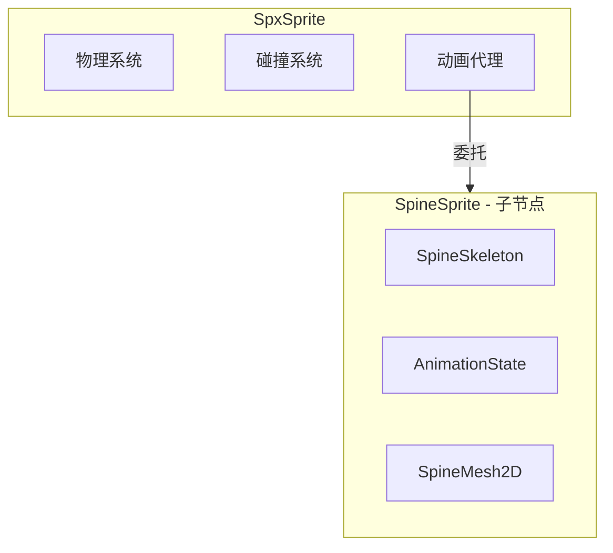

# SpxSprite 与 SpineSprite 集成方案深度分析

## 1. 核心架构差异

| 特性 | SpxSprite | SpineSprite |

|------|-----------|-------------|

| **基类** | CharacterBody2D | Node2D |

| **渲染** | AnimatedSprite2D (帧动画) | SpineMesh2D[] (骨骼网格) |

| **动画系统** | SpriteFrames | spine::AnimationState |

| **物理支持** | 内置 (碰撞/触发器) | 无 |

| **节点结构** | 单节点 + 子组件 | 动态创建 Mesh 子节点 |

---

## 2. 五种集成方案对比

### 方案 A: 组合模式 - SpxSprite 内嵌 SpineSprite



**实现要点**:

- SpxSprite 内部持有一个 SpineSprite 指针
- 通过 `set_animation_mode(FRAME/SPINE)` 切换模式
- 切换时显示/隐藏对应的渲染组件

| 优点 | 缺点 |

|------|------|

| 保持统一的 SpxSprite 接口 | 两个渲染组件同时存在，内存浪费 |

| 运行时可切换动画类型 | SpxSprite 类复杂度增加 |

| 用户无需学习新 API | 物理组件位置与 Spine 骨骼难以同步 |

| 渐进式集成，风险低 | 部分 Spine 高级功能难以暴露 |

**适用场景**: 需要在帧动画和骨骼动画之间动态切换的项目

---

### 方案 B: 继承方案 - SpxSpineSprite 继承 SpxSprite

| 优点 | 缺点 |

|------|------|

| 复用物理、碰撞、排序等基础设施 | AnimatedSprite2D 仍存在但不用，浪费资源 |

| API 兼容性好 | 继承层次复杂 |

| 代码重用度高 | 帧动画和骨骼动画 API 不完全兼容 |

**适用场景**: 快速集成，最大化代码复用

---

### 方案 C: 并行方案 - 独立的 SpxSpineSprite 类

| 优点 | 缺点 |

|------|------|

| 架构最清晰，无冗余组件 | 物理/碰撞代码重复 |

| 可针对 Spine 特性优化 | 用户需学习两套类 |

| 不影响现有 SpxSprite | SpriteMgr 需要同时管理两种类型 |

| Spine 高级功能易暴露 | 维护成本增加 |

**适用场景**: 对 Spine 功能要求高，需要完整骨骼动画能力

---

### 方案 D: 接口抽象 + 策略模式

| 优点 | 缺点 |

|------|------|

| 设计最优雅，符合开闭原则 | 改动较大，需重构现有代码 |

| 易于扩展新动画类型 | 接口设计需仔细考虑 |

| 运行时切换灵活 | 部分 Spine 特有功能难以通过通用接口暴露 |

| 统一的 API | 间接调用，轻微性能开销 |

**适用场景**: 长期维护的项目，预期会有更多动画系统集成

---

### 方案 E: 代理/装饰器模式 (当前选择)



| 优点 | 缺点 |

|------|------|

| 最小改动现有代码 | 额外的节点层级 |

| 保持物理系统独立 | 调用链较长 |

| SpineSprite 完整功能可用 | SpineSprite 位置/变换需同步 |

| 灵活的组合方式 | 两种动画 API 风格并存 |

**适用场景**: 快速原型验证，最小化对现有系统的影响

---

## 3. 方案对比总结

| 方案 | 复杂度 | 代码重用 | API 一致性 | 性能 | Spine 功能完整度 | 推荐度 |

|------|--------|----------|-----------|------|-----------------|--------|

| A. 组合内嵌 | 中 | 高 | 高 | 低 (双组件) | 中 | ★★★☆ |

| B. 继承扩展 | 低 | 最高 | 高 | 中 | 中 | ★★★☆ |

| C. 并行独立 | 高 | 低 | 低 | 最高 | 最高 | ★★★★ |

| D. 接口抽象 | 最高 | 高 | 最高 | 高 | 中 | ★★★☆ |

| E. 代理装饰 | 低 | 最高 | 中 | 中 | 高 | ★★★★ |

---

## 4. 最终方案选择

### 当前实施: 方案 E (代理/装饰器)

**选择理由**:

1. 改动最小，风险最低
2. 快速验证 Spine 集成可行性
3. SpineSprite 完整功能可用
4. 不破坏现有 SpxSprite 功能
5. 保持所有 SpxSprite API 在 Spine 模式下可用

### 未来演进方向: 方案 D (接口抽象)

如果后期需要更优雅的架构，可考虑重构为方案 D：

- 提取 `ISpxAnimatable` 接口
- 创建 `SpxFrameAnimator` 和 `SpxSpineAnimator` 策略类
- SpxSprite 持有动画器指针实现运行时切换

**注意**: 方案 D 重构不在当前计划执行范围内，仅作为未来参考。

---

## 5. 需求确认 (已确定)

| 问题 | 决定 |

|------|------|

| API 兼容性 | SpxSprite 的所有 API 在 Spine 模式下都可用，无 Spine 特有 API |

| 物理同步 | 只需要简单的包围盒碰撞，初始化时计算一次 |

| 性能要求 | 预期 ~20 个 Spine 精灵，暂不考虑批量优化 |

| 事件系统 | 先打印日志，后续再实现 SPX 回调映射 |

| 帧索引 API | Spine 模式下不支持，打印警告日志 |

| 路径转换 | 使用 `_to_engine_path()` 转为绝对路径（非 res:// 开头） |

---

## 6. 模块集成方案

### 6.1 spine_godot 模块迁移

**来源**: `spine-godot/spine_godot/` → `modules/spine_godot/`

**目录结构**:

```
modules/
├── spx/                      # SPX 模块
│   ├── SCsub
│   ├── spx_sprite.h/cpp      # 修改：添加 Spine 模式
│   ├── spx_spine_mgr.h/cpp   # 新增：Spine 资源管理器
│   ├── spx_engine.h/cpp      # 修改：添加 SpxSpineMgr
│   └── ...
└── spine_godot/              # Spine 模块（独立模块）
    ├── SCsub
    ├── config.py
    ├── register_types.h/cpp
    ├── spine-cpp/            # Spine C++ Runtime
    │   ├── include/
    │   └── src/
    ├── SpineSprite.h/cpp
    ├── SpineAtlasResource.h/cpp
    └── ...
```

### 6.2 模块配置文件

**[modules/spine_godot/config.py](modules/spine_godot/config.py)**:

```python
def can_build(env, platform):
    return True

def configure(env):
    pass

def get_doc_classes():
    return [
        "SpineSprite",
        "SpineAtlasResource",
        "SpineSkeletonDataResource",
        "SpineSkeletonFileResource",
        "SpineSkeleton",
        "SpineAnimationState",
        # ... 其他类
    ]

def get_doc_path():
    return "docs"
```

### 6.3 模块构建脚本

**[modules/spine_godot/SCsub](modules/spine_godot/SCsub)**:

```python
Import('env')

env_spine = env.Clone()
env_spine.Append(CPPPATH=["#modules/spine_godot/spine-cpp/include"])
env_spine.add_source_files(env.modules_sources, "spine-cpp/src/spine/*.cpp")
env_spine.add_source_files(env.modules_sources, "*.cpp")

if not env_spine.msvc:
    env_spine.Append(CXXFLAGS=["-Wno-inconsistent-missing-override"])
```

### 6.4 SPX 模块依赖配置

**[modules/spx/SCsub](modules/spx/SCsub)** 修改:

```python
Import("env")
Import("env_modules")

env_spx = env_modules.Clone()

# 添加 Spine 头文件路径
env_spx.Append(CPPPATH=[
    "#modules/spine_godot",
    "#modules/spine_godot/spine-cpp/include"
])

env_spx.add_source_files(env.modules_sources, "*.cpp")
```

**模块初始化顺序**: Godot 按字母顺序初始化模块，`spine_godot` 在 `spx` 之前，满足依赖关系。

---

## 7. SpxSpineMgr 实现

### 7.1 头文件

**[modules/spx/spx_spine_mgr.h](modules/spx/spx_spine_mgr.h)**:

```cpp
#ifndef SPX_SPINE_MGR_H
#define SPX_SPINE_MGR_H

#include "spx_base_mgr.h"
#include "SpineSkeletonDataResource.h"

class SpxSpineMgr : SpxBaseMgr {
    SPXCLASS(SpxSpineMgr, SpxBaseMgr)

private:
    // 缓存: cache_key -> SpineSkeletonDataResource
    HashMap<String, Ref<SpineSkeletonDataResource>> cached_skeleton_data;

public:
    void on_awake() override;
    void on_reset(int reset_code) override;

    // 加载 Spine 数据（带缓存）
    Ref<SpineSkeletonDataResource> load_spine_data(const String &atlas_path, const String &skeleton_path);
    
    // 清除缓存（适配热重载）
    void update_caches(const Vector<String> &files);
    
    // 生成缓存 key
    String _make_cache_key(const String &atlas_path, const String &skeleton_path);
};

#endif // SPX_SPINE_MGR_H
```

### 7.2 实现文件

**[modules/spx/spx_spine_mgr.cpp](modules/spx/spx_spine_mgr.cpp)**:

```cpp
#include "spx_spine_mgr.h"
#include "spx_engine.h"
#include "SpineAtlasResource.h"
#include "SpineSkeletonFileResource.h"

void SpxSpineMgr::on_awake() {
    // 初始化
}

void SpxSpineMgr::on_reset(int reset_code) {
    cached_skeleton_data.clear();
}

String SpxSpineMgr::_make_cache_key(const String &atlas_path, const String &skeleton_path) {
    return atlas_path + "|" + skeleton_path;
}

Ref<SpineSkeletonDataResource> SpxSpineMgr::load_spine_data(const String &atlas_path, const String &skeleton_path) {
    // 1. 路径转换 - 使用 _to_engine_path 转为绝对路径（非 res:// 开头）
    String abs_atlas = resMgr->_to_engine_path(atlas_path);
    String abs_skeleton = resMgr->_to_engine_path(skeleton_path);
    
    // 2. 生成缓存 key
    String cache_key = _make_cache_key(abs_atlas, abs_skeleton);
    
    // 3. 检查缓存
    if (cached_skeleton_data.has(cache_key)) {
        return cached_skeleton_data[cache_key];
    }
    
    // 4. 加载 Atlas (绝对路径，非 res:// 开头，GodotSpineTextureLoader 自动使用直接文件加载)
    Ref<SpineAtlasResource> atlas_res;
    atlas_res.instantiate();
    Error err = atlas_res->load_from_atlas_file(abs_atlas);
    if (err != OK) {
        print_error(vformat("[SpxSpineMgr] Failed to load Spine atlas: %s", abs_atlas));
        return Ref<SpineSkeletonDataResource>();
    }
    
    // 5. 加载 Skeleton 文件 (.json 或 .skel)
    Ref<SpineSkeletonFileResource> skeleton_file;
    skeleton_file.instantiate();
    err = skeleton_file->load_from_file(abs_skeleton);
    if (err != OK) {
        print_error(vformat("[SpxSpineMgr] Failed to load Spine skeleton: %s", abs_skeleton));
        return Ref<SpineSkeletonDataResource>();
    }
    
    // 6. 创建 SkeletonDataResource
    Ref<SpineSkeletonDataResource> data_res;
    data_res.instantiate();
    data_res->set_atlas_res(atlas_res);
    data_res->set_skeleton_file_res(skeleton_file);
    
    // 7. 存入缓存
    cached_skeleton_data[cache_key] = data_res;
    print_line(vformat("[SpxSpineMgr] Spine data loaded and cached: %s", cache_key));
    
    return data_res;
}

void SpxSpineMgr::update_caches(const Vector<String> &files) {
    if (cached_skeleton_data.is_empty()) return;
    
    for (const String &file : files) {
        String abs_path = resMgr->_to_engine_path(file);
        
        // 移除所有包含此路径的缓存项
        Vector<String> keys_to_remove;
        for (const auto &entry : cached_skeleton_data) {
            if (entry.key.contains(abs_path)) {
                keys_to_remove.push_back(entry.key);
            }
        }
        
        for (const String &key : keys_to_remove) {
            print_line(vformat("[SpxSpineMgr] Cache invalidated: %s", key));
            cached_skeleton_data.erase(key);
        }
    }
}
```

---

## 8. SpxSprite Spine 模式实现

### 8.1 新增成员变量

```cpp
// spx_sprite.h 新增
class SpineSprite;  // 前向声明

class SpxSprite : public CharacterBody2D, public ISortableSprite {
    // ... 现有成员 ...
    
    // Spine 模式相关
    SpineSprite* spine_child = nullptr;
    bool is_spine_mode = false;
    Ref<SpineSkeletonDataResource> spine_data;
    
    // Spine 事件处理
    void _setup_spine_event_bindings();
    void _on_spine_animation_started(SpineSprite* sprite, Ref<SpineAnimationState> state, Ref<SpineTrackEntry> entry);
    void _on_spine_animation_completed(SpineSprite* sprite, Ref<SpineAnimationState> state, Ref<SpineTrackEntry> entry);
    void _on_spine_animation_event(SpineSprite* sprite, Ref<SpineAnimationState> state, Ref<SpineTrackEntry> entry, Ref<SpineEvent> event);
    
    // 碰撞形状计算（内部方法）
    void _calculate_spine_collision_shape();
};
```

### 8.2 启用 Spine 模式

```cpp
// spx_sprite.cpp
void SpxSprite::set_spine_skeleton(const String &atlas_path, const String &skeleton_path) {
    // 1. 隐藏帧动画组件
    if (anim2d) {
        anim2d->hide();
    }
    
    // 2. 加载 Spine 数据
    spine_data = spineMgr->load_spine_data(atlas_path, skeleton_path);
    if (!spine_data.is_valid()) {
        print_error("[SpxSprite] Failed to enable Spine mode");
        return;
    }
    
    // 3. 创建 SpineSprite 子节点
    spine_child = memnew(SpineSprite);
    spine_child->set_skeleton_data_res(spine_data);
    add_child(spine_child);
    
    // 4. 设置事件绑定
    _setup_spine_event_bindings();
    
    // 5. 计算初始碰撞形状（只计算一次）
    _calculate_spine_collision_shape();
    
    // 6. 标记模式
    is_spine_mode = true;
    
    print_line(vformat("[SpxSprite] Spine mode enabled: gid=%d", gid));
}
```

### 8.3 碰撞形状计算（初始化时一次）

```cpp
void SpxSprite::_calculate_spine_collision_shape() {
    if (!spine_child || !spine_data.is_valid()) return;
    
    // 获取骨架默认尺寸
    float width = spine_data->get_width();
    float height = spine_data->get_height();
    
    if (width > 0 && height > 0) {
        Vector2 center(spine_data->get_x(), spine_data->get_y());
        Vector2 size(width, height);
        
        // 内部调用，设置碰撞器
        set_collider_rect(center, size);
        print_line(vformat("[SpxSprite] Spine collision initialized: center=%s, size=%s", center, size));
    }
}
```

---

## 9. API 映射实现

### 9.1 动画播放 API

```cpp
void SpxSprite::play_anim(GdString p_name, GdFloat p_speed, GdBool isLoop, GdBool p_from_end) {
    if (is_spine_mode && spine_child) {
        auto anim_state = spine_child->get_animation_state();
        if (anim_state.is_valid()) {
            auto entry = anim_state->set_animation(SpxStr(p_name), isLoop, 0);
            if (entry.is_valid()) {
                entry->set_time_scale(p_speed);
                if (p_from_end) {
                    entry->set_reverse(true);
                }
            }
        }
        return;
    }
    // 原有帧动画逻辑
    anim2d->play(final_anim_key, p_speed, p_from_end);
}

void SpxSprite::pause_anim() {
    if (is_spine_mode && spine_child) {
        auto anim_state = spine_child->get_animation_state();
        if (anim_state.is_valid()) {
            anim_state->set_time_scale(0);
        }
        return;
    }
    anim2d->pause();
}

void SpxSprite::stop_anim() {
    if (is_spine_mode && spine_child) {
        auto anim_state = spine_child->get_animation_state();
        if (anim_state.is_valid()) {
            anim_state->set_empty_animation(0, 0);
        }
        return;
    }
    anim2d->stop();
}
```

### 9.2 帧索引 API（不支持，打印警告日志）

```cpp
void SpxSprite::set_anim_frame(GdInt p_frame) {
    if (is_spine_mode && spine_child) {
        print_line("[SPX Warning] set_anim_frame() is not supported in Spine mode. Spine uses time-based animation.");
        return;
    }
    anim2d->set_frame(p_frame);
}

GdInt SpxSprite::get_anim_frame() const {
    if (is_spine_mode && spine_child) {
        print_line("[SPX Warning] get_anim_frame() is not supported in Spine mode. Spine uses time-based animation.");
        return 0;
    }
    return anim2d->get_frame();
}
```

### 9.3 变换和渲染 API

```cpp
void SpxSprite::set_anim_flip_h(GdBool p_flip) {
    if (is_spine_mode && spine_child) {
        auto skeleton = spine_child->get_skeleton();
        if (skeleton.is_valid()) {
            skeleton->set_scale_x(p_flip ? -1.0f : 1.0f);
        }
        return;
    }
    anim2d->set_flip_h(p_flip);
}

void SpxSprite::set_color(GdColor color) {
    if (is_spine_mode && spine_child) {
        spine_child->set_modulate(color);
        return;
    }
    default_material->set_shader_parameter("color", color);
}

void SpxSprite::set_render_scale(GdVec2 scale) {
    _render_scale = scale;
    if (is_spine_mode && spine_child) {
        spine_child->set_scale(scale);
        return;
    }
    update_anim_scale();
}
```

---

## 10. 事件处理（先打印日志）

```cpp
void SpxSprite::_setup_spine_event_bindings() {
    spine_child->connect("animation_started", callable_mp(this, &SpxSprite::_on_spine_animation_started));
    spine_child->connect("animation_completed", callable_mp(this, &SpxSprite::_on_spine_animation_completed));
    spine_child->connect("animation_event", callable_mp(this, &SpxSprite::_on_spine_animation_event));
}

void SpxSprite::_on_spine_animation_started(SpineSprite* sprite, Ref<SpineAnimationState> state, Ref<SpineTrackEntry> entry) {
    String anim_name = entry->get_animation()->get_name();
    print_line(vformat("[Spine Event] animation_started: gid=%d, animation=%s", gid, anim_name));
    // TODO: 后续实现 SPX_CALLBACK->func_on_sprite_animation_changed(gid);
}

void SpxSprite::_on_spine_animation_completed(SpineSprite* sprite, Ref<SpineAnimationState> state, Ref<SpineTrackEntry> entry) {
    String anim_name = entry->get_animation()->get_name();
    print_line(vformat("[Spine Event] animation_completed: gid=%d, animation=%s", gid, anim_name));
    // TODO: 后续实现 SPX_CALLBACK->func_on_sprite_animation_finished(gid);
}

void SpxSprite::_on_spine_animation_event(SpineSprite* sprite, Ref<SpineAnimationState> state, Ref<SpineTrackEntry> entry, Ref<SpineEvent> event) {
    String event_name = event->get_data()->get_name();
    int int_val = event->get_int_value();
    float float_val = event->get_float_value();
    String str_val = event->get_string_value();
    print_line(vformat("[Spine Event] animation_event: gid=%d, event=%s, int=%d, float=%.2f, string=%s", 
                       gid, event_name, int_val, float_val, str_val));
    // TODO: 后续实现自定义事件回调
}
```

---

## 11. 缓存适配

**修改 [modules/spx/spx_res_mgr.cpp](modules/spx/spx_res_mgr.cpp)**:

```cpp
void SpxResMgr::update_caches(const Vector<String>& files) {
    // 原有逻辑
    for (auto& file : files) {
        auto path = _to_engine_path(file);
        cached_texture.erase(path);
        cached_audio.erase(path);
    }
    
    // 同步更新 SVG 缓存
    svgMgr->update_caches(files);
    
    // 新增：同步更新 Spine 缓存
    spineMgr->update_caches(files);
}
```

---

## 12. API 映射完整表

| SpxSprite API | Spine 模式实现 | 备注 |

|--------------|----------------|------|

| `play_anim(name, speed, loop, from_end)` | `anim_state->set_animation()` | 支持 |

| `play_backwards_anim(name)` | `entry->set_reverse(true)` | 支持 |

| `pause_anim()` | `anim_state->set_time_scale(0)` | 支持 |

| `stop_anim()` | `anim_state->set_empty_animation()` | 支持 |

| `is_playing_anim()` | `entry != null && !is_complete()` | 支持 |

| `set_anim(name)` | `set_animation + pause` | 支持 |

| `get_anim()` | `entry->get_animation()->get_name()` | 支持 |

| `set_anim_frame(frame)` | **不支持** - 打印警告 | Spine 无帧概念 |

| `get_anim_frame()` | **不支持** - 返回 0 | Spine 无帧概念 |

| `set_anim_speed_scale(scale)` | `entry->set_time_scale(scale)` | 支持 |

| `set_anim_flip_h(flip)` | `skeleton->set_scale_x()` | 支持 |

| `set_anim_flip_v(flip)` | `skeleton->set_scale_y()` | 支持 |

| `set_color(color)` | `spine_sprite->set_modulate()` | 支持 |

| `set_render_scale(scale)` | `spine_sprite->set_scale()` | 支持 |

| `set_texture(path)` | **不支持** - Spine 使用 Atlas | 打印警告 |

---

## 13. 实现文件清单

| 文件 | 操作 | 说明 |

|------|------|------|

| `modules/spine_godot/*` | 新增目录 | 从 spine-godot/spine_godot 迁移 |

| `modules/spine_godot/config.py` | 新增 | 模块配置文件 |

| `modules/spine_godot/SCsub` | 修改 | 调整路径引用 |

| `modules/spx/SCsub` | 修改 | 添加 Spine 头文件依赖 |

| `modules/spx/spx_spine_mgr.h` | 新增 | Spine 资源管理器头文件 |

| `modules/spx/spx_spine_mgr.cpp` | 新增 | Spine 资源管理器实现 |

| `modules/spx/spx_sprite.h` | 修改 | 添加 Spine 模式成员和方法 |

| `modules/spx/spx_sprite.cpp` | 修改 | 实现 Spine 模式 API 分支 |

| `modules/spx/spx_engine.h` | 修改 | 添加 SpxSpineMgr 成员 |

| `modules/spx/spx_engine.cpp` | 修改 | SpxSpineMgr 生命周期管理 |

| `modules/spx/spx_res_mgr.cpp` | 修改 | update_caches 调用 spineMgr |

---

## 14. TODO（后续任务）

### 14.1 渲染层级适配（待后续实现）

- [ ] SpineSprite 子节点的 Z-Index 与 SpxSprite 同步
- [ ] 修改 ISortableSprite 实现以支持 Spine 模式
- [ ] SpineMesh2D 多子节点的层级排序处理

### 14.2 事件回调系统（待后续实现）

- [ ] 在 SpxCallbackInfo 中新增 Spine 事件回调类型
- [ ] 实现 animation_started → func_on_sprite_animation_changed 映射
- [ ] 实现 animation_completed → func_on_sprite_animation_finished 映射
- [ ] 设计 animation_event 自定义事件回调机制

### 14.3 碰撞形状动态更新（待后续实现）

- [ ] 开放 `refresh_spine_collision()` 接口给用户
- [ ] 支持基于当前动画帧计算碰撞形状

---

## 15. 风险评估

| 风险 | 概率 | 影响 | 缓解措施 |

|------|------|------|----------|

| Spine 帧索引不支持 | - | 低 | 打印警告日志，文档说明 |

| 性能影响 (20 个精灵) | 低 | 低 | Spine 官方运行时已优化 |

| 事件回调未实现 | - | 中 | 先打印日志，后续迭代实现 |

| 渲染层级问题 | 中 | 中 | 标记 TODO，后续迭代解决 |

| 碰撞形状固定 | 低 | 低 | 初始化计算一次，后续可扩展 |