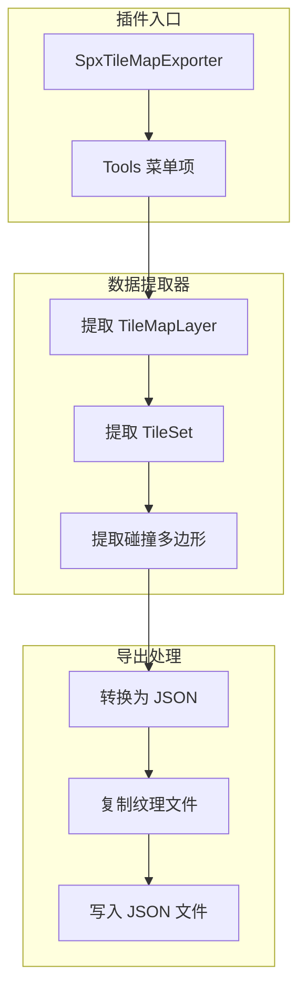

# SPX TileMap 导出插件实现计划

## 1. 方案概述

使用 GDScript 实现标准 Godot 编辑器插件，将 TileMap 场景（包含 TileMapLayer 节点和 TileSet 资源）导出为与 [spx_tilemap_types.h](modules/spx/spx_tilemap_types.h) 定义的数据结构兼容的 JSON 格式。导出时自动复制纹理文件到导出目录。

## 2. 插件文件结构

```
addons/spx_tilemap_exporter/
├── plugin.cfg                    # 插件配置文件
├── spx_tilemap_exporter.gd       # 主插件类（EditorPlugin）
├── tilemap_extractor.gd          # 数据提取核心逻辑
└── export_dialog.gd              # 导出对话框（可选 UI）
```

## 3. 架构设计



## 4. 核心实现要点

### 4.1 TileMapLayer 数据提取

```gdscript
# 使用 Godot 原生 API 获取二进制数据
var bytes: PackedByteArray = tile_map_layer.get_tile_map_data_as_array()
var base64_data: String = Marshalls.raw_to_base64(bytes)
```

关键字段映射：

- `TileMapLayer.name` -> `layer.name`
- `TileMapLayer.z_index` -> `layer.z_index`
- `TileMapLayer.position` -> `layer.offset`
- `TileMapLayer.is_enabled()` -> `layer.enabled`
- `TileMapLayer.get_tile_map_data_as_array()` -> Base64 编码 -> `layer.tile_map_data`

### 4.2 TileSet 数据提取

```gdscript
# 遍历所有 TileSetSource
for i in tileset.get_source_count():
    var source_id = tileset.get_source_id(i)
    var source = tileset.get_source(source_id)
    if source is TileSetAtlasSource:
        _extract_atlas_source(source, source_id)
```

关键字段映射：

- `TileSet.tile_size` -> `tileset.tile_size`
- `TileSet.get_physics_layers_count()` -> 遍历物理层
- `TileSetAtlasSource.texture.get_path()` -> `source.texture`（需转为相对路径）
- `TileSetAtlasSource.texture_region_size` -> `source.texture_region_size`

### 4.3 碰撞多边形提取

```gdscript
# 获取 TileData 的碰撞多边形
var tile_data: TileData = atlas_source.get_tile_data(atlas_coords, 0)
for layer_id in tileset.get_physics_layers_count():
    var poly_count = tile_data.get_collision_polygons_count(layer_id)
    for poly_idx in poly_count:
        var points: PackedVector2Array = tile_data.get_collision_polygon_points(layer_id, poly_idx)
        # 转为 flat 数组 [x1, y1, x2, y2, ...]
```

### 4.4 纹理文件复制

```gdscript
# 获取纹理原始路径并复制到导出目录
var texture_path: String = atlas_source.get_texture().get_path()  # res://...
var dest_path: String = export_dir.path_join(texture_path.get_file())
DirAccess.copy_absolute(
    ProjectSettings.globalize_path(texture_path),
    dest_path
)
```

## 5. JSON 格式对照

输出 JSON 格式与 [spx_tilemap_types.cpp](modules/spx/spx_tilemap_types.cpp) 中 `to_json()` 方法完全兼容：

| C++ 数据结构 | JSON 字段 | GDScript 提取方式 |

|-------------|----------|------------------|

| `SpxTileMapData.version` | `version` | 固定值 1 |

| `SpxTileMapData.name` | `name` | 文件名或用户指定 |

| `SpxTileSetData.tile_size` | `tileset.tile_size` | `[tileset.tile_size.x, tileset.tile_size.y]` |

| `SpxTileSetSourceData.texture` | `source.texture` | 相对路径（仅文件名） |

| `SpxTilePhysicsData.polygons` | `physics.polygons` | `[[x1,y1,x2,y2,...], ...]` |

| `SpxTileMapLayerData.tile_map_data_base64` | `layer.tile_map_data` | `Marshalls.raw_to_base64()` |

## 6. 使用流程

1. 启用插件：Project Settings > Plugins > SpxTileMapExporter
2. 打开包含 TileMapLayer 的场景
3. 点击菜单：Project > Tools > SPX Export TileMap
4. 选择导出目录
5. 插件自动：

   - 提取所有 TileMapLayer 节点
   - 提取关联的 TileSet
   - 导出 JSON 文件
   - 复制纹理到导出目录

## 7. 错误处理

- 检测场景中是否存在 TileMapLayer
- 验证 TileSet 是否为 TileSetAtlasSource 类型（跳过 TileSetScenesCollectionSource）
- 验证纹理路径有效性
- 导出失败时显示详细错误信息