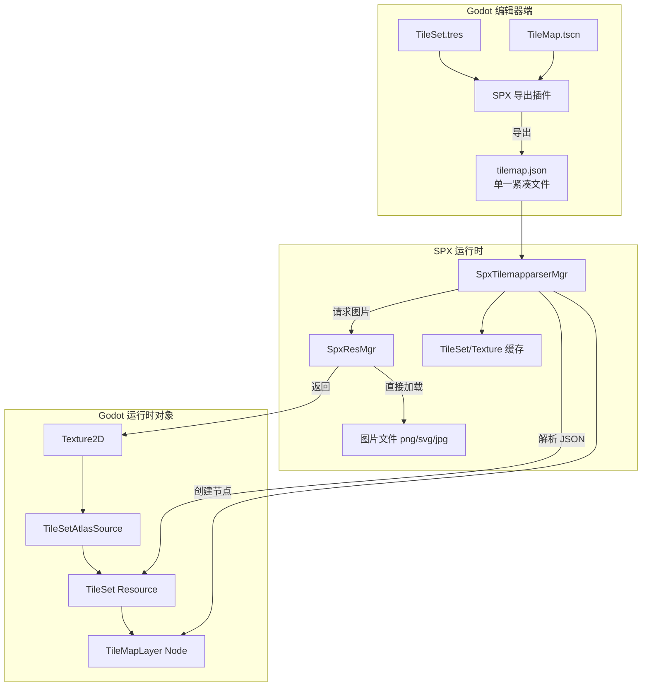
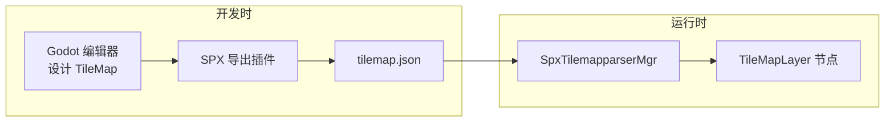
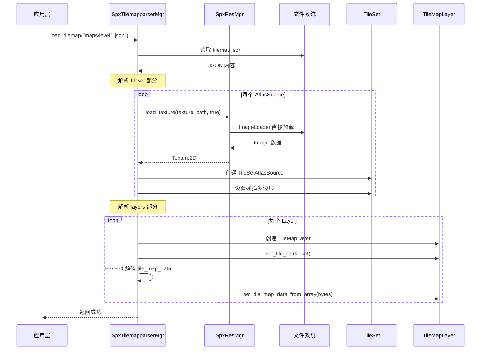
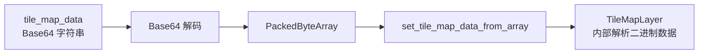
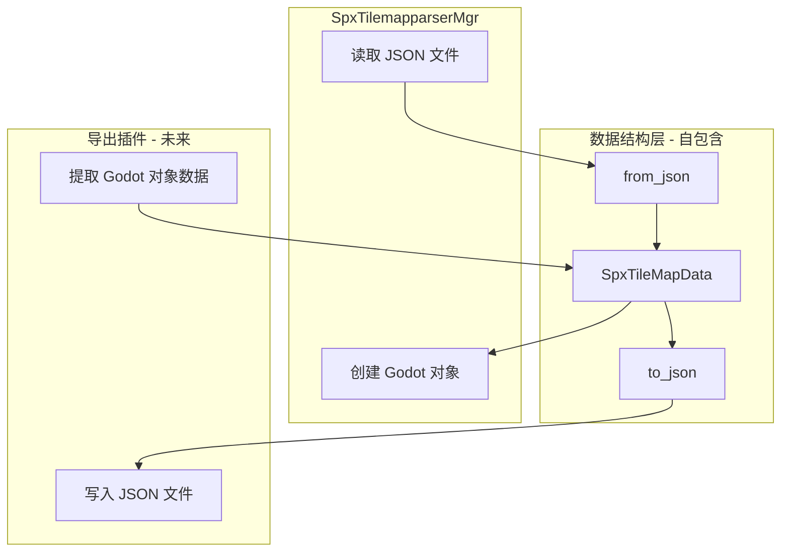
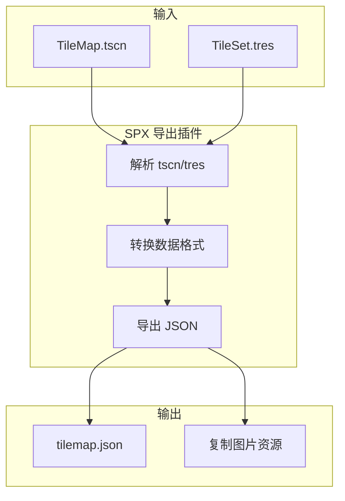
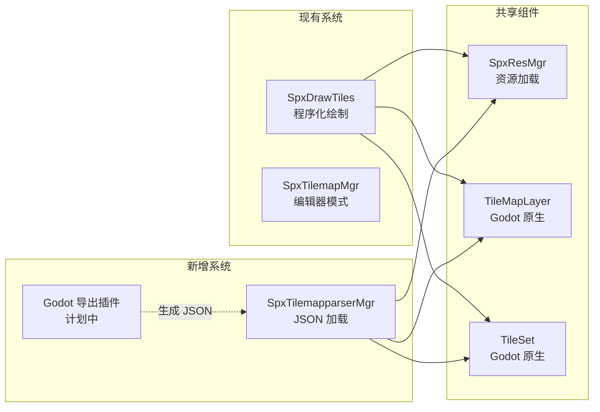

# SPX TileMap 运行时加载设计文档

## 1. 设计目标

实现 SPX TileMap 运行时加载机制，满足以下需求：

- **单一 JSON 文件** - 一个 TileMap 场景导出为一个 JSON 文件（包含 TileSet + TileMap 数据）
- **紧凑数据格式** - 保持与原始 tscn/tres 一致的紧凑格式，避免 JSON 文件过大
- **图片加载** - 使用 SPX 的 `SpxResMgr::load_texture()` 直接加载，绕过 Godot import
- **提供 API** - 让开发者在运行时动态加载 TileMap
- **Godot 导出插件** - 提供编辑器插件将 tscn/tres 导出为目标 JSON 格式（计划中，暂不实现）
- **不支持**: TileSetScenesCollectionSource, Material, Occluder, NavPoly, PackedScene, PhysMat

---

## 2. 架构设计

### 2.1 整体架构



### 2.2 工作流程



---

## 3. JSON 格式设计

### 3.1 设计原则

为了减小 JSON 文件大小，保持与原始 tscn/tres 一致的紧凑数据格式：

| 原始格式 | JSON 中的表示 | 说明 |

|---------|--------------|------|

| `PackedByteArray("AAD0...")` | `"AAD0..."` (Base64 字符串) | TileMapLayer 的 tile_map_data |

| `PackedVector2Array(...)` | `[x1, y1, x2, y2, ...]` (flat int/float 数组) | 碰撞多边形顶点 |

| `PackedInt32Array(...)` | `[1, 2, 3, ...]` (int 数组) | 其他整数数组 |

### 3.2 单一 JSON 格式 (`tilemap.json`)

一个 TileMap 场景导出为一个 JSON 文件，包含 TileSet 定义和所有 Layer 数据：

```json
{
  "version": 1,
  "name": "level1",
  
  "tileset": {
    "tile_size": [16, 16],
    "tile_shape": "square",
    "physics_layers": [
      {
        "collision_layer": 1,
        "collision_mask": 1
      }
    ],
    "sources": [
      {
        "id": 0,
        "type": "atlas",
        "texture": "terrain.png",
        "texture_region_size": [16, 16],
        "margins": [0, 0],
        "separation": [0, 0],
        "tiles": [
          {
            "atlas_coords": [0, 0],
            "size_in_atlas": [1, 1],
            "physics": [
              {
                "layer": 0,
                "polygons": [
                  [-8, -8, 8, -8, 8, 8, -8, 8]
                ]
              }
            ]
          },
          {
            "atlas_coords": [1, 0],
            "size_in_atlas": [1, 1]
          }
        ]
      }
    ]
  },
  
  "layers": [
    {
      "name": "ground",
      "z_index": 0,
      "offset": [0, 0],
      "enabled": true,
      "tile_map_data": "AAD0/wAAAAAAAQAAAAAAAAD1/wAAAAAAAQAAAAAAABYA9f8AAAAAAAEAAAAAAAAXAPb/AAAAAAEAAAAAAAAXAP3/AAAAAAEAAAAAAAAWAP7/AAAAAAABAAAAAAAAFgD//wAAAAAAAQA..."
    },
    {
      "name": "obstacles", 
      "z_index": 1,
      "offset": [0, 0],
      "enabled": true,
      "tile_map_data": "BQAFAAAAAAABAAAAAAAAAA=="
    }
  ]
}
```

### 3.3 紧凑数据格式说明

#### 3.3.1 tile_map_data (Base64 编码的二进制数据)

保持 Godot 原始的 `PackedByteArray` 格式，直接使用 Base64 字符串存储：

- **格式版本号**: 前 2 字节 (uint16)
- **每个 Cell**: 12 字节
  - 字节 0-1: X 坐标 (int16)
  - 字节 2-3: Y 坐标 (int16)
  - 字节 4-5: source_id (uint16)
  - 字节 6-7: atlas_coords.x (uint16)
  - 字节 8-9: atlas_coords.y (uint16)
  - 字节 10-11: alternative_tile (uint16)

#### 3.3.2 碰撞多边形 (flat 数组)

```json
"polygons": [
  [-8, -8, 8, -8, 8, 8, -8, 8]
]
```

等价于 Godot 中的:

```
PackedVector2Array(-8, -8, 8, -8, 8, 8, -8, 8)
```

解析时每两个值组成一个 Vector2。

### 3.4 与原始 tscn/tres 格式对照

| 字段 | tscn/tres 格式 | JSON 格式 |

|------|---------------|-----------|

| tile_map_data | `PackedByteArray("AAD0...")` | `"AAD0..."` |

| 碰撞多边形 | `PackedVector2Array(-8, -8, 8, -8, ...)` | `[-8, -8, 8, -8, ...]` |

| tile_size | `tile_size = Vector2i(16, 16)` | `[16, 16]` |

| atlas_coords | `0:0/0` | `[0, 0]` |

---

## 4. 数据流程

### 4.1 运行时加载流程



### 4.2 tile_map_data 解析流程



这样做的优势是直接复用 Godot 原生的 `set_tile_map_data_from_array()` 方法，无需手动解析每个 Cell。

---

## 5. API 设计

### 5.1 SpxTilemapparserMgr 扩展

```cpp
class SpxTilemapparserMgr : SpxBaseMgr {
public:
    // 主要 API
    void load_tilemap(GdString json_path);             // 加载 TileMap JSON 文件
    void unload_tilemap(GdString name);                // 卸载指定 TileMap
    void destroy_all_tilemaps();                       // 销毁所有 TileMap
    
    // 查询 API
    GdBool has_tilemap(GdString name);                 // 检查是否已加载
    GdInt get_tilemap_layer_count(GdString name);      // 获取层数量
    
private:
    // Godot 对象创建方法（使用解析后的数据结构）
    Ref<TileSet> _create_tileset(const SpxTileSetData &data, const String &base_path);
    void _create_atlas_source(Ref<TileSet> tileset, const SpxTileSetSourceData &data, const String &base_path);
    void _setup_tile_physics(TileData *tile_data, const SpxTileData &data);
    TileMapLayer* _create_tilemap_layer(const SpxTileMapLayerData &data, Ref<TileSet> tileset);
    
    // 缓存
    HashMap<String, Ref<TileSet>> tileset_cache;
    HashMap<String, Vector<TileMapLayer*>> tilemap_layers;
};
```

### 5.2 外部调用示例

```go
// Go/SPX 端调用
func loadLevel(levelName string) {
    // 加载 TileMap
    tilemapMgr.LoadTilemap("maps/" + levelName + ".json")
}
```

### 5.3 中间数据结构设计

为了提高代码可维护性和便于后续导出插件开发，采用自包含的中间数据结构层：

#### 5.3.1 架构设计



#### 5.3.2 数据结构定义

所有数据结构定义在 [spx_tilemap_types.h](modules/spx/spx_tilemap_types.h)：

```cpp
// 物理层数据
struct SpxPhysicsLayerData {
    uint32_t collision_layer = 1;
    uint32_t collision_mask = 1;
    bool from_json(const Dictionary &dict);
    Dictionary to_json() const;
};

// Tile 物理数据 (碰撞多边形)
struct SpxTilePhysicsData {
    int layer = 0;
    Vector<Vector<float>> polygons; // flat 数组 [x1,y1,x2,y2,...]
    bool from_json(const Dictionary &dict);
    Dictionary to_json() const;
};

// 单个 Tile 数据
struct SpxTileData {
    Vector2i atlas_coords;
    Vector2i size_in_atlas = Vector2i(1, 1);
    Vector<SpxTilePhysicsData> physics;
    bool from_json(const Dictionary &dict);
    Dictionary to_json() const;
};

// TileSet Source 数据 (Atlas 类型)
struct SpxTileSetSourceData {
    int id = 0;
    String type = "atlas";
    String texture;              // 相对路径
    Vector2i texture_region_size;
    Vector2i margins;
    Vector2i separation;
    Vector<SpxTileData> tiles;
    bool from_json(const Dictionary &dict);
    Dictionary to_json() const;
};

// TileSet 数据
struct SpxTileSetData {
    Vector2i tile_size = Vector2i(16, 16);
    String tile_shape = "square";
    Vector<SpxPhysicsLayerData> physics_layers;
    Vector<SpxTileSetSourceData> sources;
    bool from_json(const Dictionary &dict);
    Dictionary to_json() const;
};

// TileMapLayer 数据
struct SpxTileMapLayerData {
    String name;
    int z_index = 0;
    Vector2 offset;
    bool enabled = true;
    String tile_map_data_base64;  // Base64 编码的二进制数据
    bool from_json(const Dictionary &dict);
    Dictionary to_json() const;
};

// 完整 TileMap 数据 (根结构)
struct SpxTileMapData {
    int version = 1;
    String name;
    SpxTileSetData tileset;
    Vector<SpxTileMapLayerData> layers;
    bool from_json(const Dictionary &dict);
    Dictionary to_json() const;
    static bool parse_from_file(const String &json_path, SpxTileMapData &out_data);
    bool save_to_file(const String &json_path) const;
};
```

#### 5.3.3 优势

- **便于验收**: 可单独测试每个结构的 FromJson/ToJson
- **便于导出**: ToJson 直接复用于 Godot 导出插件
- **低耦合**: 数据结构自包含，职责清晰
- **解耦解析与创建**: SpxTilemapparserMgr 只负责创建 Godot 对象

---

## 6. 关键实现要点

### 6.1 图片路径处理

- JSON 中的图片路径为**相对路径**（相对于 JSON 文件所在目录）
- 使用 `SpxResMgr::_to_engine_path()` 转换为实际加载路径
- 支持 `game_data_root` 配置的动态资源目录

### 6.2 TileSet 创建流程

```cpp
Ref<TileSet> SpxTilemapparserMgr::_parse_tileset_section(
    const Dictionary &tileset_data, 
    const String &base_path) {
    
    // 1. 创建 TileSet
    Ref<TileSet> tileset;
    tileset.instantiate();
    
    Array tile_size = tileset_data["tile_size"];
    tileset->set_tile_size(Vector2i(tile_size[0], tile_size[1]));
    
    // 2. 解析 physics_layers
    Array physics_layers = tileset_data["physics_layers"];
    for (int i = 0; i < physics_layers.size(); i++) {
        Dictionary layer = physics_layers[i];
        tileset->add_physics_layer();
        tileset->set_physics_layer_collision_layer(i, layer["collision_layer"]);
        tileset->set_physics_layer_collision_mask(i, layer["collision_mask"]);
    }
    
    // 3. 解析 sources
    Array sources = tileset_data["sources"];
    for (int i = 0; i < sources.size(); i++) {
        Dictionary source = sources[i];
        int source_id = source["id"];
        
        // 使用 SPX 方式直接加载图片
        String texture_path = base_path.path_join(source["texture"]);
        Ref<Texture2D> texture = resMgr->load_texture(texture_path, true);
        
        Ref<TileSetAtlasSource> atlas;
        atlas.instantiate();
        atlas->set_texture(texture);
        
        // 创建 tiles 并设置碰撞
        Array tiles = source["tiles"];
        for (int j = 0; j < tiles.size(); j++) {
            _create_tile_with_physics(atlas, tiles[j]);
        }
        
        tileset->add_source(atlas, source_id);
    }
    
    return tileset;
}
```

### 6.3 tile_map_data 解析（关键优化）

直接使用 Godot 原生的二进制解析，避免手动解析：

```cpp
void SpxTilemapparserMgr::_parse_layers_section(
    const Array &layers_data, 
    Ref<TileSet> tileset,
    const String &name) {
    
    for (int i = 0; i < layers_data.size(); i++) {
        Dictionary layer_data = layers_data[i];
        
        TileMapLayer *layer = memnew(TileMapLayer);
        layer->set_name(layer_data["name"]);
        layer->set_z_index(layer_data["z_index"]);
        layer->set_tile_set(tileset);
        
        // 关键：Base64 解码后直接调用原生方法
        String base64_data = layer_data["tile_map_data"];
        Vector<uint8_t> bytes = _base64_decode(base64_data);
        layer->set_tile_map_data_from_array(bytes);
        
        // 添加到场景
        get_spx_root()->add_child(layer);
        tilemap_layers[name].push_back(layer);
    }
}
```

### 6.4 Base64 解码

```cpp
Vector<uint8_t> SpxTilemapparserMgr::_base64_decode(const String &base64_str) {
    // 使用 Godot 内置的 Marshalls 类
    return Marshalls::base64_to_raw(base64_str);
}
```

---

## 7. 文件组织结构

### 7.1 SPX 项目中的 TileMap 资源结构

```
project/
├── maps/
│   ├── level1.json           # 单一 JSON 文件（包含 TileSet + TileMap）
│   ├── level2.json
│   └── textures/             # 图片资源（相对于 JSON 文件的路径）
│       ├── terrain.png
│       └── objects.png
```

### 7.2 代码文件修改

| 文件 | 修改内容 |

|------|----------|

| [spx_tilemap_types.h](modules/spx/spx_tilemap_types.h) | 定义中间数据结构和 from_json/to_json 声明 |

| [spx_tilemap_types.cpp](modules/spx/spx_tilemap_types.cpp) | 实现所有序列化/反序列化方法 |

| [spx_tilemapparser_mgr.h](modules/spx/spx_tilemapparser_mgr.h) | Godot 对象创建方法声明 |

| [spx_tilemapparser_mgr.cpp](modules/spx/spx_tilemapparser_mgr.cpp) | 实现 Godot 对象创建（使用数据结构） |

---

## 8. Godot 导出插件设计（计划中，暂不实现）

### 8.1 插件概述

提供 Godot 编辑器插件，将 TileMap 场景（.tscn）和 TileSet 资源（.tres）导出为 SPX 目标 JSON 格式。

### 8.2 插件功能



### 8.3 导出流程

1. **读取 TileMap 场景** (.tscn)

   - 提取 TileMapLayer 节点信息
   - 获取 tile_map_data (PackedByteArray)

2. **读取 TileSet 资源** (.tres)

   - 提取 tile_size、physics_layers 等配置
   - 提取 sources（TileSetAtlasSource）
   - 获取每个 tile 的碰撞多边形

3. **处理图片路径**

   - 将 `res://` 路径转换为相对路径
   - 可选：复制图片到导出目录

4. **生成 JSON**

   - 合并 TileSet 和 TileMap 数据
   - 保持 tile_map_data 的 Base64 格式
   - 保持数组的紧凑格式

### 8.4 插件位置

```
project/
├── addons/
│   └── spx_tilemap_exporter/
│       ├── plugin.cfg
│       ├── spx_tilemap_exporter.gd      # 主插件脚本
│       └── export_dialog.tscn           # 导出对话框 UI
```

### 8.5 使用方式

1. 在 Godot 编辑器中启用插件
2. 选择 TileMap 节点
3. 点击菜单 "SPX > Export TileMap"
4. 选择导出路径
5. 生成 JSON 文件和复制图片

---

## 9. 与现有系统的关系



- **SpxTilemapMgr + SpxDrawTiles**: 用于程序化/编辑器模式绘制瓦片
- **SpxTilemapparserMgr**: 用于从 JSON 文件加载预制的 TileMap
- **Godot 导出插件**: 将编辑器中的 TileMap 导出为 JSON（计划中）

三个系统配合使用：编辑器设计 → 导出 JSON → 运行时加载。

---

## 10. 限制与约束

1. **不支持的功能**:

   - TileSetScenesCollectionSource（场景瓦片）
   - Material（瓦片材质）
   - OccluderPolygon2D（光遮挡）
   - NavigationPolygon（导航网格）
   - PhysicsMaterial（物理材质）
   - TileMapPattern（瓦片图案）

2. **支持的功能**:

   - TileSetAtlasSource（图集瓦片）
   - 基本物理碰撞多边形
   - 多层 TileMapLayer
   - 瓦片翻转（通过 alternative_tile，存储在 tile_map_data 中）

3. **图片格式**: 支持 SPX 已支持的格式（PNG, JPG, SVG）

---

## 11. 数据格式对比总结

| 数据类型 | 原始 tscn/tres | SPX JSON | 优势 |

|---------|---------------|----------|------|

| tile_map_data | `PackedByteArray("AAD0...")` | `"AAD0..."` | 紧凑，直接复用原生解析 |

| 碰撞多边形 | `PackedVector2Array(-8, -8, ...)` | `[-8, -8, ...]` | 紧凑数组，易于解析 |

| 坐标 | `Vector2i(16, 16)` | `[16, 16]` | 数组格式，体积小 |

| TileSet + TileMap | 分离的 .tres + .tscn | 单一 .json | 简化管理，便于分发 |