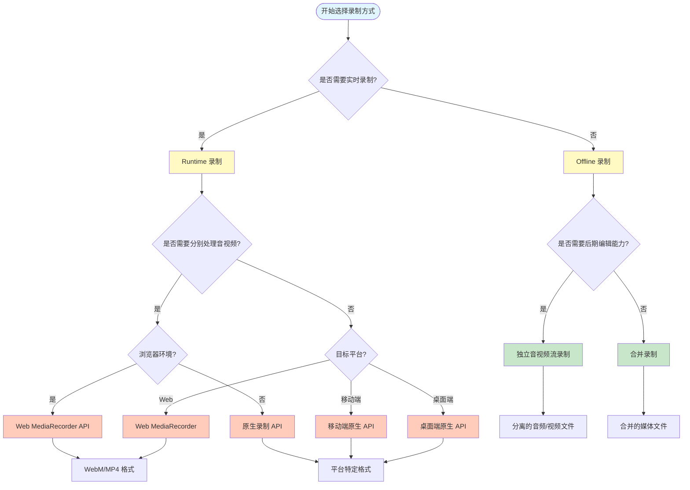
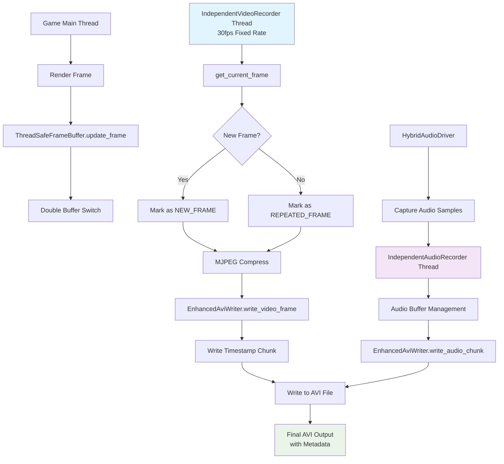
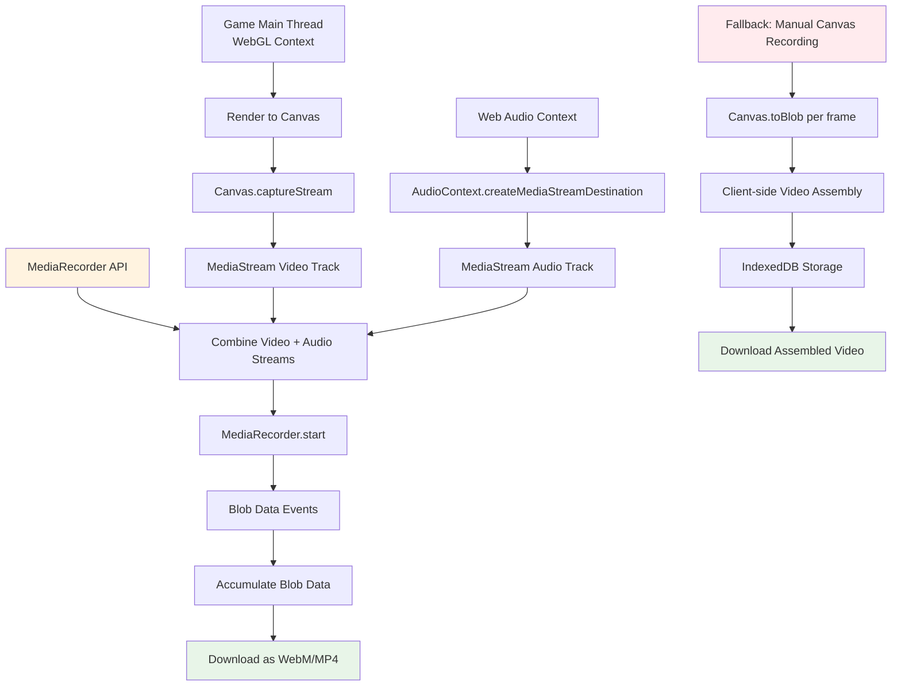
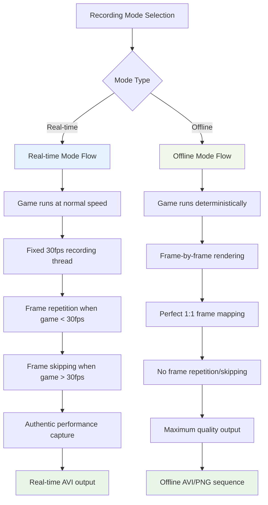
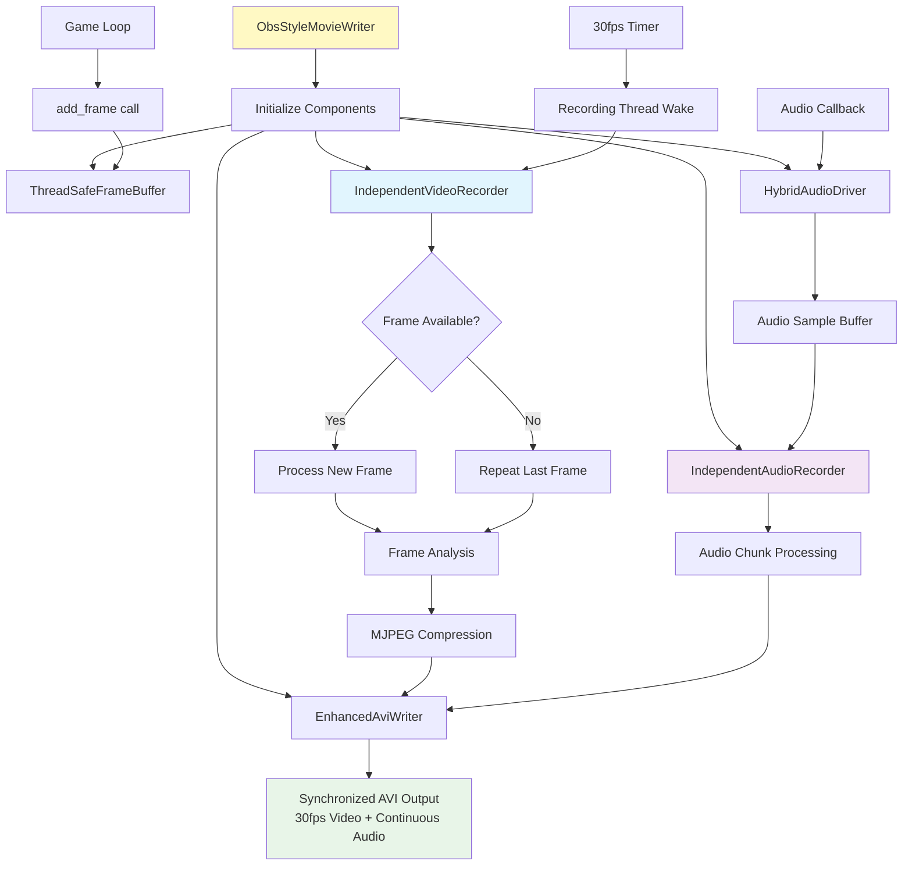

# Video Recording Implementation Analysis

## 决策流程图

### 视频录制方式选择决策流程



### 决策因素说明

#### 1. Runtime vs Offline
- **Runtime（实时录制）**
  - 适用场景：直播、视频会议、实时监控
  - 优点：低延迟，实时处理
  - 缺点：性能要求高，容错性低

- **Offline（离线录制）**
  - 适用场景：后期制作、批量处理
  - 优点：可以优化质量，支持复杂编辑
  - 缺点：需要更多存储空间，处理时间长

#### 2. 独立音视频 vs 合并录制
- **独立音视频流**
  - 适用场景：需要单独处理音频或视频
  - 优点：灵活编辑，可分别优化
  - 缺点：需要后期同步

- **合并录制**
  - 适用场景：简单录制需求
  - 优点：简单直接，同步问题少
  - 缺点：编辑灵活性低

#### 3. Web MediaRecorder vs 原生 API
- **Web MediaRecorder**
  - 适用场景：Web 应用，跨平台需求
  - 优点：标准化 API，易于使用
  - 缺点：功能受限，格式支持有限

- **原生 API**
  - 适用场景：需要高性能或特殊功能
  - 优点：性能好，功能全面
  - 缺点：平台相关，开发复杂

#### 选择建议

1. **Web 应用简单录制**：Web MediaRecorder
2. **专业视频制作**：Offline + 独立音视频流
3. **实时通信应用**：Runtime + 合并录制
4. **跨平台应用**：根据平台选择相应的原生 API

## Overview
This document provides a comprehensive analysis of the video recording system implemented in the Godot SPX fork, located in `servers/movie_writer/`. The implementation supports both offline rendering and real-time recording across multiple platforms including desktop and web.

## Architecture Components

### 1. Core MovieWriter Framework
**File:** `movie_writer.h/cpp`

The base `MovieWriter` class provides the foundation for all video recording functionality:

- **Base Features:**
  - Virtual interface for different recording formats
  - Audio/video synchronization
  - Cross-platform recording support
  - Real-time mode capabilities

- **Key Features:**
  - Support for both offline and real-time recording modes
  - Web platform support with MediaRecorder API integration
  - Hybrid audio driver management for real-time capture
  - Extensible architecture for different output formats

```cpp
// Core interface
virtual Error write_begin(const Size2i &p_movie_size, uint32_t p_fps, const String &p_base_path);
virtual Error write_frame(const Ref<Image> &p_image, const int32_t *p_audio_data);
virtual void write_end();
```

### 2. Enhanced AVI Writer
**File:** `enhanced_avi_writer.h/cpp`

Advanced AVI format writer with custom extensions:

- **Core Capabilities:**
  - Standard AVI format support with MJPEG video compression
  - Custom timestamp chunks for frame timing analysis
  - Frame marking system (new/repeated/dropped frames)
  - Audio/video synchronization with precise timing

- **Custom Extensions:**
  ```cpp
  struct TimestampChunk {
      char fourcc[4] = {'0', '0', 't', 's'};  // "00ts"
      uint64_t recording_timestamp;           // Recording timestamp (microseconds)
      uint64_t game_timestamp;               // Game timestamp (microseconds)
      uint32_t frame_sequence;               // Game frame sequence number
      uint8_t flags;                         // Frame flags (NEW/REPEATED/DROPPED)
  };
  ```

- **Frame Flags System:**
  - `FRAME_FLAG_NEW`: Indicates a newly rendered frame
  - `FRAME_FLAG_REPEATED`: Indicates a repeated/duplicated frame
  - `FRAME_FLAG_DROPPED`: Reserved for dropped frames
  - `FRAME_FLAG_RESERVED`: Future extension support

### 3. Thread-Safe Frame Buffer
**File:** `thread_safe_frame_buffer.h/cpp`

Double-buffered frame management for multi-threaded recording:

- **Design Pattern:**
  - Double buffer implementation for lock-free reading
  - Atomic operations for state management
  - Minimal synchronization overhead

- **Key Features:**
  ```cpp
  struct FrameData {
      Ref<Image> image;           // Image data
      uint64_t game_timestamp;    // Game timestamp (microseconds)
      uint32_t frame_sequence;    // Game frame sequence number
      bool is_new_frame;          // Whether it is a new frame
  };
  ```

### 4. Independent Video Recorder
**File:** `independent_video_recorder.h/cpp`

Fixed-framerate video recording thread (OBS-style):

- **Core Concept:**
  - Runs at fixed 30fps independent of game framerate
  - Accurately captures game performance issues (stutters, frame drops)
  - Produces videos with consistent timeline

- **Configuration Options:**
  ```cpp
  struct RecordingConfig {
      uint32_t target_fps = 30;                    // Fixed recording rate
      uint32_t video_width = 1920;                 // Video resolution
      uint32_t video_height = 1080;
      float jpeg_quality = 0.85f;                  // Compression quality
      bool enable_timestamp_chunks = true;         // Metadata recording
      bool enable_repeat_frame_marking = true;     // Frame analysis
  };
  ```

- **Statistics Tracking:**
  - Total recorded frames
  - New vs repeated frame counts
  - Average processing times
  - Frame repeat ratios

### 5. Independent Audio Recorder
**File:** `independent_audio_recorder.h/cpp`

Continuous audio capture system:

- **Design Goals:**
  - Uninterrupted audio recording regardless of game performance
  - Configurable chunk sizes and buffer management
  - Real-time audio monitoring capabilities

### 6. OBS-Style Movie Writer
**File:** `obs_style_movie_writer.h/cpp`

Complete recording solution mimicking OBS behavior:

- **Key Features:**
  - Fixed timeline recording (30fps output regardless of game performance)
  - Real-time reflection of game stutters and performance issues
  - Continuous audio recording independent of frame rate
  - Comprehensive timing and metadata preservation

- **Recording Modes:**
  - Separate video/audio recording
  - Combined recording to single file
  - Real-time monitoring support

- **Configuration Presets:**
  ```cpp
  static ObsRecordingConfig get_high_quality_config();    // Maximum quality
  static ObsRecordingConfig get_standard_config();        // Balanced
  static ObsRecordingConfig get_performance_config();     // Performance optimized
  ```

### 7. Supporting Components

#### Simple Video/Audio Writers
**Files:** `simple_video_writer.h/cpp`, `simple_audio_writer.h/cpp`
- Lightweight implementations for basic recording needs
- Used as building blocks for more complex recorders

#### MJPEG Writer
**File:** `movie_writer_mjpeg.h/cpp`
- MJPEG format support
- Optimized for web platform compatibility

#### PNG/WAV Writer
**File:** `movie_writer_pngwav.h/cpp`
- Uncompressed PNG sequence + WAV audio
- Highest quality option with larger file sizes

## Platform Support

### Desktop Platforms (macOS, Windows, Linux)
- Full feature support including real-time recording
- Hybrid audio driver for simultaneous playback and recording
- Multi-threaded recording architecture
- Hardware acceleration support where available

### Web Platform
- WebGL/WebAssembly compatible recording
- MediaRecorder API integration for browser-native recording
- Canvas.captureStream() support for real-time video capture
- Limited by browser sandbox security restrictions

## Recording Workflows

### 1. Offline Rendering Workflow
```
Game Render Loop → MovieWriter.add_frame() → Format-specific Writer → Output File
```
- Deterministic frame-by-frame rendering
- No real-time constraints
- Highest quality possible
- Used for final video export

### 2. Real-time Recording Workflow
```
Game Thread → ThreadSafeFrameBuffer → IndependentVideoRecorder (30fps) → Enhanced AVI
     ↓
Audio Thread → IndependentAudioRecorder → Audio Chunks → Enhanced AVI
```
- Captures actual gameplay performance
- Fixed output framerate (typically 30fps)
- Real-time audio/video synchronization
- Reflects stutters and performance issues authentically

## Technical Innovations

### 1. Frame Analysis System
- Distinguishes between new and repeated frames
- Provides performance analysis data embedded in video metadata
- Enables post-recording performance analysis

### 2. Hybrid Audio Driver
- Allows simultaneous audio playback and recording
- Minimal impact on game audio experience
- Real-time audio capture with buffering

### 3. Cross-Platform Web Support
- Leverages browser MediaRecorder APIs where available
- Fallback implementations for broader compatibility
- WebAssembly-optimized recording pipeline

### 4. Metadata Preservation
- Custom timestamp chunks preserve exact timing information
- Frame sequence numbers enable perfect synchronization analysis
- Debugging information embedded in output files

## Performance Characteristics

### Memory Usage
- Double-buffered frame storage minimizes memory pressure
- Configurable buffer sizes for different memory constraints
- Efficient image format handling

### CPU Impact
- Independent recording threads minimize game performance impact
- Configurable quality settings for performance tuning
- Lock-free data structures where possible

### Storage Requirements
- MJPEG compression provides good quality/size balance
- Configurable quality settings (0.1-1.0)
- Efficient chunk-based file writing

## Usage Patterns

### High-Quality Recording
```cpp
ObsRecordingConfig config = ObsStyleMovieWriter::get_high_quality_config();
config.video_fps = 60;
config.jpeg_quality = 0.95f;
config.enable_timestamp_chunks = true;
```

### Performance Recording
```cpp
ObsRecordingConfig config = ObsStyleMovieWriter::get_performance_config();
config.video_fps = 30;
config.jpeg_quality = 0.75f;
config.max_frame_buffer_size = 2;
```

### Web Platform Recording
```cpp
// Automatically adapts to web platform constraints
ObsRecordingConfig config = ObsStyleMovieWriter::get_standard_config();
// Web-specific optimizations applied automatically
```

## Platform Implementation Flowcharts

### Desktop Platform (macOS, Windows, Linux) Recording Flow



### Web Platform Recording Flow



### Real-time vs Offline Recording Modes



### OBS-Style Recording Architecture



## Integration Points

### SPX Module Integration
The recording system integrates with the SPX module through:
- Scene management hooks for automatic recording triggers
- Resource management for output file handling
- Platform abstraction for cross-platform functionality

### Godot Engine Integration
- Seamless integration with Godot's rendering pipeline
- AudioServer integration for real-time audio capture
- DisplayServer integration for window/canvas recording

## Future Extensions

The architecture supports future enhancements:
- Hardware-accelerated video encoding (H.264, H.265)
- Streaming output support (RTMP, WebRTC)
- Advanced audio processing (noise reduction, normalization)
- Multi-camera recording support
- VR/AR recording capabilities

## Conclusion

This video recording implementation represents a sophisticated, production-ready system that goes beyond simple screen capture. It provides professional-grade recording capabilities with detailed performance analysis, cross-platform support, and flexible configuration options. The OBS-style architecture ensures that recorded videos accurately reflect the actual gameplay experience while maintaining high quality and performance.