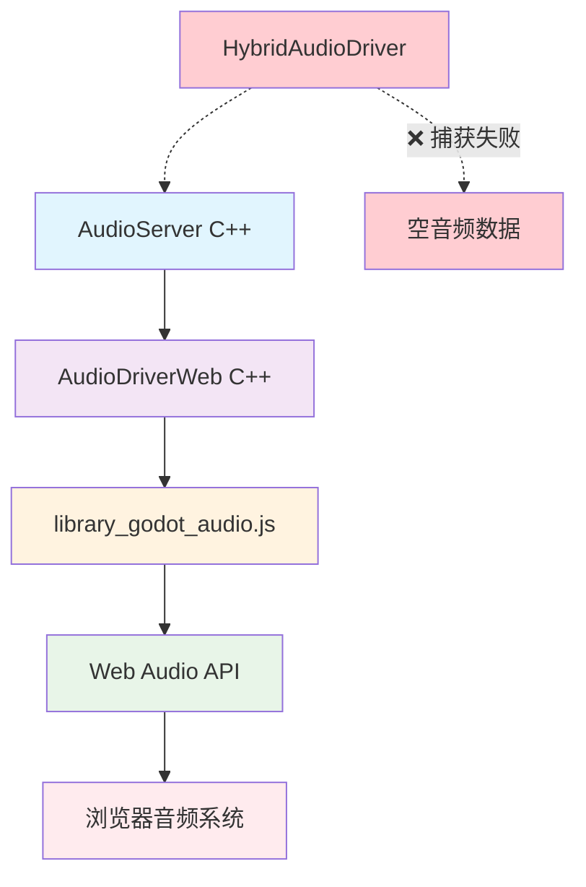

# Web端音频录制解决方案技术文档

## 📋 文档信息

- **创建日期**: 2024年
- **文档版本**: v1.0
- **适用项目**: Godot Engine MovieWriter Web端录制
- **问题描述**: Web端音频录制功能失效，录制文件有大小但无声音

---

## 🔍 问题分析

### 现象描述
- **PC端**: 音频录制正常，可以听到声音
- **Web端**: 音频录制失效，生成的audio.avi文件有大小但无声音
- **初始化**: HybridAudioDriver初始化成功，所有日志显示正常

### 根本原因

#### 1. 浏览器安全限制
Web Audio API出于安全考虑，**无法直接捕获自身的音频输出**：
```javascript
// ❌ 这样的API在浏览器中不存在
audioContext.destination.captureOutput(); 

// ✅ 只能捕获外部音频输入（需要用户授权）
navigator.mediaDevices.getUserMedia({audio: true});
```

#### 2. 音频数据流向问题
```cpp
// servers/audio_server.cpp:335
// 这个调用在Web端接收到的是空的音频数据
if (audio_capture_interface) {
    audio_capture_interface->capture_audio_data(p_buffer, p_frames, get_channel_count());
}
```

Web端的音频数据流：
```
AudioServer → AudioDriverWeb → JavaScript → Web Audio API → 浏览器音频系统
                     ↑
              HybridAudioDriver试图在这里捕获
              但Web端这里的数据已经是空的
```

---

## 🏗️ Web端音频架构分析

### 当前架构


### 核心组件分析

| 组件 | 位置 | 作用 | Web端特点 |
|------|------|------|----------|
| **AudioServer** | C++ | 音频处理核心 | 正常工作 |
| **AudioDriverWeb** | C++ | Web音频驱动接口 | 调用JS函数 |
| **GodotAudio** | JavaScript | 音频管理器 | 管理AudioContext |
| **AudioWorklet** | JavaScript | 高性能音频处理 | 独立线程处理 |
| **HybridAudioDriver** | C++ | 音频捕获器 | **Web端捕获失效** |

---

## 💡 解决方案

### 方案1：MediaRecorder API (推荐 ⭐⭐⭐⭐⭐)

**优势**: 
- 浏览器原生支持
- 高质量录制
- 多格式支持
- 性能优秀

**实现思路**: 使用MediaStreamDestination捕获Web Audio API输出

```javascript
// 在 platform/web/js/libs/library_godot_audio.js 中添加
const GodotAudioRecorder = {
    mediaRecorder: null,
    recordedChunks: [],
    isRecording: false,
    recordingStream: null,
    
    /**
     * 初始化录制器
     */
    init: function() {
        if (!GodotAudio.ctx) {
            console.error('AudioContext not initialized');
            return false;
        }
        
        // 创建录制目标
        this.recordingStream = GodotAudio.ctx.createMediaStreamDestination();
        
        // 将主输出总线连接到录制目标（不影响正常播放）
        const masterBus = GodotAudio.buses[0];
        masterBus.getOutputNode().connect(this.recordingStream);
        
        console.log('GodotAudioRecorder initialized');
        return true;
    },
    
    /**
     * 开始录制
     */
    startRecording: function() {
        if (!this.recordingStream) {
            console.error('Recorder not initialized');
            return false;
        }
        
        try {
            // 创建MediaRecorder
            this.mediaRecorder = new MediaRecorder(this.recordingStream.stream, {
                mimeType: this.getSupportedMimeType(),
                audioBitsPerSecond: 128000
            });
            
            this.recordedChunks = [];
            
            // 处理录制数据
            this.mediaRecorder.ondataavailable = (event) => {
                if (event.data.size > 0) {
                    this.recordedChunks.push(event.data);
                    console.log(`Audio chunk recorded: ${event.data.size} bytes`);
                }
            };
            
            // 错误处理
            this.mediaRecorder.onerror = (event) => {
                console.error('MediaRecorder error:', event.error);
            };
            
            // 开始录制 (每100ms一个chunk)
            this.mediaRecorder.start(100);
            this.isRecording = true;
            
            console.log('Audio recording started');
            return true;
            
        } catch (error) {
            console.error('Failed to start recording:', error);
            return false;
        }
    },
    
    /**
     * 停止录制
     */
    stopRecording: function() {
        if (this.mediaRecorder && this.isRecording) {
            this.mediaRecorder.stop();
            this.isRecording = false;
            console.log('Audio recording stopped');
        }
    },
    
    /**
     * 获取录制的音频数据
     */
    getRecordedAudio: function() {
        if (this.recordedChunks.length === 0) {
            return null;
        }
        
        const blob = new Blob(this.recordedChunks, {
            type: this.getSupportedMimeType()
        });
        
        return blob;
    },
    
    /**
     * 获取支持的MIME类型
     */
    getSupportedMimeType: function() {
        const types = [
            'audio/webm;codecs=opus',
            'audio/webm',
            'audio/mp4',
            'audio/wav'
        ];
        
        for (const type of types) {
            if (MediaRecorder.isTypeSupported(type)) {
                return type;
            }
        }
        
        return 'audio/webm'; // fallback
    }
};

// 导出到全局GodotAudio对象
GodotAudio.Recorder = GodotAudioRecorder;
```

**C++接口集成**:

```cpp
// 在 platform/web/godot_audio.h 中添加
extern "C" {
    // Web音频录制接口
    EMSCRIPTEN_KEEPALIVE int godot_audio_recorder_init();
    EMSCRIPTEN_KEEPALIVE int godot_audio_recorder_start();
    EMSCRIPTEN_KEEPALIVE void godot_audio_recorder_stop();
    EMSCRIPTEN_KEEPALIVE int godot_audio_recorder_get_data(uint8_t **data, int *size);
}
```

```cpp
// 在 servers/movie_writer/movie_writer.cpp 中修改
void MovieWriter::setup_hybrid_audio_driver() {
#ifdef WEB_ENABLED
    // Web端使用MediaRecorder
    if (godot_audio_recorder_init()) {
        print_line("Web audio recorder initialized successfully");
    } else {
        ERR_PRINT("Failed to initialize web audio recorder");
    }
#else
    // PC端使用现有的HybridAudioDriver
    if (!MovieWriter::hybrid_driver) {
        MovieWriter::hybrid_driver = memnew(HybridAudioDriver);
        // ... 现有代码
    }
#endif
}

void MovieWriter::add_frame() {
    // ... 现有视频处理代码

#ifdef WEB_ENABLED
    // Web端音频录制
    uint8_t *audio_data = nullptr;
    int audio_size = 0;
    if (godot_audio_recorder_get_data(&audio_data, &audio_size)) {
        // 处理Web端录制的音频数据
        // 注意：需要将WebM/Opus格式转换为目标格式
        process_web_audio_data(audio_data, audio_size);
    }
#else
    // PC端使用现有逻辑
    if (realtime_mode && MovieWriter::hybrid_driver) {
        int requested_frames = mix_rate / fps;
        MovieWriter::hybrid_driver->get_captured_audio_data(audio_mix_buffer.ptr(), requested_frames);
    } else {
        AudioDriverDummy::get_dummy_singleton()->mix_audio(mix_rate / fps, audio_mix_buffer.ptr());
    }
#endif

    write_frame(vp_tex, audio_mix_buffer.ptr());
}
```

### 方案2：ScriptProcessor拦截 (技术可行 ⭐⭐⭐⭐)

**优势**: 
- 完全控制音频数据流
- 实时处理能力
- 兼容性好

**劣势**: 
- 性能开销较大
- 主线程处理

```javascript
// 在 platform/web/js/libs/library_godot_audio.js 中添加
const GodotAudioCapture = {
    captureNode: null,
    isRecording: false,
    audioBuffer: [],
    sampleRate: 48000,
    channels: 2,
    
    /**
     * 设置音频捕获
     */
    setupCapture: function() {
        if (!GodotAudio.ctx) {
            console.error('AudioContext not available');
            return false;
        }
        
        // 创建ScriptProcessor进行数据拦截
        this.captureNode = GodotAudio.ctx.createScriptProcessor(4096, 2, 2);
        this.sampleRate = GodotAudio.ctx.sampleRate;
        
        this.captureNode.onaudioprocess = (event) => {
            const inputBuffer = event.inputBuffer;
            const outputBuffer = event.outputBuffer;
            
            // 直通音频（不影响播放）
            for (let ch = 0; ch < inputBuffer.numberOfChannels; ch++) {
                const input = inputBuffer.getChannelData(ch);
                const output = outputBuffer.getChannelData(ch);
                output.set(input);
                
                // 同时保存录制数据
                if (this.isRecording) {
                    this.captureAudioData(input, ch);
                }
            }
        };
        
        // 插入到音频链中
        const masterBus = GodotAudio.buses[0];
        masterBus.getOutputNode().disconnect();
        masterBus.getOutputNode().connect(this.captureNode);
        this.captureNode.connect(GodotAudio.ctx.destination);
        
        console.log('Audio capture setup complete');
        return true;
    },
    
    /**
     * 捕获音频数据
     */
    captureAudioData: function(channelData, channel) {
        // 确保有足够的缓冲区
        while (this.audioBuffer.length <= channel) {
            this.audioBuffer.push([]);
        }
        
        // 保存音频数据
        const samples = new Float32Array(channelData);
        this.audioBuffer[channel].push(samples);
        
        // 限制缓冲区大小（避免内存溢出）
        const maxBufferSize = this.sampleRate * 60; // 60秒
        if (this.audioBuffer[channel].length * samples.length > maxBufferSize) {
            // 移除最旧的数据
            this.audioBuffer[channel].shift();
        }
    },
    
    /**
     * 开始录制
     */
    startRecording: function() {
        this.isRecording = true;
        this.audioBuffer = [];
        console.log('ScriptProcessor recording started');
    },
    
    /**
     * 停止录制
     */
    stopRecording: function() {
        this.isRecording = false;
        console.log('ScriptProcessor recording stopped');
    },
    
    /**
     * 获取录制的音频数据
     */
    getRecordedAudioData: function() {
        if (this.audioBuffer.length === 0) {
            return null;
        }
        
        // 合并所有音频块
        const totalChannels = this.audioBuffer.length;
        const totalSamples = this.audioBuffer[0].reduce((sum, chunk) => sum + chunk.length, 0);
        
        const result = {
            sampleRate: this.sampleRate,
            channels: totalChannels,
            length: totalSamples,
            data: new Array(totalChannels)
        };
        
        // 合并每个通道的数据
        for (let ch = 0; ch < totalChannels; ch++) {
            const channelData = new Float32Array(totalSamples);
            let offset = 0;
            
            for (const chunk of this.audioBuffer[ch]) {
                channelData.set(chunk, offset);
                offset += chunk.length;
            }
            
            result.data[ch] = channelData;
        }
        
        return result;
    }
};

// 添加到GodotAudio
GodotAudio.Capture = GodotAudioCapture;
```

### 方案3：深度集成HybridAudioDriver (完整解决 ⭐⭐⭐⭐⭐)

**优势**: 
- 统一PC端和Web端接口
- 最小化现有代码修改
- 完整的功能支持

**实现思路**: 修改HybridAudioDriver支持Web端特殊处理

```cpp
// servers/audio/audio_driver_hybrid.h 修改
class HybridAudioDriver : public AudioCaptureInterface {
private:
    // ... 现有成员变量

#ifdef WEB_ENABLED
    // Web端特殊处理
    bool web_recording_mode = false;
    Vector<AudioFrame> web_capture_buffer;
    Mutex web_buffer_mutex;
    
    // JavaScript回调函数指针
    static HybridAudioDriver* web_instance;
#endif

public:
    // ... 现有方法

#ifdef WEB_ENABLED
    // Web端专用接口
    void enable_web_recording(bool p_enable);
    void web_capture_audio_data(const float* p_left, const float* p_right, int p_frames);
    static void web_audio_callback(const float* left, const float* right, int frames);
#endif
};
```

```cpp
// servers/audio/audio_driver_hybrid.cpp 添加Web端支持
#ifdef WEB_ENABLED
HybridAudioDriver* HybridAudioDriver::web_instance = nullptr;

void HybridAudioDriver::enable_web_recording(bool p_enable) {
    web_recording_mode = p_enable;
    
    if (p_enable) {
        web_instance = this;
        // 调用JavaScript设置音频捕获
        EM_ASM({
            if (typeof GodotAudio !== 'undefined' && GodotAudio.Capture) {
                GodotAudio.Capture.setupCapture();
                GodotAudio.Capture.startRecording();
            }
        });
        print_line("Web audio recording enabled");
    } else {
        EM_ASM({
            if (typeof GodotAudio !== 'undefined' && GodotAudio.Capture) {
                GodotAudio.Capture.stopRecording();
            }
        });
        web_instance = nullptr;
        print_line("Web audio recording disabled");
    }
}

void HybridAudioDriver::web_capture_audio_data(const float* p_left, const float* p_right, int p_frames) {
    if (!web_recording_mode || !initialized) {
        return;
    }
    
    MutexLock lock(web_buffer_mutex);
    
    // 转换为AudioFrame格式
    for (int i = 0; i < p_frames; i++) {
        AudioFrame frame;
        frame.left = p_left[i];
        frame.right = p_right[i];
        
        // 添加到缓冲区
        if (write_buffer.space_left() == 0) {
            AudioFrame dummy;
            write_buffer.read(&dummy, 1);
        }
        write_buffer.write(&frame, 1);
    }
}

// 静态回调函数供JavaScript调用
void HybridAudioDriver::web_audio_callback(const float* left, const float* right, int frames) {
    if (web_instance) {
        web_instance->web_capture_audio_data(left, right, frames);
    }
}

// Emscripten绑定
extern "C" {
    EMSCRIPTEN_KEEPALIVE void godot_web_audio_capture(float* left, float* right, int frames) {
        if (HybridAudioDriver::web_instance) {
            HybridAudioDriver::web_audio_callback(left, right, frames);
        }
    }
}

#endif // WEB_ENABLED
```

---

## 🛣️ 实施路径

### 第一阶段：快速验证 (1-2周)
1. **实施方案2** - ScriptProcessor拦截
2. 验证Web端音频数据捕获的有效性
3. 测试音频质量和同步性
4. **交付物**: 可工作的Web端音频录制原型

### 第二阶段：产品级实现 (2-3周)
1. **实施方案1** - MediaRecorder API
2. 支持多种音频格式输出
3. 优化性能和内存使用
4. 错误处理和兼容性测试
5. **交付物**: 生产就绪的Web端音频录制功能

### 第三阶段：完整集成 (3-4周)
1. **实施方案3** - 深度集成HybridAudioDriver
2. 统一PC端和Web端录制接口
3. 支持实时音频处理和效果
4. 完整的测试覆盖
5. **交付物**: 完全统一的跨平台音频录制系统

---

## ⚠️ 风险评估

### 技术风险

| 风险项 | 概率 | 影响 | 缓解措施 |
|-------|------|------|---------|
| 浏览器兼容性问题 | 中 | 高 | 多浏览器测试，fallback机制 |
| 音频格式转换复杂 | 高 | 中 | 使用成熟的音频处理库 |
| 性能影响 | 中 | 中 | 性能优化，异步处理 |
| 内存泄漏 | 低 | 高 | 严格的内存管理 |

### 实施风险

| 风险项 | 概率 | 影响 | 缓解措施 |
|-------|------|------|---------|
| 开发周期延长 | 中 | 中 | 分阶段实施，MVP优先 |
| 现有功能回归 | 低 | 高 | 充分的回归测试 |
| 跨平台一致性 | 中 | 中 | 统一接口设计 |

---

## 📋 测试策略

### 功能测试
- [ ] Web端音频录制基本功能
- [ ] 音频质量验证（频谱分析）
- [ ] 音视频同步测试
- [ ] 多种音频格式支持
- [ ] 长时间录制稳定性

### 兼容性测试
- [ ] Chrome (最新版本 + 前2个版本)
- [ ] Firefox (最新版本 + 前2个版本)
- [ ] Safari (最新版本 + 前1个版本)
- [ ] Edge (最新版本)

### 性能测试
- [ ] CPU使用率影响
- [ ] 内存占用测试
- [ ] 录制文件大小优化
- [ ] 延迟测试

---

## 📚 相关资源

### 技术文档
- [Web Audio API - MDN](https://developer.mozilla.org/en-US/docs/Web/API/Web_Audio_API)
- [MediaRecorder API - MDN](https://developer.mozilla.org/en-US/docs/Web/API/MediaRecorder)
- [AudioWorklet - W3C](https://www.w3.org/TR/webaudio/#audioworklet)

### 代码参考
- `platform/web/js/libs/library_godot_audio.js` - Web音频库
- `servers/audio/audio_driver_hybrid.cpp` - 混合音频驱动
- `servers/movie_writer/movie_writer.cpp` - 电影录制器

---

## 🔄 版本历史

| 版本 | 日期 | 修改内容 | 作者 |
|------|------|----------|------|
| v1.0 | 2024-XX-XX | 初始版本，完整的解决方案分析 | - |

---

**注意**: 此文档将随着实施进展持续更新，请定期检查最新版本。 