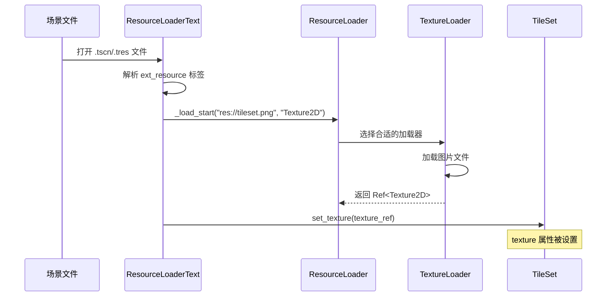

# TileMap 图片加载机制分析

## 结论

**TileSet 中的图片是通过 Godot 的通用资源加载系统（ResourceLoader）加载的，而不是通过 TileMap 特有的机制。**

---

## 详细分析

### 1. TileSet 的 texture 属性定义

在 `TileSetAtlasSource` 中，texture 是一个标准的资源引用属性：

```cpp
// scene/resources/2d/tile_set.cpp
ADD_PROPERTY(PropertyInfo(Variant::OBJECT, "texture", PROPERTY_HINT_RESOURCE_TYPE, "Texture2D", PROPERTY_USAGE_NO_EDITOR), "set_texture", "get_texture");
```

这意味着 `texture` 属性：
- 类型为 `Variant::OBJECT`
- 提示类型为 `Texture2D`
- 使用标准的 getter/setter 方法

### 2. 资源文件中的外部引用

当保存包含 TileSet 的场景或资源文件时，图片会被序列化为 `[ext_resource]` 标签：

```
[ext_resource type="Texture2D" uid="uid://xxx" path="res://tileset.png" id="1_abcd"]
```

### 3. 通用资源加载流程



### 4. 核心加载代码

在 `ResourceLoaderText::load()` 中，外部资源通过通用 API 加载：

```cpp
// scene/resources/resource_format_text.cpp
ext_resources[id].path = path;
ext_resources[id].type = type;
ext_resources[id].load_token = ResourceLoader::_load_start(
    path, 
    type, 
    use_sub_threads ? ResourceLoader::LOAD_THREAD_DISTRIBUTE : ResourceLoader::LOAD_THREAD_FROM_CURRENT, 
    cache_mode_for_external
);
```

### 5. 纹理专用加载器

Godot 注册了多个纹理格式加载器来处理不同类型的图片：

```cpp
// scene/register_scene_types.cpp
resource_loader_stream_texture.instantiate();
ResourceLoader::add_resource_format_loader(resource_loader_stream_texture);

resource_loader_texture_layered.instantiate();
ResourceLoader::add_resource_format_loader(resource_loader_texture_layered);
```

支持的纹理加载器包括：
- `ResourceFormatLoaderCompressedTexture2D` - 处理 `.ctex` 格式
- `ResourceFormatLoaderCompressedTextureLayered` - 处理分层纹理
- `ResourceFormatLoaderCompressedTexture3D` - 处理 3D 纹理

---

## 设计优势

| 特点 | 说明 |
|------|------|
| **解耦设计** | TileMap/TileSet 无需关心图片如何加载 |
| **复用机制** | 所有资源类型共享同一套加载/缓存系统 |
| **灵活扩展** | 新增图片格式只需添加 ResourceFormatLoader |
| **自动依赖** | ResourceLoader 自动处理嵌套资源依赖 |
| **缓存优化** | 同一图片被多个 TileSet 引用时只加载一次 |

---

## 相关源码文件

| 文件 | 职责 |
|------|------|
| `scene/resources/2d/tile_set.cpp` | TileSet/TileSetAtlasSource 实现，定义 texture 属性 |
| `scene/resources/resource_format_text.cpp` | 文本格式资源加载，处理 ext_resource |
| `core/io/resource_loader.cpp` | 通用资源加载器 |
| `scene/resources/compressed_texture.cpp` | 纹理专用加载器实现 |
| `scene/register_scene_types.cpp` | 注册各种资源加载器 |

---

## 总结

TileMap 系统完全依赖 Godot 的**通用属性序列化**和**通用资源加载**机制。TileSet 中的 `texture` 只是一个普通的 `Ref<Texture2D>` 属性，Godot 的资源系统会自动处理其加载、缓存和引用计数。

这种设计符合 Godot 的整体架构理念：**通过统一的资源系统管理所有类型的资源**，避免各个模块重复实现资源加载逻辑。

