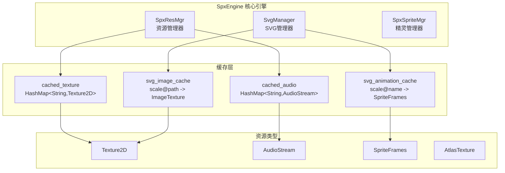
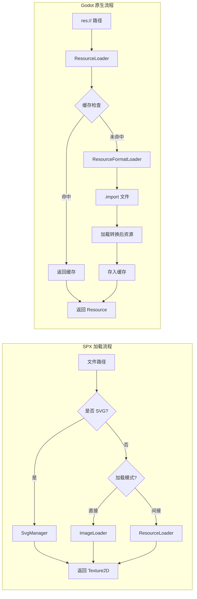
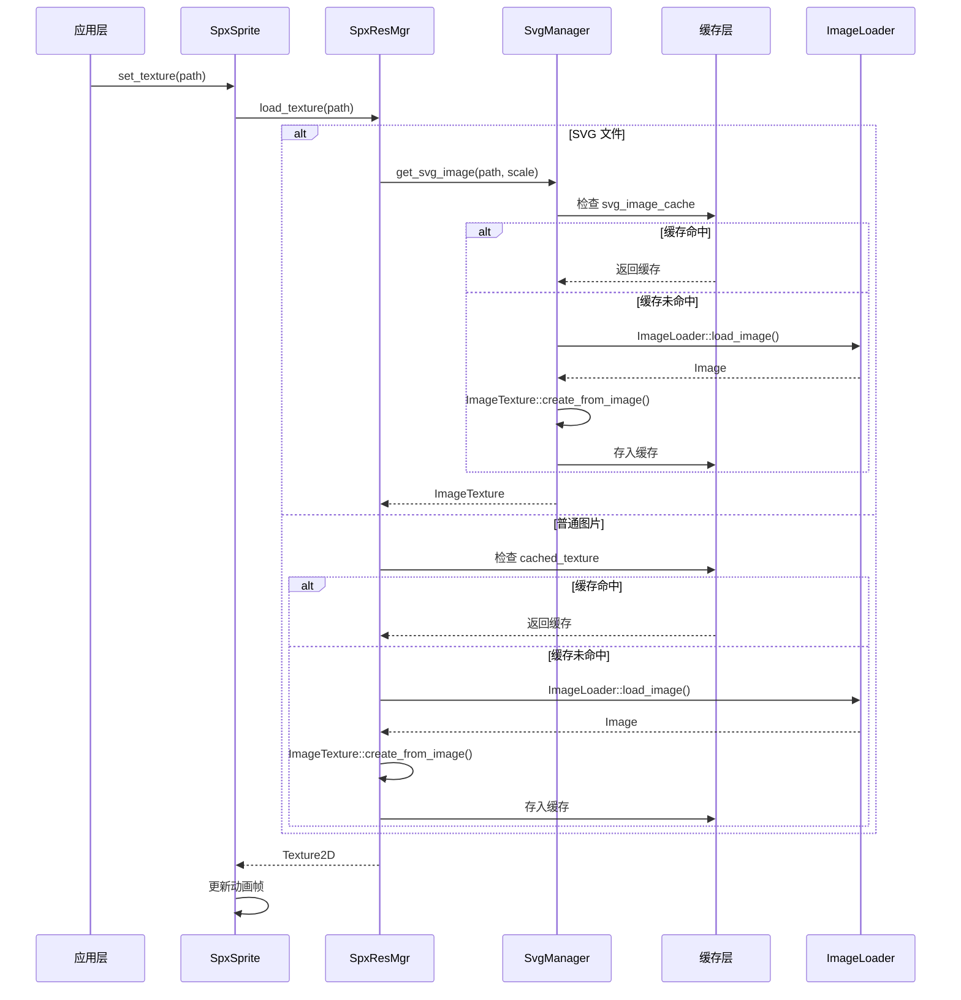
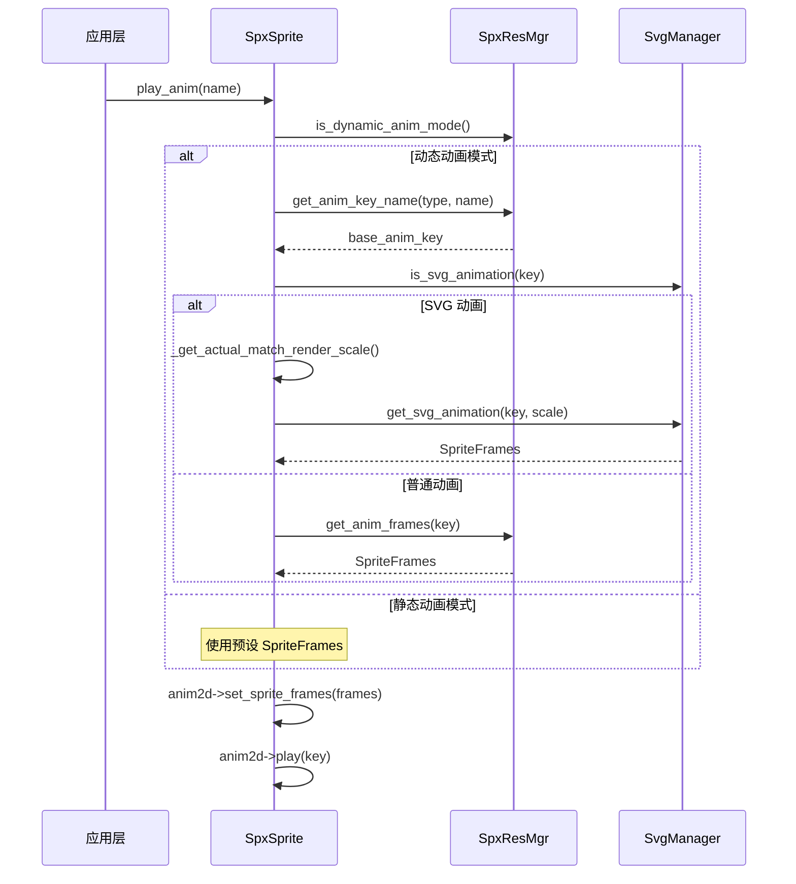

# SPX 资源加载机制分析与对比文档

## 一、架构总览

### SPX 资源加载架构



### 核心组件关系

SPX 资源系统由三个核心管理器组成：
- **SpxResMgr**: 主资源管理器，处理纹理、音频和动画资源的加载
- **SvgManager**: SVG 专用管理器，支持多缩放级别的矢量图形
- **SpxSpriteMgr**: 精灵管理器，负责精灵实例的创建和资源绑定

---

## 二、核心组件分析

### 2.1 SpxResMgr - 主资源管理器

**文件位置**: `modules/spx/spx_res_mgr.cpp`

**核心功能**:

| 方法 | 功能 | 加载方式 |
|------|------|----------|
| `load_texture()` | 加载纹理 | 支持直接/ResourceLoader |
| `load_audio()` | 加载音频 | 支持直接/ResourceLoader |
| `create_animation()` | 动态创建动画 | JSON 配置驱动 |
| `_load_texture_direct()` | 直接文件加载 | ImageLoader |
| `_load_audio_direct()` | 直接音频加载 | 原始解析 |

**双模式加载机制**:

```cpp
// 来自 spx_res_mgr.cpp:309-327
Ref<Texture2D> SpxResMgr::load_texture(String path, GdBool direct) {
    // SVG 文件走专用路径
    if (svgMgr->is_svg_file(path)) {
        return svgMgr->get_svg_image(path, 1);
    }
    
    // 直接模式: 绕过 ResourceLoader
    if (!is_load_direct && !direct) {
        Ref<Resource> res = ResourceLoader::load(path);
        return res;
    } else {
        return _load_texture_direct(path);  // 使用 ImageLoader
    }
}
```

**直接加载实现**:

```cpp
// spx_res_mgr.cpp:273-288
Ref<Texture2D> SpxResMgr::_load_texture_direct(const String &p_path) {
    String path = _to_engine_path(p_path);
    // 缓存检查
    if (cached_texture.has(path)) {
        return cached_texture[path];
    }

    Ref<Image> image;
    image.instantiate();
    _load_image(path, image);  // 使用 ImageLoader

    Ref<ImageTexture> texture = ImageTexture::create_from_image(image);
    cached_texture.insert(path, texture);  // 存入缓存
    return texture;
}
```

### 2.2 SvgManager - SVG 专用管理器

**文件位置**: `modules/spx/svg_mgr.cpp`

**核心特性**:
- 多缩放级别支持 (1x, 2x, 4x, 8x)
- 独立的图像/动画缓存
- 动态缩放计算

**缩放策略**:

```cpp
// svg_mgr.cpp:204-210
int SvgManager::calculate_svg_scale(float required_scale) {
    // 使用 2 的幂次缩放: 1, 2, 4, 8
    if (required_scale <= 1.5f) return 1;
    if (required_scale <= 3.0f) return 2;
    if (required_scale <= 6.0f) return 4;
    return 8;
}
```

**SVG 图像加载**:

```cpp
// svg_mgr.cpp:147-177
Ref<ImageTexture> SvgManager::_load_image(const String& path, int scale) {
    String key = _make_image_key(path, scale);
    
    // 缓存检查
    if (svg_image_cache.has(key)) {
        return svg_image_cache[key];
    }
    
    // 加载 SVG 并应用缩放
    Ref<Image> image;
    image.instantiate();
    Error err = ImageLoader::load_image(path, image, nullptr, 
                              ImageFormatLoader::FLAG_NONE, (float)scale);
    
    if (err == OK) {
        Ref<ImageTexture> texture;
        texture.instantiate();
        texture->set_image(image);
        texture->set_path_cache(path);
        
        // 缓存原始尺寸
        if(!svg_image_raw_size_cache.has(path)){
            svg_image_raw_size_cache[path] = Vector2(
                image->get_width()/scale,
                image->get_height()/scale
            );
        }
        
        svg_image_cache[key] = texture;
        return texture;
    }
    
    return Ref<ImageTexture>();
}
```

### 2.3 动画资源加载

**JSON 驱动的动态动画创建**:

SPX 支持通过 JSON 配置在运行时创建动画，无需编辑器预处理。

**AnimPayload 结构**:

```cpp
// spx_res_mgr.h:57-61
struct AnimPayload {
    String base_path;      // 图集基础路径
    Array frames;          // 帧数组
    int64_t max_bitmap;    // 最大位图尺寸
};
```

**动画创建流程**:

```cpp
// spx_res_mgr.cpp:370-404
void SpxResMgr::create_animation(
    GdString p_sprite_type,
    GdString p_anim_name,
    GdString p_json_ctx,  // JSON 配置
    GdInt fps,
    GdBool is_atlas) {
    
    is_dynamic_anim = true;
    String key = get_anim_key_name(sprite, clip);
    
    // 避免重复创建
    if (anim_frames->has_animation(key))
        return;

    AnimPayload payload;
    if (!_parse_anim_json(ctx, payload)) {
        print_error("animation JSON parse failed");
        return;
    }

    anim_frames->add_animation(key);
    anim_frames->set_animation_speed(key, fps);

    Vector<Vector2> offsets;
    
    if (is_atlas)
        _build_atlas_frames(key, payload, offsets);  // 图集模式
    else
        _build_normal_frames(sprite, key, payload, offsets);  // 普通模式

    // 存储帧偏移信息
    animation_frame_offsets[key] = offsets;
}
```

**普通帧构建**:

```cpp
// spx_res_mgr.cpp:187-229
void SpxResMgr::_build_normal_frames(
    const String &p_sprite_type, 
    const String &anim_key, 
    const AnimPayload &payload, 
    Vector<Vector2> &out_offsets) {
    
    int svg_count = 0;
    for (int i = 0; i < payload.frames.size(); i++) {
        Dictionary f = payload.frames[i];
        String path = f["path"];
        int64_t bitmap = f["bitmap"];
        Vector2 offset = _read_offset(f) / float(bitmap);

        Ref<Texture2D> final_tex;
        if (svgMgr->is_svg_file(path)) {
            float scale = float(payload.max_bitmap) / float(bitmap);
            final_tex = svgMgr->get_svg_image(path, scale);
            svg_count++;
        } else {
            final_tex = load_texture(path);
        }

        anim_frames->add_frame(anim_key, final_tex);
        out_offsets.push_back(offset);
    }

    svgMgr->mark_svg_animation(anim_key, svg_count > 0);
}
```

**图集帧构建**:

```cpp
// spx_res_mgr.cpp:231-255
void SpxResMgr::_build_atlas_frames(
    const String &anim_key, 
    const AnimPayload &payload, 
    Vector<Vector2> &out_offsets) {
    
    // 加载图集纹理
    Ref<Texture2D> atlas = load_texture(payload.base_path);
    
    for (int i = 0; i < payload.frames.size(); i++) {
        Dictionary f = payload.frames[i];
        int64_t x = f["x"], y = f["y"], w = f["w"], h = f["h"];
        Vector2 offset = _read_offset(f);

        // 创建图集纹理区域
        Ref<AtlasTexture> tex;
        tex.instantiate();
        tex->set_atlas(atlas);
        tex->set_region(Rect2(x, y, w, h));

        anim_frames->add_frame(anim_key, tex);
        out_offsets.push_back(offset);
    }
}
```

### 2.4 音频资源加载

**支持的格式**: WAV, MP3

**WAV 加载**:

```cpp
// spx_res_mgr.cpp:88-92
Ref<AudioStreamWAV> SpxResMgr::_load_wav(const String &path) {
    Ref<AudioStreamWAV> sample;
    AudioImporterWav::import_asset(sample, path);
    return sample;
}
```

**MP3 加载**:

```cpp
// spx_res_mgr.cpp:94-117
static Ref<AudioStream> _import_mp3(const String &p_path) {
#ifdef MODULE_MINIMP3_ENABLED
    Ref<FileAccess> f = FileAccess::open(p_path, FileAccess::READ);
    ERR_FAIL_COND_V(f.is_null(), Ref<AudioStreamMP3>());

    uint64_t len = f->get_length();
    Vector<uint8_t> data;
    data.resize(len);
    uint8_t *w = data.ptrw();
    f->get_buffer(w, len);

    Ref<AudioStreamMP3> mp3_stream;
    mp3_stream.instantiate();
    mp3_stream->set_data(data);
    
    return mp3_stream;
#else
    return Ref<AudioStream>();
#endif
}
```

---

## 三、SPX vs Godot 原生加载机制对比

### 3.1 设计理念对比

| 维度 | SPX 资源系统 | Godot 原生系统 |
|------|-------------|----------------|
| **设计目标** | 运行时动态加载，无需预处理 | 编辑器导入 + 运行时加载 |
| **资源格式** | 原始文件 (png/jpg/svg/wav/mp3) | 导入后的 .tres/.import 文件 |
| **缓存策略** | 简单 HashMap 内存缓存 | 多级缓存 + UID 追踪 |
| **线程模型** | 同步加载 | 支持异步/多线程加载 |
| **路径系统** | 自定义路径转换 | res:// user:// 标准路径 |
| **依赖管理** | 无 | 完整依赖追踪 |
| **UID 支持** | 无 | 支持资源唯一标识 |

### 3.2 加载流程对比



### 3.3 缓存机制对比

**SPX 缓存** (`spx_res_mgr.h:70-71`):

```cpp
// 简单的 HashMap 缓存
HashMap<String, Ref<Texture2D>> cached_texture;
HashMap<String, Ref<AudioStream>> cached_audio;
```

**Godot 原生缓存** (`core/io/resource_loader.h`):

```cpp
// 多级缓存系统
static HashMap<String, ThreadLoadTask> thread_load_tasks;

// 缓存模式枚举
enum CacheMode {
    CACHE_MODE_IGNORE,       // 不使用缓存
    CACHE_MODE_REUSE,        // 重用现有缓存
    CACHE_MODE_REPLACE,      // 替换缓存
    CACHE_MODE_IGNORE_DEEP,  // 深度忽略
    CACHE_MODE_REPLACE_DEEP, // 深度替换
};
```

### 3.4 音频加载对比

| 特性 | SPX | Godot |
|------|-----|-------|
| **WAV 加载** | `AudioImporterWav::import_asset` | `ResourceImporterWAV` |
| **MP3 加载** | 直接读取字节流 | 编辑器预导入 |
| **OGG 支持** | 不支持 | 支持（需导入） |
| **流式播放** | 不支持 | 支持 |
| **压缩选项** | 固定 | 可配置 |

### 3.5 线程支持对比

**Godot ResourceLoader 线程加载**:

```cpp
// core/io/resource_loader.h:229-231
static Error load_threaded_request(
    const String &p_path, 
    const String &p_type_hint = "", 
    bool p_use_sub_threads = false, 
    ResourceFormatLoader::CacheMode p_cache_mode = ResourceFormatLoader::CACHE_MODE_REUSE
);

static ThreadLoadStatus load_threaded_get_status(const String &p_path, float *r_progress = nullptr);
static Ref<Resource> load_threaded_get(const String &p_path, Error *r_error = nullptr);
```

**SPX**: 仅支持同步加载，无线程安全设计。

---

## 四、SPX 特有功能

### 4.1 动态帧偏移系统

SPX 支持每帧独立的偏移量，用于精确的动画对齐：

```cpp
// spx_res_mgr.h:77
HashMap<String, Vector<Vector2>> animation_frame_offsets;

// 运行时获取帧偏移
// spx_res_mgr.cpp:530-538
Vector2 SpxResMgr::get_animation_frame_offset(String anim_key, int frame_index) {
    if (animation_frame_offsets.has(anim_key)) {
        const Vector<Vector2>& offsets = animation_frame_offsets[anim_key];
        if (frame_index >= 0 && frame_index < offsets.size()) {
            return offsets[frame_index];
        }
    }
    return Vector2(0, 0);
}
```

**精灵中的使用**:

```cpp
// spx_sprite.cpp:900-918
void SpxSprite::_on_frame_changed() {
    if (enable_dynamic_frame_offset) {
        String current_anim = String(anim2d->get_animation());
        int current_frame = anim2d->get_frame();
        
        Vector2 frame_offset = resMgr->get_animation_frame_offset(
            current_anim, 
            current_frame
        );
        
        Vector2 final_offset = base_offset + frame_offset;
        anim2d->set_offset(final_offset);
    }
}
```

### 4.2 热重载支持

SPX 提供简单的缓存失效机制，支持资源热重载：

```cpp
// spx_res_mgr.cpp:337-347
void SpxResMgr::update_caches(const Vector<String>& files) {
    if (cached_texture.is_empty() && cached_audio.is_empty()) {
        return;
    }
    for(auto& file : files){
        auto path = _to_engine_path(file);
        cached_texture.erase(path);  // 清除纹理缓存
        cached_audio.erase(path);    // 清除音频缓存
    }
}

// svg_mgr.cpp:189-197
void SvgManager::update_caches(const Vector<String> &files) {
    if (svg_image_cache.is_empty()) {
        return;
    }
    for(auto& file : files){
        String path = resMgr->_to_engine_path(file);
        svg_image_cache.erase(path);
    }
}
```

**触发热重载**:

```cpp
// spx_res_mgr.cpp:329-335
void SpxResMgr::set_game_datas(String path, Vector<String> files) {
    game_data_root = path;
    platformMgr->_set_persistant_data_dir(path);
    update_caches(files);          // 更新主缓存
    svgMgr->update_caches(files);  // 更新 SVG 缓存
}
```

### 4.3 SVG 动态缩放

精灵根据实际渲染尺寸自动选择合适的 SVG 缩放版本，避免模糊：

```cpp
// spx_sprite.cpp:819-870
void SpxSprite::update_anim_scale(){
    GdVec2 finalScale = _render_scale;
    auto target_scale = _get_actual_match_render_scale();
    
    if(target_scale != current_svg_scale){
        current_svg_scale = target_scale;
        if(is_svg_mode){
            if(is_single_image_mode){
                // 单图模式：直接获取缩放后的 SVG
                Ref<Texture2D> texture = svgMgr->get_svg_image(current_svg_path, target_scale);
                _play_single_image_animation(texture);
            } else { 
                // 动画模式：获取缩放后的动画帧集
                auto frames = svgMgr->get_svg_animation(base_anim_key, target_scale);
                if (frames.is_valid()) {
                    anim2d->set_sprite_frames(frames);
                    // ... 恢复动画状态
                }
            }
        }
    }
    
    // 调整渲染缩放以匹配 SVG 缩放
    if(is_svg_mode){
        finalScale.x = finalScale.x / current_svg_scale;
        finalScale.y = finalScale.y / current_svg_scale;
    }
    anim2d->set_scale(finalScale);
}
```

**实际渲染缩放计算**:

```cpp
// spx_sprite.cpp:882-898
Vector2 SpxSprite::_get_actual_render_scale() {
    if (!anim2d) {
        return Vector2(1.0f, 1.0f);
    }
    
    // 获取全局变换缩放
    Vector2 global_scale = get_global_transform().get_scale() * _render_scale;
    
    // 考虑摄像机缩放
    auto camera_mgr = SpxEngine::get_singleton()->get_camera();
    if (camera_mgr) {
        Vector2 camera_zoom = camera_mgr->get_camera_zoom();
        global_scale *= camera_zoom;
    }
    
    return global_scale;
}
```

### 4.4 路径转换系统

SPX 使用自定义路径转换，支持灵活的资源目录配置：

```cpp
// spx_res_mgr.cpp:77-86
String SpxResMgr::_to_engine_path(const String &p_path){
    String path = p_path;
    // 排除持久化目录路径
    if (!path.begins_with(platformMgr->_get_persistant_data_dir()) 
        && game_data_root != "res://") {
        // 处理相对路径
        if (path.begins_with("../")) {
            path = path.substr(3, -1);
        }
        path = game_data_root + "/" + path;
    }
    return path;
}
```

---

## 五、数据流图

### 5.1 纹理加载数据流



### 5.2 动画加载数据流



---

## 六、文件结构说明

### 核心文件

| 文件 | 功能 |
|------|------|
| `spx_res_mgr.h/cpp` | 主资源管理器，处理纹理、音频和动画 |
| `svg_mgr.h/cpp` | SVG 专用管理器，多缩放支持 |
| `spx_sprite.h/cpp` | 精灵类，资源消费者 |
| `spx_engine.h/cpp` | 引擎核心，管理器生命周期 |
| `spx_audio_mgr.h/cpp` | 音频管理器，音频实例管理 |

### 数据结构

```cpp
// 普通帧信息
struct FrameNormal {
    String path;      // 图片路径
    double offset_x;  // X 偏移
    double offset_y;  // Y 偏移
    int64_t bitmap;   // 位图尺寸
};

// 图集帧信息
struct FrameAtlas {
    int64_t x, y, w, h;  // 图集区域
    double offset_x;      // X 偏移
    double offset_y;      // Y 偏移
};

// 动画载荷
struct AnimPayload {
    String base_path;     // 图集基础路径
    Array frames;         // 帧数组
    int64_t max_bitmap;   // 最大位图尺寸
};
```

---

## 七、总结

### SPX 资源系统优势

1. **零导入开销**: 直接使用原始资源文件，无需编辑器预处理，适合快速迭代
2. **动态配置**: JSON 驱动的动画创建，运行时灵活配置资源
3. **SVG 智能缩放**: 根据渲染尺寸自动选择最佳分辨率，保持矢量图清晰度
4. **热重载友好**: 简单的缓存失效机制，支持开发时快速更新资源
5. **帧偏移支持**: 每帧独立偏移，适合复杂动画对齐需求

### SPX 资源系统局限

1. **同步加载**: 不支持异步加载，大资源可能导致帧率下降
2. **缓存简单**: 无 LRU 等高级缓存策略，内存管理较为粗放
3. **格式有限**: 仅支持常见图像/音频格式，不支持 OGG 等
4. **无依赖追踪**: 不支持资源依赖管理
5. **无 UID 系统**: 资源重命名可能导致引用失效

### 适用场景

| 场景 | 推荐系统 | 原因 |
|------|----------|------|
| 教育/快速原型 | SPX | 零配置，快速迭代 |
| 需要动态资源 | SPX | 运行时加载灵活 |
| 大型游戏项目 | Godot 原生 | 异步加载，依赖管理 |
| 需要优化包体 | Godot 原生 | 资源压缩优化 |
| 复杂资源引用 | Godot 原生 | UID 和依赖追踪 |

---

## 八、API 速查表

### SpxResMgr API

| 方法 | 参数 | 返回值 | 说明 |
|------|------|--------|------|
| `load_texture` | path, direct | Texture2D | 加载纹理 |
| `load_audio` | path, direct | AudioStream | 加载音频 |
| `create_animation` | type, name, json, fps, is_atlas | void | 创建动画 |
| `get_anim_frames` | anim_name | SpriteFrames | 获取动画帧集 |
| `get_anim_key_name` | sprite_type, anim_name | String | 生成动画键名 |
| `reload_texture` | path | void | 重新加载纹理 |
| `set_load_mode` | is_direct | void | 设置加载模式 |
| `get_image_size` | path | Vec2 | 获取图片尺寸 |
| `read_all_text` | path | String | 读取文本文件 |
| `has_file` | path | Bool | 检查文件存在 |

### SvgManager API

| 方法 | 参数 | 返回值 | 说明 |
|------|------|--------|------|
| `get_svg_image` | path, scale | ImageTexture | 获取 SVG 纹理 |
| `get_svg_animation` | anim_key, scale | SpriteFrames | 获取 SVG 动画 |
| `is_svg_file` | path | bool | 检查是否 SVG |
| `is_svg_animation` | anim_key | bool | 检查是否 SVG 动画 |
| `calculate_svg_scale` | scale | int | 计算最佳缩放级别 |
| `update_caches` | files | void | 更新缓存 |
| `reset` | clear_image_cache | void | 重置缓存 |

