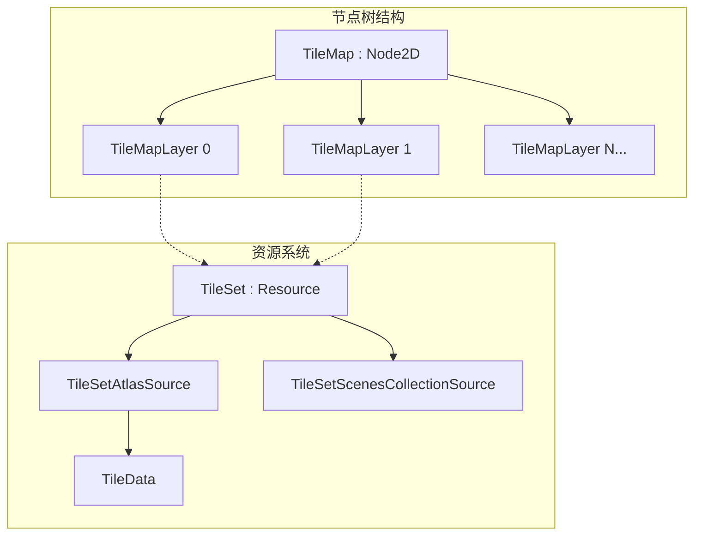
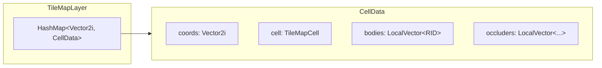
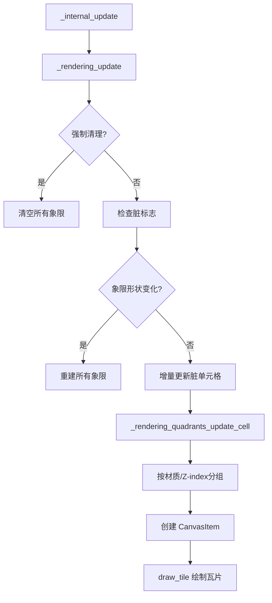
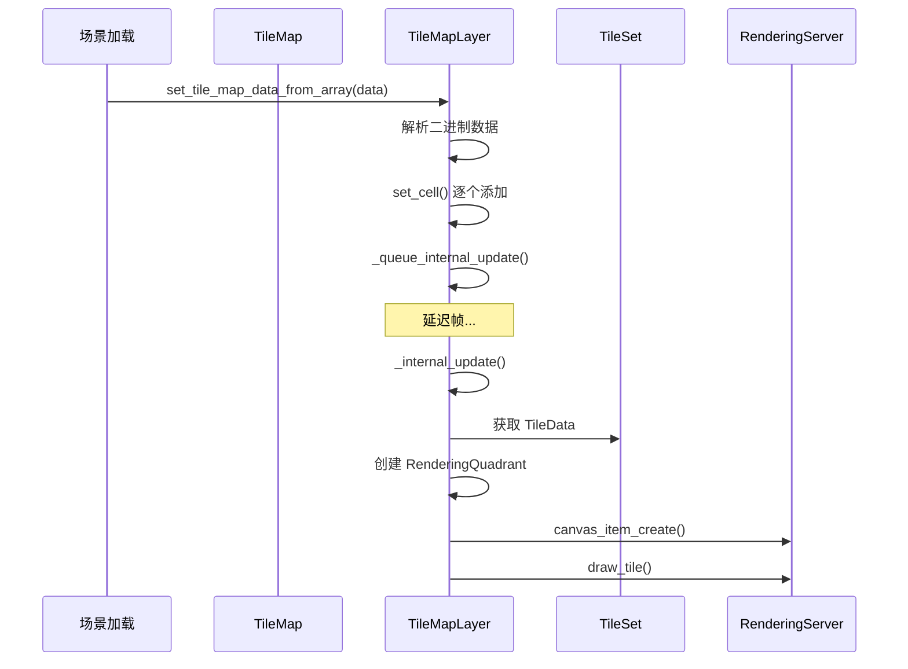

# Godot TileMap 架构分析文档

## 1. 整体架构概述

Godot TileMap 系统采用**分层架构**设计，核心分为三个主要部分：

- **TileMap** (Node2D)：兼容层/容器节点，管理多个 TileMapLayer
- **TileMapLayer** (Node2D)：实际的瓦片数据和渲染逻辑
- **TileSet** (Resource)：瓦片资源定义，包含图集、物理、导航等配置



---

## 2. 核心类层次结构

### 2.1 TileMap 类 ([tile_map.h](scene/2d/tile_map.h))

```cpp
class TileMap : public Node2D {
    // 数据格式版本控制
    mutable TileMapDataFormat format = TILE_MAP_DATA_FORMAT_3;
    
    // 核心属性
    Ref<TileSet> tile_set;
    int rendering_quadrant_size = 16;
    bool collision_animatable = false;
    
    // 层管理
    LocalVector<TileMapLayer *> layers;
};
```

**TileMap 主要职责：**

- 作为多个 TileMapLayer 的容器
- 提供向后兼容的 API（已标记为 deprecated）
- 管理 TileSet 资源引用
- 将操作委托给子 TileMapLayer

### 2.2 TileMapLayer 类 ([tile_map_layer.h](scene/2d/tile_map_layer.h))

```cpp
class TileMapLayer : public Node2D {
    // 核心数据存储
    HashMap<Vector2i, CellData> tile_map_layer_data;
    
    // 渲染象限
    HashMap<Vector2i, Ref<RenderingQuadrant>> rendering_quadrant_map;
    
    // 物理体映射
    HashMap<RID, Vector2i> bodies_coords;
    
    // 脏标志系统
    struct {
        bool flags[DIRTY_FLAGS_MAX] = { false };
        SelfList<CellData>::List cell_list;
    } dirty;
};
```

### 2.3 CellData 结构

```cpp
struct CellData {
    Vector2i coords;              // 单元格坐标
    TileMapCell cell;             // 瓦片标识 (source_id, atlas_coords, alternative)
    
    // 渲染相关
    Ref<RenderingQuadrant> rendering_quadrant;
    LocalVector<LocalVector<RID>> occluders;
    
    // 物理相关
    LocalVector<RID> bodies;
    
    // 导航相关
    LocalVector<RID> navigation_regions;
    
    // 场景实例
    String scene;
    
    // 运行时缓存
    TileData *runtime_tile_data_cache = nullptr;
};
```

### 2.4 TileMapCell 联合体 ([tile_set.h](scene/resources/2d/tile_set.h))

```cpp
union TileMapCell {
    struct {
        int16_t source_id;        // 来源 ID
        int16_t coord_x;          // Atlas X 坐标
        int16_t coord_y;          // Atlas Y 坐标
        int16_t alternative_tile; // 替代瓦片 ID（含翻转标志）
    };
    uint64_t _u64t;  // 用于高效哈希
};
```

---

## 3. 数据存储与序列化

### 3.1 内存数据结构



**数据存储特点：**

- 使用 `HashMap<Vector2i, CellData>` 存储稀疏瓦片数据
- 空单元格不占用存储空间
- Vector2i 作为键支持负坐标

### 3.2 二进制序列化格式

**TileMapLayer 数据格式 (FORMAT_0):**

| 偏移 | 大小 | 内容 |

|------|------|------|

| 0 | 2 bytes | 格式版本号 |

| 2 | 12 bytes | 第一个 Cell 数据 |

| ... | 12 bytes | 后续 Cell 数据 |

**每个 Cell 的 12 字节结构：**

| 偏移 | 大小 | 内容 |

|------|------|------|

| 0-1 | int16 | X 坐标 |

| 2-3 | int16 | Y 坐标 |

| 4-5 | uint16 | source_id |

| 6-7 | uint16 | atlas_coords.x |

| 8-9 | uint16 | atlas_coords.y |

| 10-11 | uint16 | alternative_tile |

### 3.3 加载解析流程

```cpp
// tile_map_layer.cpp: set_tile_map_data_from_array()
void TileMapLayer::set_tile_map_data_from_array(const Vector<uint8_t> &p_data) {
    // 1. 读取格式版本
    uint16_t format = decode_uint16(&ptr[index]);
    
    // 2. 清空现有数据
    clear();
    
    // 3. 逐个解析 Cell
    while (index < size) {
        int16_t x = decode_uint16(&cell_data_ptr[0]);
        int16_t y = decode_uint16(&cell_data_ptr[2]);
        uint16_t source_id = decode_uint16(&cell_data_ptr[4]);
        // ...
        set_cell(Vector2i(x, y), source_id, atlas_coords, alternative_tile);
    }
}
```

---

## 4. 渲染系统 (Quadrant 架构)

### 4.1 RenderingQuadrant 结构

```cpp
class RenderingQuadrant : public RefCounted {
    Vector2i quadrant_coords;           // 象限坐标
    SelfList<CellData>::List cells;     // 象限内的单元格列表
    List<RID> canvas_items;             // Canvas Item RID 列表
    Vector2 canvas_items_position;      // 象限世界位置
};
```

### 4.2 渲染流程



### 4.3 象限分配策略

```cpp
// Y-Sort 模式：每个 Y 位置一个象限
if (is_y_sort_enabled()) {
    canvas_items_position = Vector2(0, map_to_local(coords).y + tile_y_sort_origin);
    quadrant_coords = canvas_items_position * 100;
}
// 普通模式：按 rendering_quadrant_size 分组
else {
    quadrant_coords = Vector2i(
        coords.x / rendering_quadrant_size,
        coords.y / rendering_quadrant_size
    );
}
```

---

## 5. 脏标志与增量更新系统

### 5.1 脏标志枚举

```cpp
enum DirtyFlags {
    DIRTY_FLAGS_LAYER_ENABLED,
    DIRTY_FLAGS_LAYER_IN_TREE,
    DIRTY_FLAGS_LAYER_LOCAL_TRANSFORM,
    DIRTY_FLAGS_LAYER_VISIBILITY,
    DIRTY_FLAGS_LAYER_Y_SORT_ENABLED,
    DIRTY_FLAGS_LAYER_RENDERING_QUADRANT_SIZE,
    DIRTY_FLAGS_LAYER_COLLISION_ENABLED,
    DIRTY_FLAGS_TILE_SET,
    // ... 更多标志
};
```

### 5.2 延迟更新机制

```cpp
void TileMapLayer::_queue_internal_update() {
    if (pending_update) return;
    if (is_inside_tree()) {
        pending_update = true;
        callable_mp(this, &TileMapLayer::_deferred_internal_update).call_deferred();
    }
}

void TileMapLayer::_internal_update(bool p_force_cleanup) {
    _build_runtime_update_tile_data(p_force_cleanup);  // 运行时数据
    _rendering_update(p_force_cleanup);                 // 渲染更新
    _physics_update(p_force_cleanup);                   // 物理更新
    _navigation_update(p_force_cleanup);                // 导航更新
    _scenes_update(p_force_cleanup);                    // 场景更新
    
    // 清理脏标志
    for (int i = 0; i < DIRTY_FLAGS_MAX; i++)
        dirty.flags[i] = false;
    dirty.cell_list.clear();
}
```

---

## 6. TileSet 资源系统

### 6.1 TileSet 核心配置

```cpp
class TileSet : public Resource {
    // 瓦片形状与布局
    TileShape tile_shape = TILE_SHAPE_SQUARE;  // SQUARE/ISOMETRIC/HEXAGON
    TileLayout tile_layout = TILE_LAYOUT_STACKED;
    Size2i tile_size = Size2i(16, 16);
    
    // 功能层配置
    Vector<OcclusionLayer> occlusion_layers;   // 光遮挡
    Vector<PhysicsLayer> physics_layers;        // 物理碰撞
    Vector<NavigationLayer> navigation_layers;  // 导航网格
    Vector<TerrainSet> terrain_sets;            // 地形系统
    Vector<CustomDataLayer> custom_data_layers; // 自定义数据
    
    // 瓦片来源
    HashMap<int, Ref<TileSetSource>> sources;
};
```

### 6.2 TileSetAtlasSource

```cpp
class TileSetAtlasSource : public TileSetSource {
    Ref<Texture2D> texture;
    Vector2i margins;
    Vector2i separation;
    Size2i texture_region_size = Size2i(16, 16);
    
    // 瓦片数据
    HashMap<Vector2i, TileAlternativesData> tiles;
    
    struct TileAlternativesData {
        Vector2i size_in_atlas;
        HashMap<int, TileData *> alternatives;
        // 动画配置...
    };
};
```

### 6.3 TileData 数据

```cpp
class TileData : public Object {
    // 渲染属性
    bool flip_h, flip_v, transpose;
    Vector2i texture_origin;
    Color modulate;
    int z_index, y_sort_origin;
    
    // 物理碰撞
    Vector<PhysicsLayerTileData> physics;
    
    // 导航网格
    Vector<NavigationLayerTileData> navigation;
    
    // 地形
    int terrain_set = -1;
    int terrain = -1;
    int terrain_peering_bits[16];
    
    // 自定义数据
    Vector<Variant> custom_data;
};
```

---

## 7. 坐标系统

### 7.1 坐标转换

```cpp
// TileSet::map_to_local() - 地图坐标 -> 本地坐标
Vector2 TileSet::map_to_local(const Vector2i &p_pos) const;

// TileSet::local_to_map() - 本地坐标 -> 地图坐标
Vector2i TileSet::local_to_map(const Vector2 &p_pos) const;
```

### 7.2 支持的瓦片形状

| 形状 | 布局选项 | 邻居计算 |

|------|---------|---------|

| SQUARE | STACKED | 4/8 方向 |

| ISOMETRIC | STACKED/DIAMOND | 4 方向 |

| HEXAGON | STACKED/OFFSET | 6 方向 |

| HALF_OFFSET_SQUARE | STAIRS/DIAMOND | 可变 |

---

## 8. 关键数据流



---

## 9. 文件组织

| 文件 | 职责 |

|------|------|

| `scene/2d/tile_map.h/cpp` | TileMap 容器节点（兼容层） |

| `scene/2d/tile_map_layer.h/cpp` | TileMapLayer 核心实现 |

| `scene/resources/2d/tile_set.h/cpp` | TileSet 资源定义 |

---

## 10. 设计亮点总结

1. **稀疏存储**: HashMap 存储只记录有效瓦片，空白区域无开销
2. **象限批处理**: RenderingQuadrant 将相邻瓦片合并绘制，减少 Draw Call
3. **延迟更新**: 脏标志 + deferred call 避免频繁重建
4. **二进制紧凑格式**: 每个 Cell 仅 12 字节，高效序列化
5. **版本兼容**: 数据格式有版本号，支持旧数据迁移
6. **模块化子系统**: 渲染/物理/导航/场景独立更新管道
7. **运行时 TileData 覆盖**: 支持动态修改瓦片属性