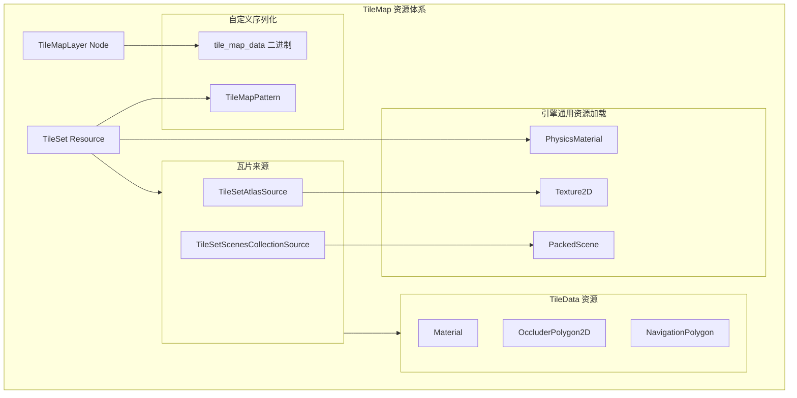
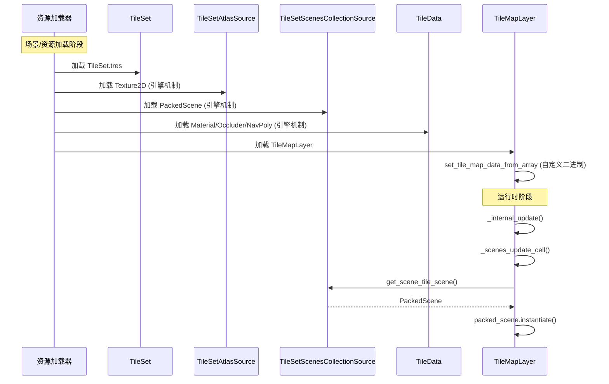
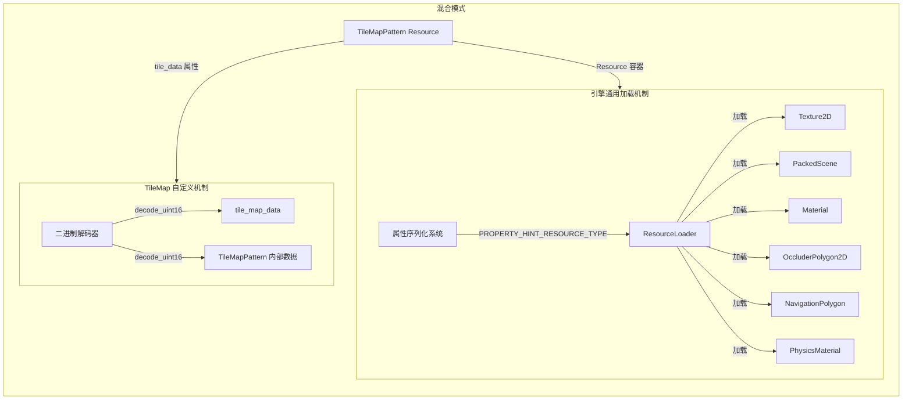

# TileMap 资源与数据加载方式分析文档

## 概述

TileMap 系统除了图片纹理资源外，还涉及多种其他资源类型。本文档详细分析所有涉及的资源及其加载机制。

---

## 1. 资源分类总览

TileMap 中的数据可分为两大类：

1. **Resource 引用类型** - 通过 Godot 引擎通用资源机制加载
2. **自定义序列化数据** - 通过 TileMap 自身的二进制格式加载



---

## 2. 引擎通用机制加载的资源

以下资源通过 Godot 的标准属性序列化机制加载（`_set`/`_get` + `PROPERTY_HINT_RESOURCE_TYPE`）：

### 2.1 TileSetAtlasSource 资源

| 资源类型 | 属性名 | 代码位置 | 说明 |

|---------|-------|---------|------|

| **Texture2D** | `texture` | [tile_set.cpp:5504](scene/resources/2d/tile_set.cpp) | 瓦片图集纹理 |

```cpp
// tile_set.cpp:5504
ADD_PROPERTY(PropertyInfo(Variant::OBJECT, "texture", 
    PROPERTY_HINT_RESOURCE_TYPE, "Texture2D", PROPERTY_USAGE_NO_EDITOR), 
    "set_texture", "get_texture");
```

### 2.2 TileSetScenesCollectionSource 资源

| 资源类型 | 属性名 | 代码位置 | 说明 |

|---------|-------|---------|------|

| **PackedScene** | `scenes/N/scene` | [tile_set.cpp:5929](scene/resources/2d/tile_set.cpp) | 场景瓦片的预制场景 |

```cpp
// tile_set.cpp:5929 - 动态属性
p_list->push_back(PropertyInfo(Variant::OBJECT, 
    vformat("scenes/%d/scene", scenes_ids[i]), 
    PROPERTY_HINT_RESOURCE_TYPE, "TileSetScenesCollectionSource"));
```

### 2.3 TileSet 层配置资源

| 资源类型 | 属性名 | 代码位置 | 说明 |

|---------|-------|---------|------|

| **PhysicsMaterial** | `physics_layer_N/physics_material` | [tile_set.cpp:4212](scene/resources/2d/tile_set.cpp) | 物理层材质 |

| **TileMapPattern** | `pattern_N` | [tile_set.cpp:4262](scene/resources/2d/tile_set.cpp) | 瓦片图案模板 |

### 2.4 TileData (每个瓦片的数据) 资源

| 资源类型 | 属性名 | 代码位置 | 说明 |

|---------|-------|---------|------|

| **Material** | `material` | [tile_set.cpp:7139](scene/resources/2d/tile_set.cpp) | 瓦片材质 (CanvasItemMaterial/ShaderMaterial) |

| **OccluderPolygon2D** | `occlusion_layer_N/polygon_M/polygon` | [tile_set.cpp:6971](scene/resources/2d/tile_set.cpp) | 光遮挡多边形 |

| **NavigationPolygon** | `navigation_layer_N/polygon` | [tile_set.cpp:7040](scene/resources/2d/tile_set.cpp) | 导航网格多边形 |

### 2.5 TileMapLayer 引用的资源

| 资源类型 | 属性名 | 代码位置 | 说明 |

|---------|-------|---------|------|

| **TileSet** | `tile_set` | [tile_map_layer.cpp:1891](scene/2d/tile_map_layer.cpp) | TileSet 资源引用 |

---

## 3. TileMap 自身特殊加载机制

以下数据使用 TileMap 自定义的二进制序列化格式：

### 3.1 TileMapLayer 瓦片数据 (`tile_map_data`)

**属性定义：**

```cpp
// tile_map_layer.cpp:1888
ADD_PROPERTY(PropertyInfo(Variant::PACKED_BYTE_ARRAY, "tile_map_data", 
    PROPERTY_HINT_NONE, "", PROPERTY_USAGE_NO_EDITOR), 
    "set_tile_map_data_from_array", "get_tile_map_data_as_array");
```

**二进制格式 (每个 Cell 12 字节)：**

| 偏移 | 大小 | 内容 |

|------|------|------|

| 0-1 | int16 | 格式版本号 (仅首次) |

| 0-1 | int16 | X 坐标 |

| 2-3 | int16 | Y 坐标 |

| 4-5 | uint16 | source_id |

| 6-7 | uint16 | atlas_coords.x |

| 8-9 | uint16 | atlas_coords.y |

| 10-11 | uint16 | alternative_tile |

**解析代码：**

```cpp
// tile_map_layer.cpp:2800-2840
void TileMapLayer::set_tile_map_data_from_array(const Vector<uint8_t> &p_data) {
    // 读取格式版本
    uint16_t format = decode_uint16(&ptr[index]);
    
    // 清空并逐个解析 Cell
    while (index < size) {
        int16_t x = decode_uint16(&cell_data_ptr[0]);
        int16_t y = decode_uint16(&cell_data_ptr[2]);
        uint16_t source_id = decode_uint16(&cell_data_ptr[4]);
        // ...
        set_cell(Vector2i(x, y), source_id, atlas_coords, alternative_tile);
    }
}
```

### 3.2 TileMapPattern 数据

**属性定义：**

```cpp
// tile_set.cpp:205
p_list->push_back(PropertyInfo(Variant::OBJECT, "tile_data", 
    PROPERTY_HINT_NONE, "", PROPERTY_USAGE_NO_EDITOR | PROPERTY_USAGE_INTERNAL));
```

**格式：** 与 TileMapLayer 相同的 12 字节/Cell 格式

---

## 4. 运行时动态创建的资源

以下资源在运行时由 TileMap 系统内部动态创建，不参与序列化：

| 资源类型 | 创建位置 | 说明 |

|---------|---------|------|

| **ArrayMesh** | TileSet 构造函数 | `tile_lines_mesh`, `tile_filled_mesh` 用于绘制 |

| **CanvasTexture** | TileSetAtlasSource | `padded_texture` 纹理填充 |

| **ConvexPolygonShape2D** | TileData 物理层 | 碰撞形状 (从点数据生成) |

---

## 5. 场景瓦片的实例化流程

场景类型瓦片 (TileSetScenesCollectionSource) 的实例化不是资源加载，而是运行时实例化：

```cpp
// tile_map_layer.cpp:1289
void TileMapLayer::_scenes_update_cell(CellData &r_cell_data) {
    Ref<PackedScene> packed_scene = scenes_collection_source->get_scene_tile_scene(c.alternative_tile);
    if (packed_scene.is_valid()) {
        Node *scene = packed_scene->instantiate();  // 运行时实例化
        // 设置位置变换...
        add_child(scene);
    }
}
```

---

## 6. 数据流与加载顺序



---

## 7. 总结对比表

| 数据类型 | 加载机制 | 序列化方式 | 备注 |

|---------|---------|-----------|------|

| Texture2D | 引擎通用 | 属性系统 + ResourceLoader | 标准资源加载 |

| PackedScene | 引擎通用 | 属性系统 + ResourceLoader | 标准资源加载 |

| PhysicsMaterial | 引擎通用 | 属性系统 + ResourceLoader | 标准资源加载 |

| Material | 引擎通用 | 属性系统 + ResourceLoader | 标准资源加载 |

| OccluderPolygon2D | 引擎通用 | 属性系统 + ResourceLoader | 标准资源加载 |

| NavigationPolygon | 引擎通用 | 属性系统 + ResourceLoader | 标准资源加载 |

| TileSet | 引擎通用 | 属性系统 + ResourceLoader | 标准资源加载 |

| TileMapPattern | 引擎通用 (容器) | 内部使用自定义二进制 | 混合模式 |

| **tile_map_data** | **TileMap 自身** | **自定义二进制格式** | **12字节/Cell** |

| ConvexPolygonShape2D | 运行时生成 | 不序列化 | 从点数据创建 |

| ArrayMesh | 运行时生成 | 不序列化 | 内部绘制用 |

---

## 8. 详细资源说明

### 8.1 TileSetScenesCollectionSource (场景瓦片集合源)

**定义位置：** [tile_set.h:781-829](scene/resources/2d/tile_set.h)

**作用：** TileSetScenesCollectionSource 是 TileSet 中的一种瓦片来源类型，允许将 **PackedScene（预制场景）** 作为瓦片使用。与 TileSetAtlasSource（图集纹理瓦片）不同，它可以将完整的节点场景实例化到 TileMap 的指定位置。

**使用场景：**
- 需要在 TileMap 中放置复杂对象（如带动画的角色、交互物品）
- 瓦片需要有自定义脚本逻辑
- 瓦片需要包含多个子节点的复杂结构

**数据结构：**
```cpp
// tile_set.h:781-791
class TileSetScenesCollectionSource : public TileSetSource {
private:
    struct SceneData {
        Ref<PackedScene> scene;           // 关联的预制场景
        bool display_placeholder = false;  // 编辑器中是否显示占位符
    };
    Vector<int> scenes_ids;               // 场景瓦片 ID 列表
    HashMap<int, SceneData> scenes;       // ID -> 场景数据映射
};
```

**配置格式 (.tres 文件示例)：**
```
[sub_resource type="TileSetScenesCollectionSource" id="1"]
scenes/0/scene = ExtResource("1_xxxxx")  # PackedScene 引用
scenes/0/display_placeholder = false
scenes/1/scene = ExtResource("2_xxxxx")
```

**加载方式：** 引擎通用属性序列化机制
- 通过 `_set`/`_get` 动态属性系统加载
- PackedScene 资源由 ResourceLoader 自动加载

**运行时实例化流程：**
```cpp
// tile_map_layer.cpp:1273-1309
void TileMapLayer::_scenes_update_cell(CellData &r_cell_data) {
    TileSetScenesCollectionSource *scenes_collection_source = 
        Object::cast_to<TileSetScenesCollectionSource>(source);
    
    Ref<PackedScene> packed_scene = scenes_collection_source->get_scene_tile_scene(c.alternative_tile);
    if (packed_scene.is_valid()) {
        Node *scene = packed_scene->instantiate();  // 运行时实例化
        
        // 设置位置
        if (scene_as_node2d) {
            Transform2D xform;
            xform.set_origin(tile_set->map_to_local(r_cell_data.coords));
            scene_as_node2d->set_transform(xform * scene_as_node2d->get_transform());
        }
        
        add_child(scene);  // 添加为子节点
    }
}
```

---

### 8.2 Material (瓦片材质)

**定义位置：** [tile_set.h:843](scene/resources/2d/tile_set.h)

**作用：** 为单个瓦片设置自定义渲染材质，可以是 CanvasItemMaterial 或 ShaderMaterial。

**数据结构：**
```cpp
// tile_set.h:843
class TileData : public Object {
    Ref<Material> material;  // 支持 CanvasItemMaterial 或 ShaderMaterial
};
```

**配置格式：**
```
# TileSet .tres 文件中的 TileData 配置
[sub_resource type="TileData" id="tile_0_0"]
material = SubResource("ShaderMaterial_xxx")  # 或 ExtResource 引用

# 独立材质资源
[sub_resource type="ShaderMaterial" id="ShaderMaterial_xxx"]
shader = ExtResource("shader_path")
shader_parameters/param1 = value
```

**属性绑定：**
```cpp
// tile_set.cpp:7139
ADD_PROPERTY(PropertyInfo(Variant::OBJECT, "material", 
    PROPERTY_HINT_RESOURCE_TYPE, "CanvasItemMaterial,ShaderMaterial"), 
    "set_material", "get_material");
```

**加载方式：** 引擎通用属性序列化机制
- Material 可以是内嵌子资源或外部引用
- 由 ResourceLoader 自动加载

---

### 8.3 OccluderPolygon2D (光遮挡多边形)

**定义位置：** [tile_set.h:847-854](scene/resources/2d/tile_set.h)

**作用：** 定义瓦片的光遮挡区域，用于 2D 灯光系统的阴影投射。TileSet 支持多个遮挡层，每个瓦片可在每层配置多个遮挡多边形。

**数据结构：**
```cpp
// tile_set.h:847-854
struct OcclusionLayerTileData {
    struct PolygonOccluderTileData {
        Ref<OccluderPolygon2D> occluder_polygon;  // 遮挡多边形资源
        // 翻转/转置变换后的缓存
        mutable HashMap<int, Ref<OccluderPolygon2D>> transformed_polygon_occluders;
    };
    Vector<PolygonOccluderTileData> polygons;  // 该层的多个多边形
};
Vector<OcclusionLayerTileData> occluders;  // 多个遮挡层
```

**配置格式：**
```
# TileData 中的遮挡配置
[sub_resource type="TileData" id="tile_0_0"]
# 遮挡层0，多边形0
occlusion_layer_0/polygon_0/polygon = SubResource("OccluderPolygon2D_xxx")
# 遮挡层0，多边形1
occlusion_layer_0/polygon_1/polygon = SubResource("OccluderPolygon2D_yyy")

# OccluderPolygon2D 资源
[sub_resource type="OccluderPolygon2D" id="OccluderPolygon2D_xxx"]
polygon = PackedVector2Array(0, 0, 16, 0, 16, 16, 0, 16)  # 多边形顶点
closed = true
cull_mode = 0  # 0=Disabled, 1=Clockwise, 2=CounterClockwise
```

**属性绑定：**
```cpp
// tile_set.cpp:6971
property_info = PropertyInfo(Variant::OBJECT, 
    vformat("occlusion_layer_%d/polygon_%d/%s", i, j, PNAME("polygon")), 
    PROPERTY_HINT_RESOURCE_TYPE, "OccluderPolygon2D", PROPERTY_USAGE_DEFAULT);
```

**加载方式：** 引擎通用属性序列化机制
- OccluderPolygon2D 通常作为内嵌子资源
- 支持瓦片翻转时自动创建变换后的副本（运行时缓存）

---

### 8.4 NavigationPolygon (导航多边形)

**定义位置：** [tile_set.h:878-883](scene/resources/2d/tile_set.h)

**作用：** 定义瓦片的可行走导航区域，用于 NavigationServer2D 的路径寻找。每个导航层可配置一个导航多边形。

**数据结构：**
```cpp
// tile_set.h:878-883
struct NavigationLayerTileData {
    Ref<NavigationPolygon> navigation_polygon;  // 导航多边形资源
    // 翻转/转置变换后的缓存
    mutable HashMap<int, Ref<NavigationPolygon>> transformed_navigation_polygon;
};
Vector<NavigationLayerTileData> navigation;  // 多个导航层
```

**配置格式：**
```
# TileData 中的导航配置
[sub_resource type="TileData" id="tile_0_0"]
navigation_layer_0/polygon = SubResource("NavigationPolygon_xxx")

# NavigationPolygon 资源
[sub_resource type="NavigationPolygon" id="NavigationPolygon_xxx"]
vertices = PackedVector2Array(0, 0, 16, 0, 16, 16, 0, 16)
polygons = [PackedInt32Array(0, 1, 2, 3)]  # 索引三角形
outlines = [PackedVector2Array(0, 0, 16, 0, 16, 16, 0, 16)]
```

**属性绑定：**
```cpp
// tile_set.cpp:7040
property_info = PropertyInfo(Variant::OBJECT, 
    vformat("navigation_layer_%d/%s", i, PNAME("polygon")), 
    PROPERTY_HINT_RESOURCE_TYPE, "NavigationPolygon", PROPERTY_USAGE_DEFAULT);
```

**加载方式：** 引擎通用属性序列化机制
- NavigationPolygon 通常作为内嵌子资源
- 运行时会注册到 NavigationServer2D

---

### 8.5 TileMapPattern (瓦片图案模板)

**定义位置：** [tile_set.h:114-146](scene/resources/2d/tile_set.h)

**作用：** 存储一组瓦片的排列模式，可用于批量放置预定义的瓦片组合（如房间模板、地形块）。

**数据结构：**
```cpp
// tile_set.h:114-146
class TileMapPattern : public Resource {
    Size2i size;                           // 图案尺寸
    HashMap<Vector2i, TileMapCell> pattern;  // 坐标 -> 瓦片单元映射
    
    // 内部序列化方法
    void _set_tile_data(const Vector<int> &p_data);
    Vector<int> _get_tile_data() const;
};

// TileMapCell 结构（每个瓦片的标识）
union TileMapCell {
    struct {
        int16_t source_id;        // 来源 ID (TileSetAtlasSource 或 TileSetScenesCollectionSource)
        int16_t coord_x;          // Atlas X 坐标
        int16_t coord_y;          // Atlas Y 坐标
        int16_t alternative_tile; // 替代瓦片 ID（含翻转标志）
    };
};
```

**配置格式（混合模式）：**
```
# TileMapPattern .tres 文件
[gd_resource type="TileMapPattern"]
tile_data = PackedInt32Array(...)  # 自定义二进制格式
```

**二进制数据格式（每个 Cell 12 字节 = 3 个 int32）：**

| 字节偏移 | 大小 | 内容 |
|---------|------|------|
| 0-1 | int16 | X 坐标 |
| 2-3 | int16 | Y 坐标 |
| 4-5 | uint16 | source_id |
| 6-7 | uint16 | atlas_coords.x |
| 8-9 | uint16 | atlas_coords.y |
| 10-11 | uint16 | alternative_tile |

**解析代码：**
```cpp
// tile_set.cpp:44-77
void TileMapPattern::_set_tile_data(const Vector<int> &p_data) {
    for (int i = 0; i < c; i += 3) {  // 每3个int32 = 12字节 = 1个Cell
        const uint8_t *ptr = (const uint8_t *)&r[i];
        
        int16_t x = decode_uint16(&local[0]);
        int16_t y = decode_uint16(&local[2]);
        uint16_t source_id = decode_uint16(&local[4]);
        uint16_t atlas_coords_x = decode_uint16(&local[6]);
        uint16_t atlas_coords_y = decode_uint16(&local[8]);
        uint16_t alternative_tile = decode_uint16(&local[10]);
        
        set_cell(Vector2i(x, y), source_id, Vector2i(atlas_coords_x, atlas_coords_y), alternative_tile);
    }
}
```

**加载方式：** 混合模式
- **资源容器**：作为 Resource 通过引擎标准机制加载
- **内部数据**：使用自定义二进制格式（与 TileMapLayer.tile_map_data 相同格式）

---

### 8.6 tile_map_data (TileMapLayer 瓦片数据)

**定义位置：** [tile_map_layer.cpp:1888](scene/2d/tile_map_layer.cpp)

**作用：** 存储 TileMapLayer 中所有瓦片单元的位置和标识信息。

**数据结构：**
```cpp
// tile_map_layer.h:278
HashMap<Vector2i, CellData> tile_map_layer_data;  // 内存中的数据结构

// 序列化为 PackedByteArray
```

**配置格式（纯二进制）：**
```
# .tscn 场景文件中
[node name="TileMapLayer" type="TileMapLayer"]
tile_map_data = PackedByteArray("AGFiY2RlZg...")  # Base64 编码的二进制数据
```

**二进制数据格式：**

| 字节偏移 | 大小 | 内容 |
|---------|------|------|
| 0-1 | uint16 | 格式版本号 (仅文件开头) |
| -- | -- | --- 每个 Cell 重复以下 12 字节 --- |
| 0-1 | int16 | X 坐标 |
| 2-3 | int16 | Y 坐标 |
| 4-5 | uint16 | source_id |
| 6-7 | uint16 | atlas_coords.x |
| 8-9 | uint16 | atlas_coords.y |
| 10-11 | uint16 | alternative_tile |

**加载方式：** TileMap 自身机制
- 通过 `set_tile_map_data_from_array()` 解析二进制数据
- 不使用 ResourceLoader，直接解码字节数组

---

## 9. 加载机制对比图



---

## 10. 关键代码文件

- [tile_set.h](scene/resources/2d/tile_set.h) - TileSet/TileData/TileMapPattern/TileSetScenesCollectionSource 类定义
- [tile_set.cpp](scene/resources/2d/tile_set.cpp) - 所有资源类的实现和属性绑定
- [tile_map_layer.h](scene/2d/tile_map_layer.h) - TileMapLayer 类定义
- [tile_map_layer.cpp](scene/2d/tile_map_layer.cpp) - TileMapLayer 实现，包含二进制数据解析和场景实例化