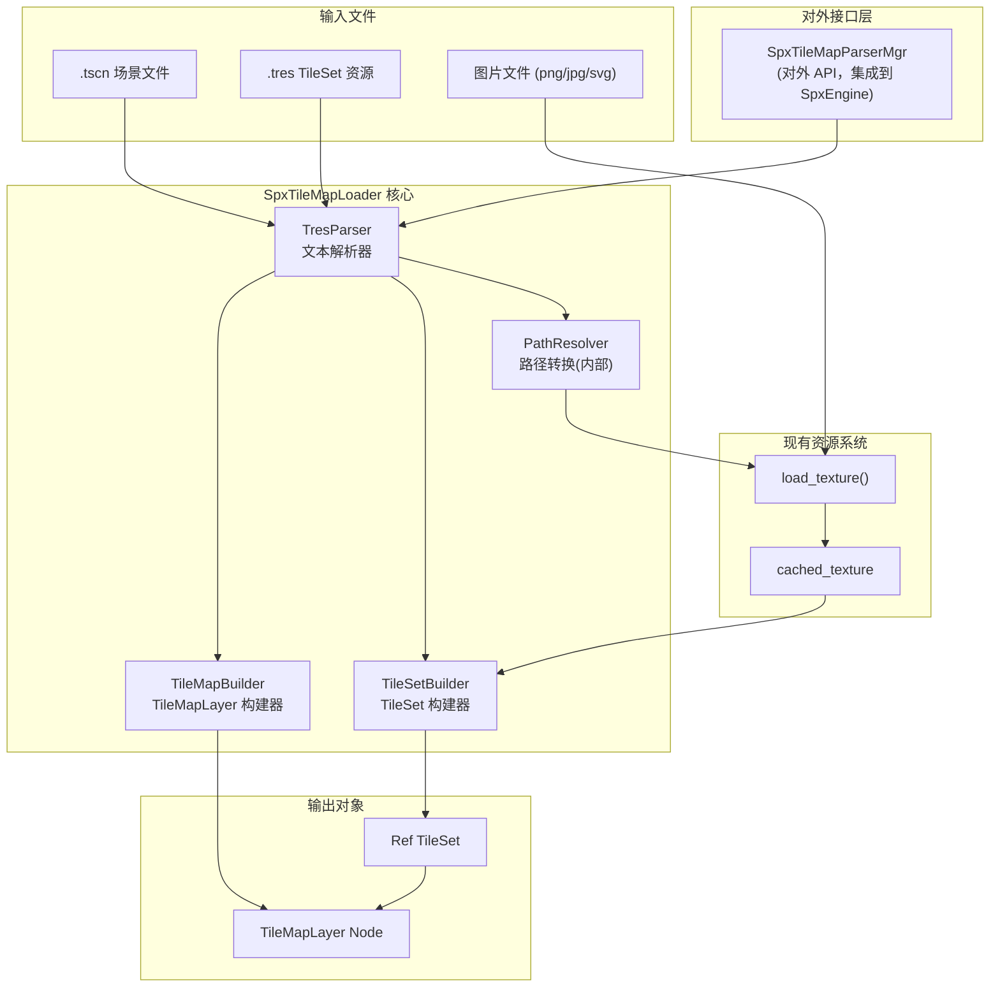
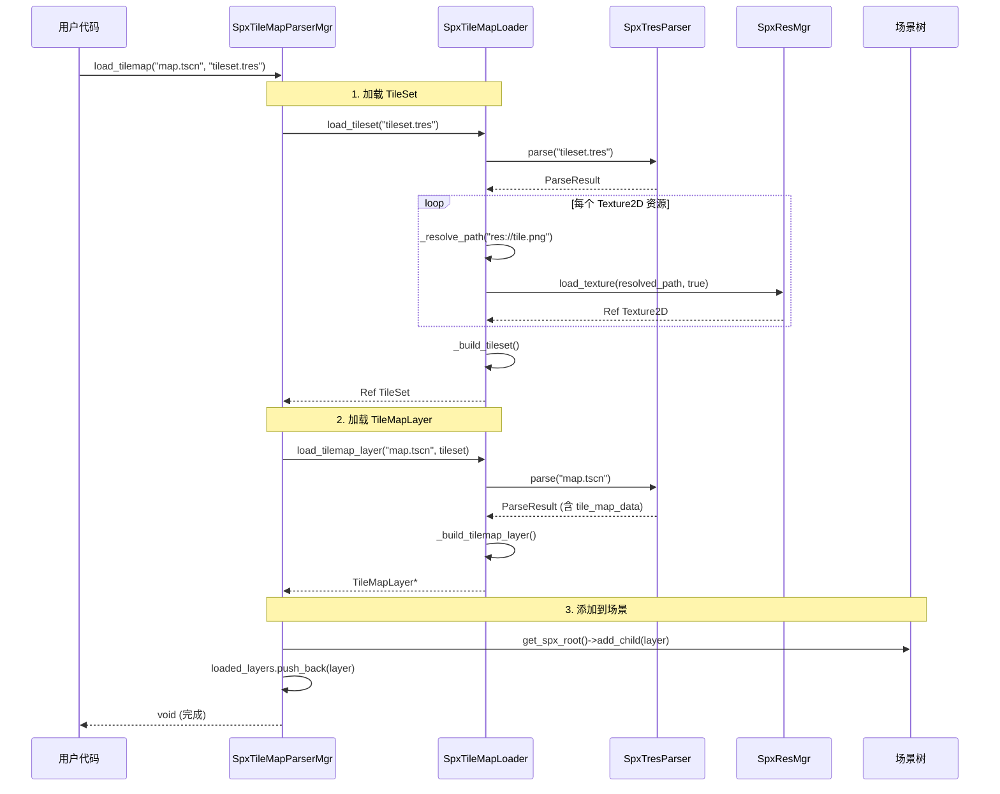

# SPX TileMap 运行时加载机制设计文档 v3

## 代码规范要求

**重要：生成的 C++ 代码中的所有注释必须使用英文。本设计文档中的代码示例注释保持中文仅用于说明目的。**

---

## 一、需求总结

| 需求项 | 决策 |

|--------|------|

| 数据来源 | 从 Godot 编辑器创建的 tscn/tres 文件解析 |

| TileSet 配置 | 解析 Godot 的 .tres 资源文件 |

| TileMap 数据 | 从 tscn 文件中解析 tile_map_data |

| 路径映射 | SPX 内部实现默认逻辑（不对外暴露） |

| 物理碰撞 | 支持（解析 TileData 中的碰撞多边形） |

| 对外接口 | SpxTileMapParserMgr 集成到 SpxEngine |

| 不支持 | TileSetScenesCollectionSource, Material, Occluder, NavPoly, PackedScene, PhysMat |

---

## 二、整体架构

在 v1 架构基础上，添加 SpxTileMapParserMgr 作为对外接口层：



---

## 三、文件结构

```
modules/spx/
├── spx_tilemap_parser_mgr.h   # 对外接口管理器（新建）
├── spx_tilemap_parser_mgr.cpp # 对外接口实现（新建）
├── spx_tilemap_loader.h       # 加载器核心（新建，内部）
├── spx_tilemap_loader.cpp     # 加载器实现（新建，内部）
├── spx_tres_parser.h          # tres/tscn 解析器（新建，内部）
├── spx_tres_parser.cpp        # 解析器实现（新建，内部）
├── spx_engine.h               # 修改：添加 tilemap_parser 成员
├── spx_engine.cpp             # 修改：创建和管理 ParserMgr
└── ...
```

---

## 四、核心类设计

### 4.1 SpxTileMapParserMgr（对外接口，集成到 SpxEngine）

参考 `SpxCameraMgr` 的实现方式：

```cpp
// spx_tilemap_parser_mgr.h
#ifndef SPX_TILEMAP_PARSER_MGR_H
#define SPX_TILEMAP_PARSER_MGR_H

#include "gdextension_spx_ext.h"
#include "spx_base_mgr.h"

class SpxTileMapLoader;
class TileMapLayer;
class TileSet;

class SpxTileMapParserMgr : SpxBaseMgr {
    SPXCLASS(SpxTileMapParserMgr, SpxBaseMgr)

public:
    virtual ~SpxTileMapParserMgr() = default;

private:
    SpxTileMapLoader *loader = nullptr;

    // 已加载的 TileMapLayer 列表（用于销毁管理）
    Vector<TileMapLayer *> loaded_layers;

    // 已加载的 TileSet 缓存
    HashMap<String, Ref<TileSet>> tileset_cache;

public:
    // 生命周期方法（类似 SpxCameraMgr）
    void on_awake() override;
    void on_destroy() override;
    void on_reset(int reset_code) override;

    // ========== 对外 API（仅两个接口） ==========

    // 加载 TileMap：传入 tscn 路径和 tileset.tres 路径
    // 内部自动创建 TileMapLayer 并添加到 spx_root
    void load_tilemap(GdString tscn_path, GdString tileset_path);

    // 销毁所有已加载的 TileMap
    void destroy_all_tilemaps();
};

#endif // SPX_TILEMAP_PARSER_MGR_H
```

### 4.2 SpxEngine 集成（参考 SpxCameraMgr）

在 `spx_engine.h` 中添加：

```cpp
// spx_engine.h 修改
class SpxTileMapParserMgr;  // 前向声明

class SpxEngine : SpxBaseMgr {
private:
    // ... 现有成员 ...
    SpxTilemapMgr *tilemap;
    SpxTileMapParserMgr *tilemap_parser;  // 新增

public:
    // ... 现有方法 ...
    SpxTilemapMgr *get_tilemap() { return tilemap; }
    SpxTileMapParserMgr *get_tilemap_parser() { return tilemap_parser; }  // 新增
};
```

### 4.3 SpxTileMapLoader（内部加载核心）

```cpp
// spx_tilemap_loader.h
#ifndef SPX_TILEMAP_LOADER_H
#define SPX_TILEMAP_LOADER_H

#include "core/object/ref_counted.h"
#include "scene/2d/tile_map_layer.h"
#include "scene/resources/2d/tile_set.h"

class SpxTresParser;
class SpxResMgr;

class SpxTileMapLoader {
private:
    SpxResMgr *res_mgr = nullptr;
    SpxTresParser *parser = nullptr;

    // 默认路径解析（内部实现，后续可替换）
    String _resolve_path(const String &res_path);

    // 加载纹理（使用 SpxResMgr）
    Ref<Texture2D> _load_texture(const String &res_path);

    // 构建 TileSet
    Ref<TileSet> _build_tileset(/* 解析数据 */);

    // 构建 TileMapLayer
    TileMapLayer *_build_tilemap_layer(/* 解析数据 */, Ref<TileSet> tileset);

    // 解析 TileData 物理碰撞
    void _parse_tile_physics(TileData *tile_data, const Dictionary &props,
                             int physics_layer_count);

public:
    SpxTileMapLoader();
    ~SpxTileMapLoader();

    void set_res_mgr(SpxResMgr *mgr) { res_mgr = mgr; }

    // 从 tres 文件加载 TileSet
    Ref<TileSet> load_tileset(const String &tres_path);

    // 从 tscn 文件加载 TileMapLayer（使用外部 TileSet）
    TileMapLayer *load_tilemap_layer(const String &tscn_path,
                                     Ref<TileSet> tileset);
};

#endif // SPX_TILEMAP_LOADER_H
```

### 4.4 SpxTresParser（文件解析器）

```cpp
// spx_tres_parser.h
#ifndef SPX_TRES_PARSER_H
#define SPX_TRES_PARSER_H

#include "core/io/file_access.h"
#include "core/variant/dictionary.h"

class SpxTresParser {
public:
    // 外部资源引用
    struct ExtResource {
        String type;      // "Texture2D", "TileSet"
        String path;      // "res://xxx.png"
        String uid;
        String id;        // "1_abcd"
    };

    // 子资源（内嵌）
    struct SubResource {
        String type;      // "TileSetAtlasSource", "TileData"
        String id;
        Dictionary properties;
    };

    // 节点信息
    struct ParsedNode {
        String name;
        String type;
        String parent;
        Dictionary properties;
    };

    // 解析结果
    struct ParseResult {
        String resource_type;
        HashMap<String, ExtResource> ext_resources;
        HashMap<String, SubResource> sub_resources;
        Dictionary root_properties;
        Vector<ParsedNode> nodes;
    };

public:
    // 解析 tres/tscn 文件
    Error parse(const String &path, ParseResult &out_result);

private:
    Error _parse_line(const String &line, Ref<FileAccess> file,
                      ParseResult &result);
    Error _parse_ext_resource(const String &line, ParseResult &result);
    Error _parse_sub_resource(const String &header, Ref<FileAccess> file,
                              ParseResult &result);
    Error _parse_node(const String &header, Ref<FileAccess> file,
                      ParseResult &result);
    Error _parse_resource(const String &header, Ref<FileAccess> file,
                          ParseResult &result);

    // 值解析
    Variant _parse_value(const String &value_str);
    PackedByteArray _parse_packed_byte_array(const String &str);
    PackedVector2Array _parse_packed_vector2_array(const String &str);
    Vector2i _parse_vector2i(const String &str);
};

#endif // SPX_TRES_PARSER_H
```

---

## 五、数据流程

### 5.1 完整加载流程



---

## 六、关键实现细节

### 6.1 默认路径解析器（内部实现）

```cpp
// spx_tilemap_loader.cpp
// Default path resolver implementation
// TODO: Replace with correct implementation later
String SpxTileMapLoader::_resolve_path(const String &res_path) {
    // Default: remove res:// prefix
    if (res_path.begins_with("res://")) {
        return res_path.substr(6);  // Remove "res://"
    }
    return res_path;
}
```

### 6.2 SpxEngine 集成实现

```cpp
// spx_engine.cpp 修改

void SpxEngine::on_awake() {
    // ... 现有代码 ...
    tilemap_parser = memnew(SpxTileMapParserMgr);
    mgrs.push_back(tilemap_parser);
    // ... 现有代码 ...
}
```

---

## 七、使用示例

```cpp
// 获取管理器（类似 get_camera()）
auto parser_mgr = SpxEngine::get_singleton()->get_tilemap_parser();

// 加载 TileMap
parser_mgr->load_tilemap("maps/level1.tscn", "tilesets/main.tres");

// 销毁所有已加载的 TileMap
parser_mgr->destroy_all_tilemaps();
```

---

## 八、与现有系统的关系

| 组件 | 职责 | 关系 |

|------|------|------|

| **SpxTileMapParserMgr** | 对外 API，管理加载的 TileMap 生命周期 | 新增，集成到 SpxEngine |

| **SpxTileMapLoader** | 核心加载逻辑 | 新增，被 ParserMgr 内部使用 |

| **SpxTresParser** | 文件解析 | 新增，被 Loader 内部使用 |

| **SpxTilemapMgr** | 现有编程式 API（SpxDrawTiles） | 保持不变 |

| **SpxResMgr** | 纹理加载 | 复用 `load_texture()` |

---

## 九、修改的文件清单

| 文件 | 类型 | 说明 |

|------|------|------|

| `modules/spx/spx_tilemap_parser_mgr.h` | 新建 | 对外接口管理器头文件 |

| `modules/spx/spx_tilemap_parser_mgr.cpp` | 新建 | 对外接口管理器实现 |

| `modules/spx/spx_tilemap_loader.h` | 新建 | 加载器头文件（内部） |

| `modules/spx/spx_tilemap_loader.cpp` | 新建 | 加载器实现（内部） |

| `modules/spx/spx_tres_parser.h` | 新建 | 解析器头文件（内部） |

| `modules/spx/spx_tres_parser.cpp` | 新建 | 解析器实现（内部） |

| `modules/spx/spx_engine.h` | 修改 | 添加 `SpxTileMapParserMgr` 成员和 `get_tilemap_parser()` |

| `modules/spx/spx_engine.cpp` | 修改 | 创建和管理 ParserMgr |

| `modules/spx/register_types.cpp` | 修改 | 注册新类（如需要） |

| `modules/spx/SCsub` | 修改 | 添加新源文件 |

---

## 十、限制与注意事项

1. **不支持的功能：**

   - TileSetScenesCollectionSource（场景瓦片）
   - Material（瓦片材质）
   - OccluderPolygon2D（光遮挡）
   - NavigationPolygon（导航网格）

2. **文件格式要求：**

   - 仅支持文本格式 `.tres`/`.tscn`（format=3）
   - 不支持二进制格式 `.res`/`.scn`

3. **路径注意：**

   - 默认路径解析移除 `res://` 前缀
   - 后续可在 `_resolve_path()` 中替换为正确实现