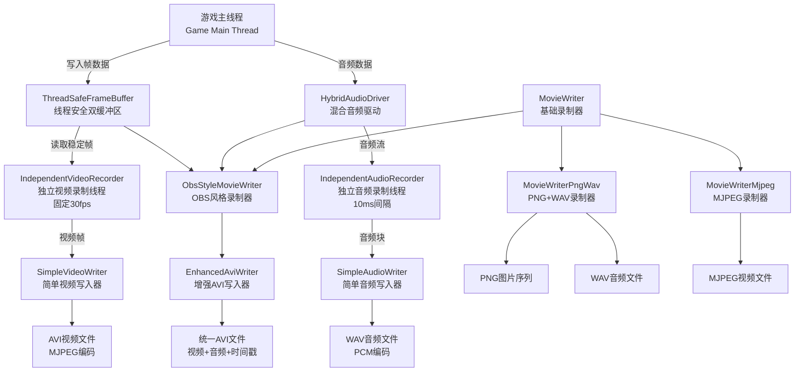

# Godot 视频录制系统架构分析

## 项目概述

这是一个基于Godot引擎的高级视频录制系统，实现了类似OBS的专业录制功能。系统采用多层架构设计，支持实时录制和离线录制两种模式，具备完整的音视频同步、多格式输出和性能监控能力。

## 系统架构图



## 详细架构分析

### 🏗️ 核心架构层次

#### 1. 基础层 - MovieWriter

**文件位置**: `movie_writer.h` (第12-115行)

```cpp
class MovieWriter : public Object {
    GDCLASS(MovieWriter, Object);
    
    uint64_t fps = 0;
    uint64_t mix_rate = 0;
    uint32_t audio_channels = 0;
    
    // 实时录制支持
    bool realtime_mode = false;
    static class HybridAudioDriver *hybrid_driver;
    class AudioDriver *original_driver = nullptr;
```

**核心特点：**
- 提供统一的录制接口
- 支持**实时录制**和**离线录制**两种模式
- 管理音频驱动的切换（HybridAudioDriver ↔ DummyAudioDriver）
- 可插拔的多个录制器架构
- 静态管理器模式，支持最多8个录制器实例

#### 2. 高级录制器 - ObsStyleMovieWriter

**文件位置**: `obs_style_movie_writer.h` (第31-67行)

```cpp
/**
 * OBS式独立线程录制器
 * 实现与OBS类似的录制效果：
 * - 固定时间轴录制（30fps）
 * - 游戏卡顿在视频中真实体现
 * - 音频连续录制，不受游戏帧率影响
 * - 完整的时序信息保存
 */
class ObsStyleMovieWriter : public MovieWriter {
```

**核心特性：**
- 🎯 **固定30fps录制**：不管游戏帧率如何变化
- 🎵 **连续音频录制**：音频不受游戏卡顿影响
- ⏰ **精确时间戳记录**：保存完整的时序信息
- 🔄 **重复帧标记**：标识哪些帧是重复的
- 📊 **合并录制模式**：视频和音频可以输出到同一文件

### 🔄 多线程并行架构

#### 1. 线程安全数据传输 - ThreadSafeFrameBuffer

**文件位置**: `thread_safe_frame_buffer.h` (第21-47行)

```cpp
/**
 * 线程安全的双缓冲帧数据管理器
 * 实现游戏主线程与录制线程之间的安全数据交换
 */
class ThreadSafeFrameBuffer {
public:
    struct FrameData {
        Ref<Image> image;           // 图像数据
        uint64_t game_timestamp;    // 游戏时间戳（微秒）
        uint32_t frame_sequence;    // 游戏帧序号
        bool is_new_frame = false;  // 是否为新帧
    };
```

**设计特点：**
- 🔒 **双缓冲机制**：buffer_a和buffer_b轮换使用
- ⚡ **原子操作**：`std::atomic<bool> has_new_data`确保线程安全
- 📊 **统计追踪**：记录缓冲区切换次数和更新总数
- 🛡️ **无锁设计**：最小化互斥锁使用，提高性能

#### 2. 独立视频录制线程 - IndependentVideoRecorder

**文件位置**: `independent_video_recorder.h` (第25-53行)

```cpp
/**
 * 独立视频录制线程
 * 以固定30fps运行，与游戏主线程完全独立
 * 从双缓冲区读取画面数据，生成标准时间轴的录制视频
 */
class IndependentVideoRecorder { 
public:
    // 录制统计
    struct RecordingStats {
        uint32_t total_recorded_frames = 0;     // 总录制帧数
        uint32_t new_frames_count = 0;          // 新帧数量
        uint32_t repeated_frames_count = 0;     // 重复帧数量
        uint64_t recording_duration_us = 0;     // 录制时长（微秒）
        uint64_t avg_frame_process_time_us = 0; // 平均帧处理时间
        uint32_t last_game_frame_sequence = 0;  // 最后处理的游戏帧序号
    };
```

**技术亮点：**
- ⏱️ **精确定时**：`FRAME_INTERVAL_USEC = 1000000 / 30` (33333微秒)
- 🔄 **智能重复帧处理**：自动检测和标记重复帧
- 📈 **详细统计**：记录新帧vs重复帧比例
- 🧵 **独立线程**：完全与游戏主线程分离

#### 3. 独立音频录制线程 - IndependentAudioRecorder

**文件位置**: `independent_audio_recorder.h` (第27-54行)

```cpp
/**
 * 独立音频录制线程
 * 以固定采样率连续运行，与游戏主线程完全独立
 * 从音频驱动获取输出数据，生成连续的音频流
 */
class IndependentAudioRecorder {
public:
    // 音频统计信息
    struct AudioStats {
        uint64_t total_chunks_recorded = 0;    // 总录制的音频块数
        uint64_t total_samples_recorded = 0;   // 总录制的样本数
        uint64_t buffer_overruns = 0;          // 缓冲区溢出次数
        uint64_t buffer_underruns = 0;         // 缓冲区下溢次数
        uint64_t recording_duration_us = 0;    // 录制时长（微秒）
        uint32_t current_buffer_level = 0;     // 当前缓冲区使用率(0-100)
        uint64_t avg_chunk_process_time_us = 0; // 平均块处理时间
    };
```

**核心特性：**
- 🎵 **高质量音频**：48kHz, 2声道，10ms间隔处理
- 🔧 **环形缓冲区**：`RingBuffer<int32_t>`处理音频流
- 📊 **缓冲区监控**：实时监控溢出/下溢情况
- ⚡ **低延迟**：`CHUNK_INTERVAL_USEC = 10000` (10ms间隔)

### 📁 多格式输出支持

#### 1. 增强AVI写入器 - EnhancedAviWriter

**文件位置**: `enhanced_avi_writer.h` (第20-44行)

```cpp
/**
 * 增强的AVI写入器，支持自定义时间戳和帧标记信息
 * 基于标准AVI格式扩展，添加用于性能分析的元数据
 */
class EnhancedAviWriter {
public:
    // 帧标志位定义
    enum FrameFlags : uint8_t {
        FRAME_FLAG_NEW = 0x01,        // 新帧
        FRAME_FLAG_REPEATED = 0x02,   // 重复帧
        FRAME_FLAG_DROPPED = 0x04,    // 丢帧（预留）
        FRAME_FLAG_RESERVED = 0x08    // 保留标志
    };
    
    // 自定义时间戳chunk结构
    struct TimestampChunk {
        char fourcc[4] = {'0', '0', 't', 's'};  // "00ts"
        uint32_t size = 24;                     // 数据大小
        uint64_t recording_timestamp;           // 录制时间戳（微秒）
        uint64_t game_timestamp;               // 游戏时间戳（微秒）
        uint32_t frame_sequence;               // 游戏帧序号
        uint8_t flags;                         // 标志位
        uint8_t reserved[3];                   // 保留字段
    };
```

**技术创新：**
- 📅 **自定义时间戳**：`"00ts"` chunk存储双时间轴信息
- 🏷️ **帧标记系统**：区分新帧、重复帧、丢帧
- 🔗 **音视频同步**：精确的音视频时间对齐
- 📊 **元数据记录**：性能分析所需的完整信息

#### 2. 基础格式支持

- **PNG+WAV录制器**：适合高质量无损录制
- **MJPEG录制器**：适合快速预览和轻量录制
- **简单AVI录制器**：标准AVI格式输出

**文件位置**: `simple_video_writer.h`, `simple_audio_writer.h`

### ⚙️ 配置管理系统

**文件位置**: `obs_style_movie_writer.h` (第36-58行)

```cpp
// OBS录制配置
struct ObsRecordingConfig {
    // 视频参数
    uint32_t video_fps = 30;            // 固定录制帧率
    uint32_t video_width = 1920;        // 视频宽度
    uint32_t video_height = 1080;       // 视频高度
    float jpeg_quality = 0.85f;         // JPEG质量
    
    // 音频参数
    uint32_t audio_sample_rate = 48000; // 音频采样率
    uint32_t audio_channels = 2;        // 音频声道数
    uint32_t audio_chunk_ms = 10;       // 音频块时长（毫秒）
    uint32_t audio_buffer_seconds = 2;  // 音频缓冲区时长（秒）
    
    // 功能开关
    bool enable_timestamp_chunks = true;      // 启用时间戳记录
    bool enable_repeat_frame_marking = true;  // 启用重复帧标记
    bool enable_audio_monitoring = false;     // 启用音频监控
    bool enable_debug_output = true;          // 启用调试输出
    bool enable_combined_recording = true;    // 启用合并录制（video+audio到同一文件）
    
    // 性能参数
    uint32_t max_frame_buffer_size = 4;       // 最大帧缓冲区大小
};
```

**配置特点：**
- 🎛️ **预设配置**：高质量、标准、性能三种预设
- 🔧 **项目设置集成**：从ProjectSettings自动加载配置
- 🎯 **细粒度控制**：每个功能都可独立开关

**实现位置**: `obs_style_movie_writer.cpp` (第24-52行) - 从项目设置加载配置

### 🚀 性能优化特性

#### 1. 内存管理
- **双缓冲区避免拷贝开销**：游戏线程和录制线程使用不同缓冲区
- **环形缓冲区高效处理音频流**：`RingBuffer<int32_t>`循环利用内存
- **预分配缓冲区减少动态分配**：避免录制过程中的内存分配

#### 2. 线程优化
- **录制线程与游戏线程完全分离**：不影响游戏性能
- **原子操作确保最小锁竞争**：`std::atomic`变量减少锁使用
- **固定时间间隔避免抖动**：精确的定时器控制

#### 3. 存储优化
- **JPEG压缩平衡质量与文件大小**：可配置的压缩质量
- **增量索引减少文件头开销**：AVI索引优化
- **批量写入减少I/O次数**：缓冲写入策略

### 📊 监控和调试系统

**文件位置**: `obs_style_movie_writer.h` (第152-161行)

```cpp
struct CombinedStats {
    IndependentVideoRecorder::RecordingStats video_stats;
    IndependentAudioRecorder::AudioStats audio_stats;
    uint32_t game_frames_added = 0;
    uint64_t total_recording_duration_us = 0;
    float overall_repeat_frame_ratio = 0.0f;
};
```

**监控功能：**
- 📈 **实时统计**：帧率、重复率、缓冲区状态
- 🐛 **详细调试信息**：每个组件的运行状态
- ⚡ **性能分析**：处理时间、内存使用情况
- 📊 **综合报告**：录制结束后的详细统计报告

### 🎯 主要技术亮点

1. **类OBS录制体验**
   - 游戏卡顿会在录制中真实体现，保持时间轴一致性
   - 固定30fps录制轴，不受游戏帧率影响

2. **音视频分离录制**
   - 音频录制不受游戏帧率影响，保证流畅性
   - 独立的音频和视频录制线程

3. **时间戳精确记录**
   - 双时间轴设计（游戏时间+录制时间）
   - 微秒级精度的时间戳记录

4. **线程安全设计**
   - 多线程并行录制，无锁竞争
   - 原子操作和双缓冲区设计

5. **可扩展架构**
   - 插件化设计，支持多种输出格式
   - 基于MovieWriter的统一接口

6. **完整监控体系**
   - 详细的统计和调试信息
   - 实时性能监控

## 实现细节

### 录制模式

#### 实时录制模式 (Realtime Mode)
**文件位置**: `movie_writer.cpp` (第126-141行)
- 使用HybridAudioDriver捕获实际音频输出
- 音频连续录制，不受游戏卡顿影响
- 适合录制真实的游戏体验

#### 离线录制模式 (Offline Mode)  
**文件位置**: `movie_writer.cpp` (第143-149行)
- 使用DummyAudioDriver，音频与帧同步
- 每帧生成固定时长的音频
- 适合生成演示视频

### 文件结构

```
servers/movie_writer/
├── movie_writer.h/cpp                 # 基础录制器接口
├── obs_style_movie_writer.h/cpp       # OBS风格录制器
├── independent_video_recorder.h/cpp   # 独立视频录制线程
├── independent_audio_recorder.h/cpp   # 独立音频录制线程
├── thread_safe_frame_buffer.h/cpp     # 线程安全帧缓冲区
├── enhanced_avi_writer.h/cpp          # 增强AVI写入器
├── simple_video_writer.h/cpp          # 简单视频写入器
├── simple_audio_writer.h/cpp          # 简单音频写入器
├── movie_writer_pngwav.h/cpp          # PNG+WAV录制器
├── movie_writer_mjpeg.h/cpp           # MJPEG录制器
└── SCsub                              # 构建配置
```

### 编译配置

**文件位置**: `SCsub`
```python
#!/usr/bin/env python
from misc.utility.scons_hints import *

Import("env")

env.add_source_files(env.servers_sources, "*.cpp")
```

## 使用建议

1. **高质量录制**：使用ObsStyleMovieWriter + 高质量配置
2. **性能优先**：使用性能配置，降低JPEG质量和分辨率
3. **调试分析**：开启调试输出和时间戳记录
4. **实时录制**：游戏发布时记录真实用户体验
5. **离线录制**：制作宣传视频和教程

## 总结

这个视频录制系统设计非常专业和完善，具备了商业级录制软件的核心功能。通过多线程并行设计、精确的时间控制和丰富的配置选项，既保证了录制质量，又最大化了系统性能。特别是类OBS的录制机制和双时间轴设计，使其在游戏录制领域具有很强的实用价值。

系统的可扩展性设计也很出色，可以方便地添加新的输出格式和录制功能，是一个值得学习和参考的优秀架构实现。 