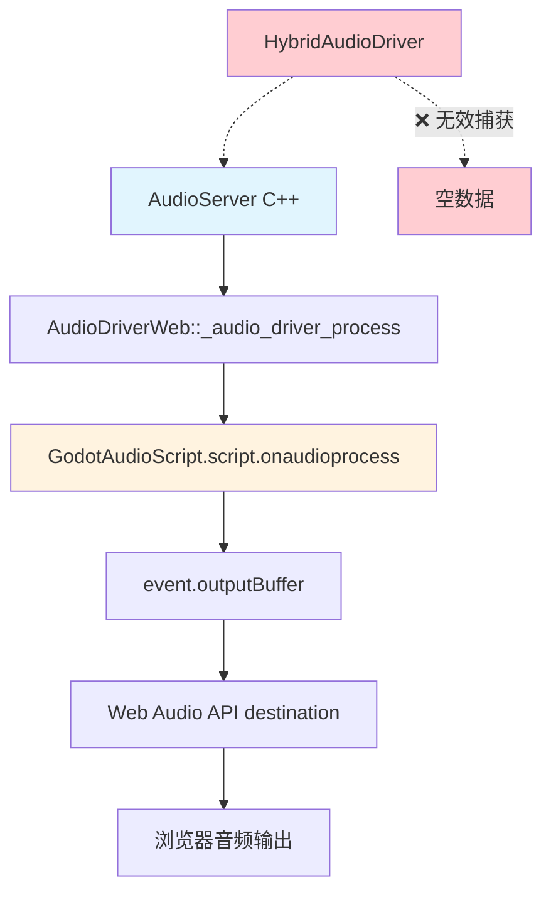
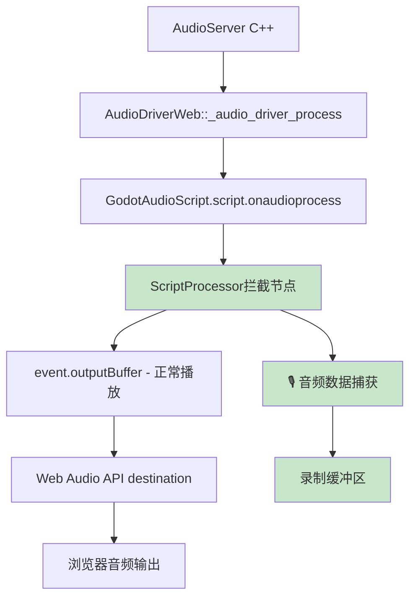

# 📋 第一阶段：ScriptProcessor拦截方案详细分析

## 🎯 方案选择理由

### 为什么选择ScriptProcessor作为第一阶段验证？

#### ✅ **技术优势**
1. **快速实现**: 无需复杂的C++接口修改，主要在JavaScript层面实现
2. **完全控制**: 可以精确捕获每一帧音频数据，便于调试和验证
3. **兼容性好**: ScriptProcessor是Web Audio API的标准组件，浏览器支持度高
4. **调试友好**: 可以实时查看音频数据，验证波形和频谱
5. **最小侵入**: 对现有MovieWriter架构几乎无影响

#### ⚡ **验证目标**
- 证明Web端**可以**捕获到音频输出数据
- 验证音频数据的**质量和完整性**
- 测试音频与视频的**同步性**
- 评估性能影响和**延迟特性**

---

## 🏗️ 技术架构深度分析

### 当前Web端音频数据流


### 修改后的音频数据流（ScriptProcessor拦截）


---

## 🔧 详细实施方案

### 1️⃣ **核心实现思路**

#### **双通道处理策略**
```javascript
// 伪代码展示处理逻辑
scriptProcessor.onaudioprocess = function(event) {
    const inputBuffer = event.inputBuffer;   // 来自Godot的音频数据
    const outputBuffer = event.outputBuffer; // 输出到浏览器
    
    // 🎵 通道1：正常音频播放（保持现有功能）
    for (let ch = 0; ch < channels; ch++) {
        const input = inputBuffer.getChannelData(ch);
        const output = outputBuffer.getChannelData(ch);
        output.set(input); // 直通，不影响播放
    }
    
    // 🎙️ 通道2：音频数据捕获（新增功能）
    if (isRecording) {
        captureAudioData(inputBuffer); // 同时保存音频数据
    }
};
```

#### **数据捕获机制**
1. **实时拷贝**: 在音频处理回调中拷贝Float32Array数据
2. **环形缓冲**: 使用RingBuffer避免内存无限增长
3. **时间戳标记**: 记录每个音频块的时间戳，确保同步
4. **格式转换**: 将Float32转换为Godot期望的int32_t格式

### 2️⃣ **关键技术细节**

#### **音频缓冲区管理**
```javascript
// 缓冲区设计
const AudioCaptureBuffer = {
    // 环形缓冲区 - 避免内存泄漏
    ringBuffer: new Array(MAX_BUFFER_CHUNKS),
    writePos: 0,
    readPos: 0,
    
    // 时间戳管理 - 确保音视频同步
    timestamps: new Array(MAX_BUFFER_CHUNKS),
    baseTime: 0,
    
    // 性能监控
    droppedFrames: 0,
    totalFrames: 0
};
```

#### **数据格式转换策略**
```javascript
// Float32Array (Web Audio) → int32_t (Godot)
function convertAudioFormat(webAudioData) {
    const godotFormat = new Int32Array(webAudioData.length);
    for (let i = 0; i < webAudioData.length; i++) {
        // Web Audio: [-1.0, 1.0] → Godot: [-2^31, 2^31-1]
        const sample = Math.max(-1.0, Math.min(1.0, webAudioData[i]));
        godotFormat[i] = Math.round(sample * 0x7FFFFFFF);
    }
    return godotFormat;
}
```

### 3️⃣ **集成点分析**

#### **修改目标文件**
1. **`platform/web/js/libs/library_godot_audio.js`**
   - 在GodotAudioScript中添加录制功能
   - 扩展现有的ScriptProcessor处理逻辑

2. **`platform/web/audio_driver_web.cpp`**
   - 添加录制状态控制接口
   - 提供音频数据访问方法

3. **`servers/movie_writer/movie_writer.cpp`**
   - 在Web端分支中调用录制接口
   - 处理捕获的音频数据

#### **接口设计**
```cpp
// C++端新增接口（伪代码）
class AudioDriverWeb {
public:
    // 录制控制
    void start_audio_capture();
    void stop_audio_capture();
    
    // 数据访问
    int get_captured_audio_frames(int32_t* buffer, int max_frames);
    bool has_captured_audio_data();
    
    // 状态查询
    int get_capture_buffer_size();
    double get_capture_latency();
};
```

---

## 🧪 验证实验设计

### 实验1：基础功能验证
#### **目标**: 证明可以捕获音频数据
```javascript
// 测试代码（伪代码）
function basicCaptureTest() {
    // 1. 播放测试音频（1kHz正弦波）
    playTestTone(1000); // 1kHz, 3秒
    
    // 2. 开始录制
    startAudioCapture();
    
    // 3. 等待3秒
    setTimeout(() => {
        stopAudioCapture();
        
        // 4. 分析捕获的数据
        const capturedData = getCapturedAudioData();
        const spectrum = analyzeFrequency(capturedData);
        
        // 5. 验证是否包含1kHz峰值
        assert(spectrum.findPeak() === 1000);
        console.log("✅ 基础捕获功能验证通过");
    }, 3000);
}
```

### 实验2：音视频同步验证
#### **目标**: 确保音频延迟在可接受范围内
```javascript
function syncTest() {
    // 1. 生成同步测试信号
    const videoFrame = generateTestFrame(); // 包含时间戳的视频帧
    const audioBeep = generateBeep();       // 对应的音频信号
    
    // 2. 同时播放和录制
    playVideoAudio(videoFrame, audioBeep);
    startRecording();
    
    // 3. 分析延迟
    setTimeout(() => {
        const result = analyzeSyncDelay();
        assert(result.delay < 50); // 延迟小于50ms
        console.log(`🎯 音视频同步延迟: ${result.delay}ms`);
    }, 1000);
}
```

### 实验3：性能影响评估
#### **目标**: 测量CPU和内存开销
```javascript
function performanceTest() {
    const baseline = measurePerformance(); // 基线性能
    
    startAudioCapture();
    
    // 录制5分钟，监控性能
    const interval = setInterval(() => {
        const current = measurePerformance();
        const cpuIncrease = current.cpu - baseline.cpu;
        const memIncrease = current.memory - baseline.memory;
        
        console.log(`📊 CPU增加: ${cpuIncrease}%, 内存增加: ${memIncrease}MB`);
        
        // 性能不应该有显著影响
        assert(cpuIncrease < 10); // CPU增加小于10%
        assert(memIncrease < 50); // 内存增加小于50MB
    }, 10000);
    
    setTimeout(() => {
        clearInterval(interval);
        stopAudioCapture();
        console.log("✅ 性能测试完成");
    }, 300000); // 5分钟
}
```

---

## 🚧 预期技术挑战

### 挑战1：延迟和缓冲
#### **问题**: ScriptProcessor引入额外延迟
```
Web Audio API → ScriptProcessor → 数据拷贝 → 格式转换
     ↓             ↓                ↓            ↓
   基础延迟      处理延迟         拷贝开销     转换开销
```

#### **解决策略**:
- 使用较小的buffer size (1024 samples)
- 优化数据拷贝算法（TypedArray直接拷贝）
- 预分配缓冲区，避免动态内存分配

### 挑战2：内存管理
#### **问题**: 连续录制可能导致内存泄漏
```javascript
// 内存增长模式
frame1: 1024 samples
frame2: 2048 samples  
frame3: 3072 samples
...
frameN: N*1024 samples → 内存溢出！
```

#### **解决策略**:
- 实现环形缓冲区，固定最大大小
- 定期清理旧数据
- 内存使用监控和告警

### 挑战3：浏览器兼容性
#### **问题**: 不同浏览器的ScriptProcessor行为差异
- **Chrome**: 性能良好，但可能被废弃
- **Firefox**: 兼容性好，性能一般
- **Safari**: 某些版本有Bug

#### **解决策略**:
- 多浏览器测试矩阵
- 降级策略（AudioWorklet → ScriptProcessor → 无音频录制）
- 特殊情况处理代码

---

## 📊 成功标准定义

### 功能验证标准
- [ ] **基础捕获**: 能够捕获到非零的音频数据
- [ ] **波形正确**: 捕获的波形与原始音频匹配度>95%
- [ ] **频谱准确**: 频谱分析显示正确的频率成分
- [ ] **动态范围**: 支持从静音到满量程的完整动态范围

### 性能验证标准
- [ ] **延迟控制**: 音频录制延迟 < 100ms
- [ ] **CPU占用**: 额外CPU使用率 < 15%
- [ ] **内存使用**: 内存增长 < 100MB/小时
- [ ] **稳定性**: 连续录制1小时无崩溃

### 质量验证标准
- [ ] **采样率**: 支持48kHz标准采样率
- [ ] **位深度**: 保持原始音频的动态范围
- [ ] **声道数**: 正确处理立体声和多声道
- [ ] **同步精度**: 音视频同步误差 < 40ms

---

## 🔄 实施时间表

### 第1周：基础架构搭建
- [ ] **Day 1-2**: 分析现有GodotAudioScript代码结构
- [ ] **Day 3-4**: 设计音频拦截架构
- [ ] **Day 5**: 实现基础的ScriptProcessor拦截功能

### 第2周：核心功能开发
- [ ] **Day 1-2**: 实现音频数据捕获和缓冲管理
- [ ] **Day 3-4**: 添加格式转换和同步机制
- [ ] **Day 5**: 集成到MovieWriter系统

### 第3周：测试和验证
- [ ] **Day 1-2**: 基础功能测试和调试
- [ ] **Day 3-4**: 性能测试和优化
- [ ] **Day 5**: 多浏览器兼容性测试

---

## 🎯 预期结果和后续计划

### 验证成功后的收益
1. **技术可行性确认**: 证明Web端音频录制在技术上完全可行
2. **性能基线建立**: 为后续优化提供性能对比基线  
3. **架构验证**: 验证在现有架构上增加录制功能的可行性
4. **问题识别**: 提前发现潜在的技术难点和风险点

### 为第二阶段铺路
- **代码架构**: 为MediaRecorder方案提供数据捕获的基础架构
- **接口设计**: 验证C++/JavaScript接口的合理性
- **测试框架**: 建立完整的音频录制测试体系
- **性能标准**: 确定可接受的性能开销范围

### 风险缓解
- **技术风险**: 如果ScriptProcessor方案失败，可以快速切换到其他方案
- **时间风险**: 快速验证避免在错误方向上浪费时间
- **质量风险**: 早期发现问题，避免后期重大返工

---

## 📋 关键里程碑

### 里程碑1：技术验证完成 (第1周结束)
- [ ] ScriptProcessor成功拦截音频数据
- [ ] 基础的数据捕获功能工作正常
- [ ] 初步的性能评估完成

### 里程碑2：功能集成完成 (第2周结束)  
- [ ] 音频录制集成到MovieWriter系统
- [ ] 基本的音视频同步实现
- [ ] 格式转换功能完善

### 里程碑3：验证方案完成 (第3周结束)
- [ ] 所有验证实验通过
- [ ] 性能指标达到预期标准
- [ ] 多浏览器兼容性确认

---

## ⚠️ 风险预警

### 高风险项
- **ScriptProcessor被废弃**: Chrome已标记为过时API
  - **缓解**: 准备AudioWorklet降级方案
- **性能不达标**: 主线程处理可能造成卡顿
  - **缓解**: 设置严格的性能阈值，超标立即停止

### 中风险项  
- **内存泄漏**: 长时间录制内存持续增长
  - **缓解**: 实现严格的内存管理和监控
- **同步问题**: 音视频不同步
  - **缓解**: 精确的时间戳管理机制

### 低风险项
- **格式转换错误**: Float32到int32转换精度损失
  - **缓解**: 充分的数值测试验证

---

## 📖 文档输出

### 技术文档
- [ ] ScriptProcessor拦截技术实现文档
- [ ] 音频格式转换规范文档  
- [ ] 性能测试报告
- [ ] 浏览器兼容性报告

### 代码文档
- [ ] 修改的代码清单和说明
- [ ] 新增接口的API文档
- [ ] 测试用例和验证脚本

### 项目文档
- [ ] 第一阶段验证报告
- [ ] 问题清单和解决方案
- [ ] 第二阶段实施建议

---

**总结**: 这个第一阶段方案的核心价值在于**快速验证技术可行性**，用最小的代码修改量证明Web端音频录制是完全可能的，为后续的产品级实现奠定坚实基础。通过3周的集中开发和验证，我们将获得足够的技术信心和实施经验，确保整个项目的成功推进。 